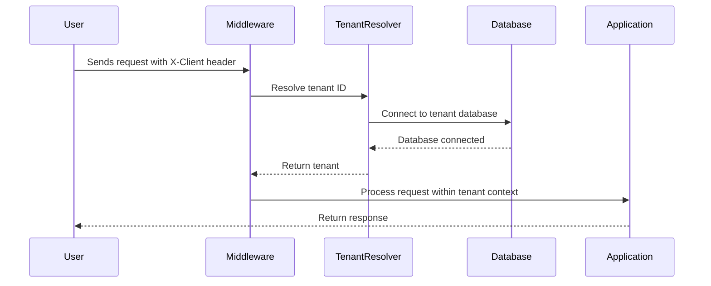

# Chapter 5: Multi-Tenancy

In the last chapter, [AI Integration](04_ai_integration.md), we explored how to use AI to enhance your Programs. Now, let's dive into how our app can serve multiple organizations simultaneously using a concept called **Multi-Tenancy**.

## What is Multi-Tenancy and why do we need it?

Imagine you're running a software platform for fitness coaches.  Each coach has their own clients, training programs, and branding.  Instead of building a separate app for each coach, you can use a single app to serve them all. This is where multi-tenancy comes in.

Multi-tenancy allows multiple independent "tenants" (in this case, fitness coaches) to use the same application while keeping their data, users, and settings completely separate. Think of it like an apartment building – one building (the application), many apartments (the tenants), each with its own separate space and configuration.

## Understanding Multi-Tenancy

In our app, each tenant has its own isolated environment. This means:

* **Data Isolation:** Coach A's client data is completely separate from Coach B's.
* **User Isolation:** Coach A's clients can only access their own coach's programs, not Coach B's.
* **Settings Isolation:**  Each coach can customize their own branding and settings without affecting other coaches.

## How Multi-Tenancy Works

Our app uses a header called `X-Client` to identify the current tenant.  When a user logs in, the system uses this header to determine which tenant's data to access.

Let's say Coach A has a tenant ID of `1` and Coach B has a tenant ID of `2`.  When Coach A's client logs in, the request will include the header `X-Client: 1`.  The app then knows to load Coach A's data, programs, and settings.

## Using Multi-Tenancy

You don't need to do anything special to use multi-tenancy. The app handles it automatically behind the scenes.  When you create [Programs](01_protocols_and_programs.md) or [Modules](02_modules.md), they are automatically associated with your tenant.

## Internal Implementation

When a request comes in, the system first identifies the tenant using the `X-Client` header. Then, it loads the appropriate database connection and settings for that tenant.



The `InitializeTenancyByRequestData` middleware (in `Providers/TenancyServiceProvider.php`) is responsible for identifying the tenant based on the `X-Client` header.

```php
// Providers/TenancyServiceProvider.php (simplified)
InitializeTenancyByRequestData::$header = 'X-Client';
```

The `MultiTenantResolver` (in `Resolvers/MultiTenantResolver.php`) then retrieves the tenant information from the database.

```php
// Resolvers/MultiTenantResolver.php (simplified)
public function resolveWithoutCache(...$args): Tenant
{
    // ... logic to retrieve tenant based on X-Client header ...
}
```

The `AppServiceProvider` (in `Providers/AppServiceProvider.php`) creates a separate mailer for each tenant.

```php
// Providers/AppServiceProvider.php (simplified)
public function createTenantMailer(): void
{
    // ... logic to create tenant-specific mailer ...
}
```

## Conclusion

In this chapter, we learned about multi-tenancy and how it allows our app to serve multiple organizations simultaneously. We saw how data, users, and settings are isolated for each tenant. We also explored the internal implementation, including the middleware and resolver responsible for identifying and loading the correct tenant context.

Next, we'll learn about [Scheduled Tasks](06_scheduled_tasks.md), which allow you to automate tasks within your Programs.


---

Generated by [AI Codebase Knowledge Builder](https://github.com/The-Pocket/Tutorial-Codebase-Knowledge)