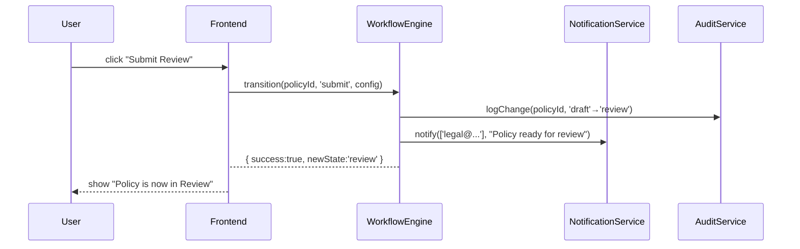

# Chapter 5: Policy Lifecycle Workflow

In [Chapter 4: Policy Editor](04_policy_editor_.md) we saw how to draft and preview policy text. Now let’s learn how HMS-GOV manages a policy’s journey from **Draft** all the way to **Sunset**, keeping everyone on schedule and logged in every step.

---

## 5.1 Why a Policy Lifecycle Workflow?

Imagine the Department of Education is updating its “Student Loan Forgiveness” policy. It needs to:

1. Be **drafted** by policy analysts  
2. Sent for **legal review**  
3. **Approved** by the Secretary  
4. **Deployed** on the public website  
5. **Monitored** for metrics (e.g., uptake, complaints)  
6. **Retired** (sunset) after a set term  

This mirrors how a bill moves through committees, votes, and finally into law. HMS-GOV’s **Policy Lifecycle Workflow** codifies each stage with deadlines, notifications, and audit logs so nothing falls through the cracks.

---

## 5.2 Key Concepts

1. **Finite State Machine (FSM)**  
   Defines states (`draft`, `review`, `approved`, etc.) and valid transitions (`submit`, `approve`, `deploy`, …).

2. **Audit Trail**  
   Records every state change: who did it, when, and any comments.

3. **Reminder Triggers**  
   Automatic email or in-app reminders when a deadline approaches (e.g., “Review due in 2 days”).

4. **Stakeholder Notifications**  
   On each transition, notify the right users (e.g., legal team, agency head).

5. **State Deadlines**  
   Each state can have a maximum duration before requiring escalation.

---

## 5.3 Defining a Lifecycle in Code

Let’s configure a simple policy workflow. Save this as `src/workflow/policyLifecycleConfig.js`:

```js
export default {
  initial: 'draft',
  states: {
    draft: {
      on: { submit: 'review' },
      deadlineDays: 7
    },
    review: {
      on: { approve: 'approved', reject: 'draft' },
      stakeholders: ['legal@agency.gov'],
      deadlineDays: 5
    },
    approved: {
      on: { deploy: 'deployed' }
    },
    deployed: {
      on: { monitor: 'monitoring' }
    },
    monitoring: {
      on: { retire: 'sunset' },
      reminderDays: [30, 7] // check metrics every 30d and 7d before sunset
    },
    sunset: { type: 'final' }
  }
}
```

Explanation:  
- `initial` is the starting state.  
- Each `state` lists possible transitions (`on`), deadlines, and who to notify.  
- `reminderDays` triggers periodic checks.

---

## 5.4 How to Move a Policy Along

In your Vue component or service you call a **Workflow Engine**:

```js
import lifecycleConfig from '../workflow/policyLifecycleConfig'
import WorkflowEngine from '../services/WorkflowEngine'

async function advancePolicy(policyId, action) {
  const result = await WorkflowEngine.transition(
    policyId, action, lifecycleConfig
  )
  if (result.success) {
    console.log(`Policy moved to ${result.newState}`)
  }
}
```

What happens:

1. The engine loads the policy’s current state.  
2. It checks that `action` is valid in the FSM.  
3. It updates the state, writes an audit record, and fires notifications.  
4. If the new state has a deadline or reminders, it schedules timers.

---

## 5.5 Behind the Scenes

Here’s a simplified sequence when an analyst clicks **Submit for Review**:



---

## 5.6 Peek at the Engine

File: `src/services/WorkflowEngine.js`

```js
import AuditService from './AuditService'
import NotificationService from './NotificationService'
import TimerService from './TimerService'

export default {
  async transition(id, action, config) {
    const policy = await this.loadPolicy(id)
    const cur = policy.state
    const next = config.states[cur].on[action]
    // 1. Update state
    policy.state = next
    await this.savePolicy(policy)
    // 2. Audit
    await AuditService.record(id, cur, next, action)
    // 3. Notify
    const to = config.states[next].stakeholders || []
    if (to.length) NotificationService.send(to, `Policy is ${next}`)
    // 4. Schedule reminders/deadline
    TimerService.schedule(id, next, config.states[next])
    return { success: true, newState: next }
  }
}
```

Explanation:  
- Loads and updates the policy record.  
- Calls `AuditService`, `NotificationService`, and `TimerService`.  
- Returns the new state so the UI can update.

---

## 5.7 Scheduling Reminders

The **TimerService** might use `setTimeout` or a cron job. Example:

```js
// src/services/TimerService.js
export default {
  schedule(id, state, meta) {
    if (meta.deadlineDays) {
      // send reminder at half the deadline
      const ms = meta.deadlineDays * 24*60*60*1000 / 2
      setTimeout(() => this.triggerReminder(id, state), ms)
    }
  },
  triggerReminder(id, state) {
    // fetch policy, re-notify or escalate
    NotificationService.sendGroup(
      state + '-owners', `Reminder: policy in ${state}`
    )
  }
}
```

---

## 5.8 Conclusion

You’ve learned how HMS-GOV:

- Defines a **finite state machine** for policies  
- Records every change in an **audit trail**  
- Sends **notifications** at key points  
- Schedules **reminders** and enforces deadlines  

All of this keeps your policy process transparent and compliant—just like a legislative calendar in Congress. In the next chapter, we’ll see how human reviewers can **override** these automated flows when special cases arise:  
[Chapter 6: Human-in-the-Loop Override](06_human_in_the_loop_override_.md)

---

Generated by [AI Codebase Knowledge Builder](https://github.com/The-Pocket/Tutorial-Codebase-Knowledge)