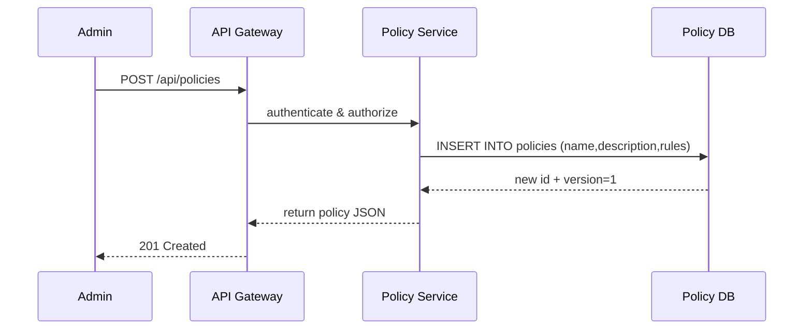

# Chapter 5: Policy Management API

Welcome back! In [Chapter 4: Protocol Model](04_protocol_model_.md) we learned how to break a Program into ordered steps. Now we’ll zoom out and see how to **govern** those Programs and Protocols by drafting, versioning, and enforcing high-level rules—just like a legislative office publishes laws.

---

## 5.1 Why a Policy Management API?

**Use Case:**  
A state legislator needs to roll out a new **Emergency Eviction Moratorium** policy that halts tenant evictions during natural disasters. They want to:

1. **Draft** the moratorium text and rules.  
2. **Version** it so they can amend or roll back changes.  
3. **Publish** it so caseworkers across all Programs (housing, legal aid) see the update instantly.  

Without a Policy API, each module would hard-code rules. With it, every change flows in real time across HMS-API and the frontends (like HMS-GOV).

> Analogy: Think of the Policy API as the “State Register of Laws.” Every regulation is drafted, tracked by version, and published so that every department reads the latest text instantly.

---

## 5.2 Key Concepts

1. **Policy**  
   A named set of governance rules (e.g., “Eviction Moratorium”).

2. **Version**  
   Each time you update a policy, you create a new version. Older versions stay archived.

3. **Rules**  
   A structured list of conditions and actions (e.g., `{ "action": "halt_eviction", "condition": { "disaster": true } }`).

4. **Enforcement**  
   Once published, HMS-API modules (Programs, Protocols, Assessments) automatically respect the latest policy version.

5. **Endpoints**  
   Standard CRUD (Create, Read, Update, Delete) over REST: `/api/policies`, `/api/policies/:id`.

---

## 5.3 How to Use the Policy Management API

### 5.3.1 Create a New Policy

```http
POST /api/policies
Content-Type: application/json

{
  "name": "Eviction Moratorium",
  "description": "Halt evictions during declared emergencies",
  "rules": [
    {
      "action": "halt_eviction",
      "condition": { "emergencyDeclared": true }
    }
  ]
}
```

What happens:  
- HMS-API validates your token and `create_policy` permission.  
- Inserts a new policy with version `1`.  
- Returns the full policy record:

```json
{
  "id": "policy_001",
  "name": "Eviction Moratorium",
  "version": 1,
  "status": "published",
  "rules": [ /* as above */ ]
}
```

### 5.3.2 List All Policies

```http
GET /api/policies
```

Response:

```json
[
  { "id": "policy_001", "name": "Eviction Moratorium", "version": 1 },
  { "id": "policy_002", "name": "Data Privacy Act", "version": 3 }
]
```

> Every item shows the latest version and its status.

### 5.3.3 Update an Existing Policy

```http
PUT /api/policies/policy_001
Content-Type: application/json

{
  "description": "Halt all residential evictions during declared emergencies",
  "rules": [
    {
      "action": "halt_eviction",
      "condition": { "emergencyDeclared": true }
    },
    {
      "action": "notify_landlord",
      "condition": { "within30Days": true }
    }
  ]
}
```

- Creates version `2` of `policy_001`.  
- Returns updated record with `version: 2`.

### 5.3.4 Retrieve a Specific Version

```http
GET /api/policies/policy_001?version=1
```

- Returns the archived version `1` (before amendments).

### 5.3.5 Delete or Archive a Policy

```http
DELETE /api/policies/policy_002
```

- Marks `policy_002` as `archived`.  
- Does not remove historical versions.

---

## 5.4 What Happens Under the Hood?



1. **API Gateway** checks your token and permissions.  
2. **Policy Service** handles business logic: draft, version, publish.  
3. **Database** stores each policy record and its version history.  
4. Gateway sends back the created policy.

---

## 5.5 Internal Implementation

Below is a minimal JavaScript model and middleware to give you a peek under the hood.

### File: models/policy_model.js

```js
// models/policy_model.js
class Policy {
  constructor(data) {
    Object.assign(this, data);
  }

  static async create({ name, description, rules }) {
    // Simplified DB call
    const result = await db.insert('policies', {
      name, description, rules, version: 1, status: 'published'
    });
    return new Policy(result);
  }
}
module.exports = Policy;
```

> Explanation:  
> - `create()` inserts the first version of a policy.  
> - Returns a `Policy` instance with `id`, `version`, and `status`.

### File: middleware/policy.js

```js
// middleware/policy.js
const PolicyModel = require('../models/policy_model');

async function requirePolicy(req, res, next) {
  const policy = await PolicyModel.findById(req.params.policyId);
  if (!policy) {
    return res.status(404).json({ error: 'Policy not found' });
  }
  req.policy = policy;
  next();
}
module.exports = requirePolicy;
```

> Explanation:  
> - Verifies the requested policy exists before allowing updates or deletes.

---

## 5.6 Recap & Next Steps

You’ve learned how to:

- Draft, version, and publish high-level governance rules via REST.  
- Use core endpoints to create, list, update, and archive policies.  
- See how the Policy Service interacts with the database to enforce real-time updates.

Next up, we’ll dive into [Chapter 6: CodifySubproject](06_codifysubproject_.md), where we’ll break policies into smaller legislative “subprojects” for fine-grained tracking and collaboration.

---

Generated by [AI Codebase Knowledge Builder](https://github.com/The-Pocket/Tutorial-Codebase-Knowledge)