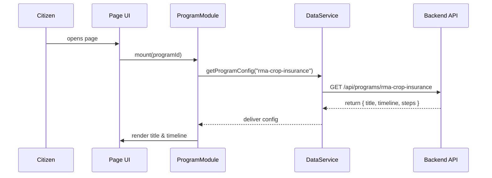

# Chapter 5: Program Module

In [Chapter 4: Protocol Builder](04_protocol_builder_.md), we learned how agency staff design workflows as JSON protocols. Now, let’s see how to surface those protocols (and other program data) on your web pages using a **Program Module**—a self-contained UI component you can drop anywhere.

---

## 1. Why a Program Module?

Imagine the Office of the Federal Register wants to embed a “Registration Timeline” widget in several pages: one for public notices, another for agency rulemaking, and one for archiving. Instead of copying HTML, JavaScript, and CSS by hand, you build a **Program Module**:

- It bundles markup, logic, and styles for showing a discrete “Program” block.  
- You pass in a `programId` like `"fedreg-registration"`.  
- It automatically fetches the right data and renders the timeline.

This saves time, ensures consistency, and lets you reuse the same component on any page—just like a LEGO brick you snap in place.

---

## 2. Key Concepts

1. **ProgramModule Component**  
   The outer wrapper you import and render (e.g., `<ProgramModule>`).

2. **Props / Config**  
   You pass `programId` (string) so the module knows which program or policy segment to load.

3. **Data Fetching**  
   The module calls a service (e.g., `DataService.getProgramConfig`) to load titles, dates, steps.

4. **Template & Styling**  
   A small `<template>` for layout plus scoped CSS for look-and-feel.

5. **Lifecycle**  
   On `created()` (Vue) or `useEffect` (React), the component loads data and then displays it.

---

## 3. Using the Program Module

Here’s how to embed a “Crop Insurance” timeline for the USDA Risk Management Agency:

### 3.1 Import and Render

```vue
<!-- src/pages/CropInsurancePage.vue -->
<template>
  <div>
    <h1>Crop Insurance Signup</h1>
    <ProgramModule programId="rma-crop-insurance" />
  </div>
</template>
<script>
import ProgramModule from '@/components/Modules/ProgramModule.vue'

export default {
  components: { ProgramModule }
}
</script>
```

What happens:

- You drop `<ProgramModule>` into any page.  
- The `programId` tells it which program to fetch (here, `"rma-crop-insurance"`).  
- The module loads and renders the timeline for signup deadlines, eligibility, and contact info.

---

## 4. Under the Hood: Step-by-Step

When a citizen visits the page, here’s the flow:



1. **Mount:** Vue/React mounts your component with `programId`.  
2. **Fetch Config:** Calls `DataService`.  
3. **API Call:** Backend returns JSON with display data.  
4. **Render:** Module updates its template to show the program.

---

## 5. Internal Implementation

### 5.1 ProgramModule.vue

```vue
<!-- src/components/Modules/ProgramModule.vue -->
<template>
  <div class="program-module">
    <h2>{{ config.title }}</h2>
    <ul>
      <li v-for="step in config.timeline" :key="step.date">
        {{ step.date }} – {{ step.label }}
      </li>
    </ul>
  </div>
</template>

<script>
import DataService from '@/services/DataService'

export default {
  props: ['programId'],
  data() { return { config: { title: '', timeline: [] } } },
  async created() {
    this.config = await DataService.getProgramConfig(this.programId)
  }
}
</script>

<style scoped>
.program-module { 
  border: 1px solid #ccc; 
  padding: 16px; 
  background: #f9f9f9;
}
</style>
```

Explanation:

- `props: ['programId']` tells Vue which program to load.  
- `created()` runs when the component mounts, fetching config.  
- The template loops over `config.timeline` to render each event.

### 5.2 DataService.js

```js
// src/services/DataService.js
export default {
  async getProgramConfig(id) {
    const resp = await fetch(`/api/programs/${id}`)
    if (!resp.ok) throw new Error('Failed to load program')
    return resp.json()  // { title: string, timeline: Array }
  }
}
```

Explanation:

- Calls the backend endpoint for program data.  
- Returns JSON used by `ProgramModule`.

---

## 6. Analogy: A Plug-and-Play Kiosk

Think of the **Program Module** like a self-serve kiosk you set up in a federal building:

- You attach a touchscreen (import the component).  
- You program it with a service code (`programId`).  
- It automatically shows the right menus, forms, and timelines.  

No wiring or extra setup each time—just plug in and go.

---

## 7. Summary & Next Steps

You’ve learned how to:

- Embed a standalone **Program Module** by passing `programId`.  
- Understand its lifecycle: fetch data, then render.  
- Peek under the hood at `ProgramModule.vue` and `DataService`.  

Next up, we’ll add intelligence to our UIs with an [AI Representative Agent](06_ai_representative_agent_.md).

---

Generated by [AI Codebase Knowledge Builder](https://github.com/The-Pocket/Tutorial-Codebase-Knowledge)