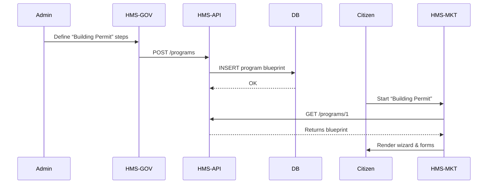

# Chapter 5: Program / Protocol

In [Chapter 4: HMS-API (Backend API)](04_hms_api__backend_api__.md) we saw how every portal talks to the same backend. Now let’s define the **Program/Protocol**—the blueprint that turns an abstract service (like issuing permits) into a concrete multi-step workflow.

---

## 1. Motivation & Central Use Case

**Problem:** Many government services (building permits, benefit disbursement, business licensing) involve a sequence of steps, branching logic, and forms. If you hard-code each flow in your portal, you’ll end up with scattered, hard-to-update code.

**Use Case Example:**  
The “Building Permit” service typically follows:
1. Citizen submits an application form.  
2. System runs a zoning check (approved/rejected).  
3. If approved, schedule a site inspection.  
4. Issue the permit or request corrections.  

By defining this as a **Program**, administrators in [HMS-GOV](01_hms_gov__admin_gov_portal__.md) can tweak steps or rules in real time, and citizens in [HMS-MKT](02_hms_mkt__citizen_portal__.md) simply execute the same flow without extra coding.

---

## 2. Key Concepts

1. **Program/Protocol**  
   Think of it as a “service recipe” or blueprint that lists each stage of a government service.

2. **Steps**  
   Ordered phases (e.g., `apply`, `zoningCheck`, `inspection`, `issuePermit`).

3. **Decision Points**  
   Branches driven by data (e.g., pass/fail zoning approval).

4. **Data Fields**  
   Form inputs required at each step (owner name, address, site plans).

5. **Workflow Modules**  
   Small code units in **HMS-API** that implement one stage (validate application, run checks, send notifications).

---

## 3. Using a Program in HMS-GOV & HMS-MKT

### 3.1 Admin: Defining a Program in HMS-GOV

In the admin portal you fill a form or upload JSON like this:

```js
// src/pages/CreateProgram.vue (simplified)
const buildingPermitProgram = {
  name: "Building Permit",
  steps: [
    { id: "apply",     label: "Submit Application", fields: ["owner","address","plans"] },
    { id: "zoningCheck", label: "Zoning Check",    decisionField: "approved" },
    { id: "inspection", label: "Site Inspection",  fields: ["inspector","date"] },
    { id: "issuePermit", label: "Issue Permit" }
  ]
}
await this.$api.post('/programs', buildingPermitProgram)
// Now the blueprint is stored in HMS-API
```

Every field you enter becomes part of the live workflow.

### 3.2 Citizen: Executing a Program in HMS-MKT

In the citizen portal you fetch and run the same blueprint:

```js
// src/pages/StartProgram.vue
const program = await this.$api.get('/programs/1')
this.steps = program.steps
// Render a wizard component with those steps
```

```vue
<!-- src/components/ProgramWizard.vue -->
<template>
  <div v-for="step in steps" :key="step.id">
    <h3>{{ step.label }}</h3>
    <!-- auto-render form fields or decision UI -->
  </div>
</template>
```

The user simply follows each step in order—no extra coding needed per service.

---

## 4. What Happens Under the Hood



---

## 5. Internal Implementation

### 5.1 Program Model

File: `hms-api/src/models/program.js`

```js
// A minimal Program schema
export const ProgramSchema = {
  id: String,
  name: String,
  steps: [
    // each step has: id, label, optional fields[], optional decisionField
  ]
}
```

This schema lives in the database and defines the shape of every program.

### 5.2 Workflow Modules

Each step corresponds to a module:

File: `hms-api/src/modules/applicationModule.js`

```js
export function runApplyStep(application) {
  // Ensure required fields are present
  for (let f of application.step.fields || []) {
    if (!application.data[f]) {
      throw new Error(`${f} is required`)
    }
  }
  // Save data and advance
  application.advance()
}
```

File: `hms-api/src/modules/zoningModule.js`

```js
export function runZoningCheck(application) {
  const ok = checkZone(application.data.address)
  application.decision = ok ? 'approved' : 'rejected'
  application.advance()
}
```

### 5.3 Orchestration Service

File: `hms-api/src/services/programService.js`

```js
export async function startProgram(programId, userId) {
  const program = await db('programs').where({ id: programId }).first()
  // Create a new application record at the first step
  return db('applications').insert({
    programId, userId, currentStep: program.steps[0].id
  })
}
```

The service picks the right module for each step, runs it, then updates `currentStep` until completion.

---

## 6. Conclusion & Next Steps

You’ve learned how a **Program/Protocol**:

- Serves as a reusable blueprint for any multi-step service  
- Is defined by administrators in [HMS-GOV](01_hms_gov__admin_gov_portal__.md)  
- Is executed by citizens in [HMS-MKT](02_hms_mkt__citizen_portal__.md)  
- Maps to models and workflow modules in [HMS-API](04_hms_api__backend_api__.md)

Next up, we’ll see how rules and eligibility checks are enforced automatically with the [Chapter 6: Policy Engine](06_policy_engine_.md). Stay tuned!

---

Generated by [AI Codebase Knowledge Builder](https://github.com/The-Pocket/Tutorial-Codebase-Knowledge)