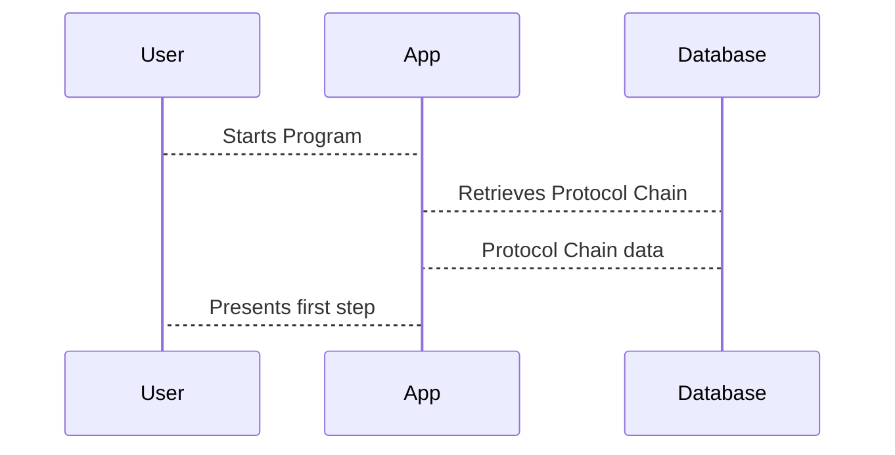

# Chapter 5: Protocol Chains

In the last chapter, [Personal Chains](04_personal_chains.md), we learned how to track a user's individual progress through a program. Now, let's dive into how the steps within a [Protocol](03_protocols.md) are organized and executed. This is where *Protocol Chains* come in.

Imagine Alice created a "Morning Yoga" Protocol.  This protocol includes several steps: "Sun Salutations," "Warrior Pose," "Triangle Pose," and a final "Relaxation."  How do we define the order of these steps and what happens after each step is completed?  A Protocol Chain defines this flow, like a flowchart for the workout routine.

## What is a Protocol Chain?

A Protocol Chain represents the flow of a [Protocol](03_protocols.md). It's like a flowchart, defining the order and conditions for executing each [Protocol Module](06_protocol_modules.md) within a Protocol. They handle branching logic and jumps between steps.  Think of it like a choose-your-own-adventure book.  Based on your choices (or in our case, the completion of a step), you're directed to a different page (or the next step in the Protocol).

## Key Concepts in a Protocol Chain

* **Modules:** These are the individual steps within the Protocol, like "Sun Salutations" in Alice's "Morning Yoga" Protocol.  These are represented by [Protocol Modules](06_protocol_modules.md).
* **Order:** The Protocol Chain defines the order in which these modules are executed.
* **Conditions:**  Protocol Chains can include branching logic. For example, after "Sun Salutations," the Protocol might ask, "Are you feeling energized?" If yes, proceed to "Warrior Pose." If no, skip to "Relaxation."
* **Flow:** The overall path a user takes through the Protocol, determined by the order and conditions.

## Creating a Protocol Chain

Let's simplify Alice's "Morning Yoga" Protocol Chain.  We'll define a simple sequence: "Sun Salutations" -> "Warrior Pose" -> "Relaxation."

```php
// File: factories/Core/Protocol/ProtocolChainFactory.php

use App\Models\Core\Protocol\ProtocolChain;

// Create the "Sun Salutations" step
$sunSalutations = ProtocolChain::factory()->create([
    'protocol_id' => 1, // Alice's "Morning Yoga" Protocol ID
    'name' => 'Sun Salutations',
    // ... other fields ...
]);

// Create the "Warrior Pose" step
$warriorPose = ProtocolChain::factory()->create([
    'protocol_id' => 1,
    'name' => 'Warrior Pose',
    'parent_id' => $sunSalutations->node_id, // Link to the previous step
    // ... other fields ...
]);

// Create the "Relaxation" step
$relaxation = ProtocolChain::factory()->create([
    'protocol_id' => 1,
    'name' => 'Relaxation',
    'parent_id' => $warriorPose->node_id, // Link to the previous step
    // ... other fields ...
]);
```

This code creates three entries in the `protocol_chains` table, linking them together using the `parent_id` and `node_id` fields.  This establishes the flow of the Protocol.

## Under the Hood

When a [User](01_users.md) starts a [Program](02_programs.md), the application retrieves the associated Protocol Chain.  It then guides the user through the steps defined in the chain.



The `protocol_chains` table stores the information about each step in the chain.  The `CreateProtocolChainsTable` migration file defines the structure of this table.

```php
// File: migrations/2022_06_08_091325_create_protocol_chains_table.php
// ... code to create the protocol_chains table ...
```

## Conclusion

In this chapter, we learned about Protocol Chains, which define the flow and execution of steps within a Protocol. We saw how Protocol Chains are created and how they link together different modules. In the next chapter, we'll explore [Protocol Modules](06_protocol_modules.md), the individual building blocks of a Protocol.


---

Generated by [AI Codebase Knowledge Builder](https://github.com/The-Pocket/Tutorial-Codebase-Knowledge)