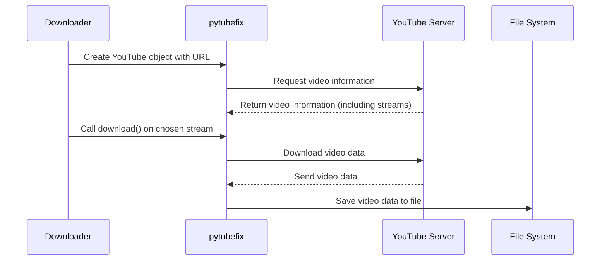

# Chapter 5: pytubefix Library

In the previous chapter, [pyktok Library](04_pyktok_library.md), we learned how to easily download TikTok videos. Now, let's explore how to download videos from YouTube using the `pytubefix` library.  Think of `pytubefix` as a specialized toolkit designed for working with YouTube, just like `pyktok` is for TikTok.

## What Problem Does the `pytubefix` Library Solve?

Imagine you want to download your favorite music video from YouTube.  You could try to figure out how YouTube stores its videos and how to download them directly, but that's complicated! The `pytubefix` library simplifies this process. It's like a specialized downloader tool designed specifically for YouTube.

## Key Concepts

1. **`YouTube` Object:** This is the core of `pytubefix`. You create a `YouTube` object, giving it the video URL. This object then lets you access information about the video and download it. Think of it as your personal YouTube assistant.

2. **Streams:** YouTube videos can have different streams, representing different qualities (like 720p, 1080p) and formats (like MP4, WebM). `pytubefix` lets you choose which stream you want to download.  Think of streams as different versions of the same video.

3. **Download:**  Once you've chosen a stream, you can download it using the `download()` function. This function saves the video to your computer.

## Using `pytubefix`

Here's a simplified example of how to download an audio stream from a YouTube video:

```python
from pytubefix import YouTube

video_url = "https://www.youtube.com/watch?v=dQw4w9WgXcQ" # Example URL (Never Gonna Give You Up)
yt = YouTube(video_url) # Create a YouTube object
ys = yt.streams.get_audio_only() # Get the audio-only stream
ys.download(filename="never_gonna_give_you_up.mp4") # Download the audio stream
# The audio will be saved as never_gonna_give_you_up.mp4 (it will be an audio file despite the .mp4 extension)
```

This code creates a `YouTube` object, gets the audio-only stream, and downloads it to a file named "never_gonna_give_you_up.mp4".

## Internal Implementation

Here's a simplified sequence diagram showing how `pytubefix` works:



The `Downloader` creates a `YouTube` object with the video URL. `pytubefix` then requests information about the video from YouTube's servers.  After receiving the information, including available streams, the `Downloader` chooses a stream and calls the `download()` function. `pytubefix` then downloads the video data from YouTube's servers and saves it to a file.

### Code Example: `lib/youtube.py`

```python
from pytubefix import YouTube
# ... (other imports)

class Youtube:
    # ... (other code)

    def download(self):
        # ... (other code)
        yt = YouTube(self.url) # Create a YouTube object
        ys = yt.streams.get_audio_only() # Get the audio stream
        ys.download(...) # Download the audio
        # ... (convert to mp3 and upload to [S3Uploader](07_s3uploader.md))
        return self.result
```

This simplified code snippet shows how the `Youtube` class in our project uses `pytubefix` to download YouTube videos. It creates a `YouTube` object, gets the audio-only stream, and downloads it.  It then converts the downloaded file to MP3 and uploads it to S3 using the [S3Uploader](07_s3uploader.md).

## Conclusion

In this chapter, we explored the `pytubefix` library, a powerful tool for downloading YouTube videos. We learned about the `YouTube` object, streams, and the `download()` function. Next, we'll look at the [instaloader Library](06_instaloader_library.md), which is used for downloading Instagram content.


---

Generated by [AI Codebase Knowledge Builder](https://github.com/The-Pocket/Tutorial-Codebase-Knowledge)