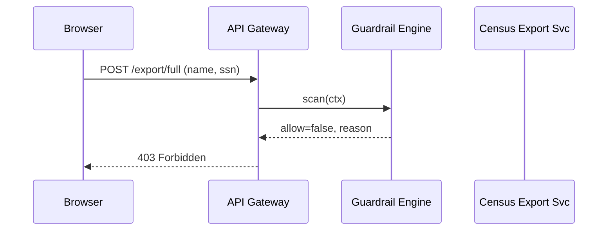

# Chapter 5: Security, Privacy & Legal Guardrails (HMS-ESQ + Platform Controls)

*(continuing from [Identity & Access Management (IAM)](04_identity___access_management__iam__.md))*  

---

## 1. Why Do We Need “Seat-Belts & Airbags” for Code?

Picture the U.S. Census Bureau launching a **“Move-Out Notification”** API.  
A city housing agency wants daily exports so it can plan school bus routes.  
Great—until someone accidentally asks for *full SSNs* instead of the redacted last-4 digits!

A single slip could violate:

* The Privacy Act of 1974  
* OMB M-23-22 Zero-Trust memo  
* Multiple state data-sharing compacts  

**HMS-ESQ** (Ethical & Statutory Qualifier) is our built-in censor:  

1. It reads every API call or AI-agent action **before** it runs.  
2. It compares the request to machine-readable rules derived from statutes, executive orders, and agency policy.  
3. It either lets the request through, auto-redacts, or blocks with an audit trail.

Result: developers stay productive; agencies stay compliant.

---

## 2. Key Concepts (Zero-Jargon Cheat-Sheet)

| Term | Mall Analogy | One-Line Meaning |
|------|--------------|------------------|
| Guardrail | Speed bump at parking lot exit | A rule that forces you to slow down & stay legal. |
| HMS-ESQ Rule | City traffic ordinance in machine form | JSON or Rego snippet describing what is allowed. |
| Scan Engine | Parking attendant | Reads each request and applies the rules. |
| Remediation | Attendant confiscates fireworks | Auto-redact, mask, or fully block the request. |
| Audit Ledger | Security camera footage | Tamper-proof log of every allow/deny decision. |

---

## 3. A 5-Minute “Hello Guardrail” Walk-Through

We’ll protect an endpoint `/census/export/full` so only **hashed SSNs** leave the building.

### 3.1 Define a Simple ESQ Rule (8 lines)

`rules/pii.json`

```json
{
  "id": "no-clear-ssn-export",
  "appliesTo": "GET /census/export/*",
  "forbid": ["ssn"],
  "remediation": "hash",
  "legalBasis": ["Privacy Act §3(a)"]
}
```

*Explanation*  
• For any export route, raw `ssn` fields are forbidden.  
• If detected, replace them with a SHA-256 hash.

### 3.2 Plug the Guardrail into the Gateway (16 lines)

`gateway/guardrail.js`

```js
import { scan } from '../hms-esq/engine.js';

export async function guardrail(req, res, next) {
  // 1. Gather context
  const ctx = {
    route: `${req.method} ${req.path}`,
    body:  req.body,
    user:  req.user        // set by IAM middleware
  };

  // 2. Ask ESQ engine for a verdict
  const verdict = await scan(ctx);   // { allow, redactedBody, reason }

  // 3. Act on the verdict
  if (!verdict.allow) {
    return res.status(403).json({ error: verdict.reason });
  }
  if (verdict.redactedBody) req.body = verdict.redactedBody;
  next();
}
```

*What happened?*  
`scan` enforces *all* applicable rules and tells us to block, redact, or pass through.

### 3.3 Update the Gateway Pipeline

`gateway/index.js` (snippet)

```js
app.post('/census/export/full',
  verifyToken,           // from Chapter 4
  guardrail,             // ⬅️ new!
  (req, res) => res.proxy('http://localhost:4005' + req.originalUrl)
);
```

Run the flow:

```bash
curl -H "Authorization: Bearer $token" \
     -d '{"fields":["name","ssn"]}' \
     http://localhost:3000/census/export/full
```

Output:

```json
{
  "error": "Rule no-clear-ssn-export violated: ssn must be hashed"
}
```

Try again with compliant fields:

```bash
-d '{"fields":["name","ssn_hash"]}'
```

Now the request passes and the export service receives a safe payload.

---

## 4. What Happens Under the Hood?



---

## 5. Peeking Inside HMS-ESQ (Beginner Edition)

### 5.1 Engine Skeleton (18 lines)

`hms-esq/engine.js`

```js
import rules from './rules/*.json'  assert { type: 'json' };

export async function scan(ctx) {
  for (const r of rules) {
    if (!ctx.route.match(toRegex(r.appliesTo))) continue;

    const hit = r.forbid.find(f => ctx.body?.fields?.includes(f));
    if (hit) {
      // Redact or block
      if (r.remediation === 'hash')
        ctx.body.fields = ctx.body.fields.map(f => f === hit ? `${hit}_hash` : f);

      await log(ctx, r.id, hit);      // audit trail
      return { allow: r.remediation === 'hash', redactedBody: ctx.body,
               reason: `Rule ${r.id} violated: ${hit} must be hashed` };
    }
  }
  return { allow: true };
}

/* helper */ const toRegex = pat => new RegExp('^' + pat.replace('*', '.*') + '$');
```

*Highlights*  
1. Loads every `*.json` rule on startup.  
2. Loops until it finds a match.  
3. Either **hashes** the field or **blocks** the request.  
4. Calls `log` which writes to the immutable ledger (implementation skipped).

### 5.2 The Immutable Audit Ledger (pseudo-code)

```js
async function log(ctx, ruleId, targetField) {
  /* push to HMS-OPS or blockchain-style store */
  publish('audit', {
    ts: Date.now(),
    user: ctx.user.sub,
    rule: ruleId,
    field: targetField,
    route: ctx.route
  });
}
```

Every decision is now provable for FOIA or Inspector General requests.

---

## 6. Common Guardrail Recipes

| Recipe | 1-Line Purpose | Example Rule Snippet |
|--------|---------------|----------------------|
| PII Redaction | Remove phone or email before leaving domain | `{ "forbid":["phone"], "remediation":"mask" }` |
| Export Control | Block export of encryption tech to foreign IPs | `{ "ipNotIn":["US"], "action":"block" }` |
| Budget Cap | Prevent AI agent from spending >$500 on cloud GPUs | `{ "limit":{"usd":500} }` |
| Section 508 | Ensure PDFs are tagged for accessibility | `{ "fileType":"pdf", "require":["pdf/UA"] }` |

---

## 7. How Does ESQ Get Its Rules?

1. **Source**: Policy analysts feed statutes into the [Policy & Legislative Engine](08_policy___legislative_engine__hms_cdf__.md).  
2. **Conversion**: The engine emits machine-readable snippets (`r.forbid`, `r.require`).  
3. **Distribution**: Rules are versioned and pushed to ESQ nodes every night.  

This means developers never translate law by hand—reducing errors and politics.

---

## 8. Frequently Asked Beginner Questions

**Q: Does ESQ slow down my API?**  
A: A rule check is just JSON + regex matching—~1-2 ms per request. Far faster than database I/O.

**Q: What if two rules conflict?**  
A: ESQ uses a simple precedence model: *block* > *redact* > *allow*. The stricter rule wins and both decisions are logged.

**Q: Can I write rules in code instead of JSON?**  
A: Advanced users can write Rego (OPA) or JavaScript plugins, but JSON covers 90 % of needs and is easier for policy staff to review.

---

## 9. Recap & Next Steps

You’ve learned how HMS-ESQ:

• Reads every request like a vigilant compliance officer.  
• Enforces privacy, security, and legal mandates automatically.  
• Creates an immutable audit trail for investigators and auditors.

Now that our data exits are safe, we need a trustworthy *home* for the data itself.  
In the next chapter we’ll tour the **Data Repository & Governance (HMS-DTA)**—schemas, lineage, and retention controls.

👉 Continue to [Data Repository & Governance (HMS-DTA)](06_data_repository___governance__hms_dta__.md)

---

Generated by [AI Codebase Knowledge Builder](https://github.com/The-Pocket/Tutorial-Codebase-Knowledge)