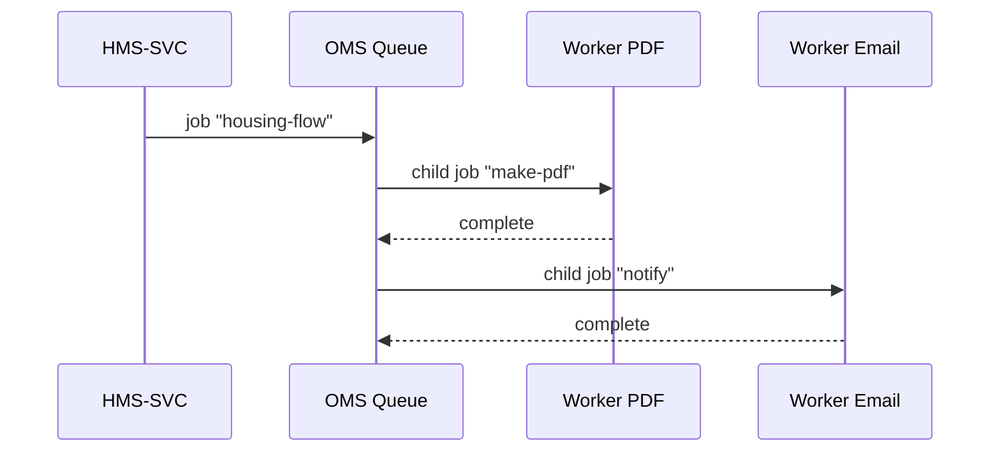

# Chapter 5: Service Orchestration & Task Queues (HMS-OMS)

*(coming from [Governance API Layer (HMS-SVC / HMS-API)](04_governance_api_layer__hms_svc___hms_api__.md))*  

---

> “One clerk stamps your form, another prints it, a third mails it—  
> HMS-OMS makes sure each clerk works in the right order and never forgets a step.”

---

## 1. Why do we need an “invisible back-office”?

Imagine the **Office of Housing** rolls out an online *Housing Benefit Application*:

1. A citizen clicks **Submit**.  
2. HMS-GOV must:
   1. Generate a PDF of the application.  
   2. Run an income eligibility check.  
   3. Process a $0.00 verification payment (card on file).  
   4. Email a receipt to the applicant.  

Doing all four steps **inside the HTTP request** would freeze the browser for minutes and time-out.  
Instead, HMS-SVC quickly replies “✅ Received” and hands the heavy lifting to **HMS-OMS**—our *service orchestrator* and *task queue*.

---

## 2. Key concepts (in plain English)

| Word | Think of it as… |
|------|-----------------|
| Task | A single to-do (e.g., “convert HTML → PDF”). |
| Queue | A line where tasks wait their turn. |
| Worker | A robot that pulls a task from the line and does it. |
| Orchestrator | The choreographer that says which task happens next. |
| Retry | “Try again later” if a task stumbles. |
| Dead-Letter | The penalty box for tasks that fail too many times. |

That’s really it—five Lego pieces you can click together.

---

## 3. How to add a task (the 60-second client view)

### 3.1 Enqueue from HMS-SVC

```js
// services/housing/apply.js  (17 lines)
import { queue } from '../../oms/client.js'

export async function applyForHousing(appData) {
  const id = await db.apps.insert(appData)          // normal DB save
  await queue.add('housing-flow', { appId: id })    // 1 line: enqueue
  return { status: 'pending', id }
}
```

Explanation  
• After saving the form, we add a **housing-flow** job with just the new record’s `appId`.  
• `queue.add()` returns instantly → the API can answer the citizen in < 200 ms.

---

### 3.2 What the citizen sees

```
Application submitted!  
Confirmation #HB-1042 will arrive by email.
```

Behind the curtain, four tasks have just entered the queue.

---

## 4. The worker side (robots doing the work)

### 4.1 A PDF worker

```js
// workers/pdfWorker.js  (19 lines)
import { Worker } from 'bullmq'
import { createPdf } from './lib/pdf.js'

new Worker('pdf', async job => {
  const { appId } = job.data
  const html = await db.apps.getHtml(appId)
  const pdf  = await createPdf(html)
  await db.files.save(appId, pdf)
})
```

Explanation  
1. Connects to the **pdf** queue.  
2. Converts HTML → PDF.  
3. Saves the file.  
If something throws, BullMQ will re-queue the task automatically (default 3 tries).

### 4.2 An email worker

```js
// workers/emailWorker.js
new Worker('email', async job => {
  sendMail(job.data.to, job.data.subject, job.data.body)
})
```

Each worker is tiny—easy to read, deploy, and scale.

---

## 5. Choreographing multi-step flows

We still need the *order*: PDF → eligibility → payment → email.

### 5.1 A micro-orchestrator

```js
// workers/housingFlow.js  (18 lines)
import { QueueScheduler, Worker, Queue } from 'bullmq'
const pdfQ   = new Queue('pdf')
const ruleQ  = new Queue('rules')
const payQ   = new Queue('payment')
const mailQ  = new Queue('email')

new QueueScheduler('housing-flow')   // enables retries & delayed jobs

new Worker('housing-flow', async job => {
  const { appId } = job.data
  await pdfQ.add('make-pdf',   { appId })
  await ruleQ.add('check',     { appId })
  await payQ.add('charge',     { appId })
  await mailQ.add('notify',    { to:getEmail(appId), subject:'Receipt', body:'...' })
})
```

Explanation  
• The *housing-flow* worker only **enqueues** the children in order.  
• Each child queue can scale horizontally—1 worker or 100.

---

## 6. What happens under the hood?



(Eligibility & payment workers omitted for brevity.)

---

## 7. Monitoring & retries

HMS-OMS ships a **web dashboard** (`/oms`) where admins can:

* Watch live queues (green = flowing, red = stuck).  
* Click a failed task → see error + stack trace.  
* Press **Retry**, **Pause**, or **Promote** (run now).  

If a PDF printer crashes, the task auto-retries after 30 s, up to 5 times.  
After 5 failures it lands in the **dead-letter** queue for human eyes.

---

## 8. Minimal setup guide

1. Add Redis (used by BullMQ).  
   ```bash
   docker run -p 6379:6379 redis:7
   ```
2. Install packages:  
   ```bash
   npm i bullmq ioredis
   ```
3. Start workers (each in its own tiny Node process):  
   ```bash
   node workers/pdfWorker.js
   node workers/housingFlow.js
   # etc.
   ```

That’s enough to run thousands of background jobs per minute on a laptop.

---

## 9. How HMS-OMS connects to other layers

```
Browser → HMS-API → HMS-SVC ─┐
                            │  enqueue()
                            ▼
                       HMS-OMS (queues)
                            │
                +-----------+-----------+
                |           |           |
           PDF Worker   Payment   Email Worker
```

The **API layer** you built in Chapter 4 stays fast, because slow or CPU-heavy tasks move into OMS.  
Future chapters (e.g., [AI Representative Agent](06_ai_representative_agent__hms_agt___hms_agx__.md)) will also drop tasks—like “summarize 500 pages”—into these same queues.

---

## 10. Recap

You learned:

✓ The pain HMS-OMS solves: keep HTTP snappy while big jobs run elsewhere.  
✓ Five basic pieces: Task, Queue, Worker, Orchestrator, Retry.  
✓ How to enqueue a job from HMS-SVC in **one line**.  
✓ How to write tiny, focused workers.  
✓ How multi-step orchestration keeps tasks in order.  
✓ Where to watch, retry, or debug tasks in the dashboard.

In the next chapter we’ll give those queues some **brains**—an AI agent that can read tasks, decide next steps, and even draft letters.  
Fly on to [AI Representative Agent (HMS-AGT / HMS-AGX)](06_ai_representative_agent__hms_agt___hms_agx__.md).

---

Generated by [AI Codebase Knowledge Builder](https://github.com/The-Pocket/Tutorial-Codebase-Knowledge)