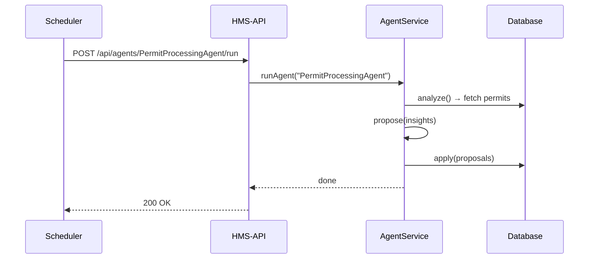

# Chapter 5: Specialized AI Agents (HMS-A2A)

Welcome back! In [Chapter 4: AI-Facilitated Process Optimization](04_ai_facilitated_process_optimization_.md) we built a service that loops through feedback, finds bottlenecks, and applies fixes. Now, let’s zoom in on **Specialized AI Agents (HMS-A2A)**—autonomous modules that act like expert consultants inside your agency.

---

## 1. Why Specialized AI Agents?

Imagine the U.S. Fleet Forces Command (USFFC) needs to optimize ship maintenance schedules every day. Instead of a human team running reports, a **Specialized AI Agent** can:

1. Fetch last night’s maintenance logs.
2. Analyze delays on each vessel.
3. Propose revised schedules.
4. Automatically update the priority table.
5. Learn over time which proposals actually improved throughput.

This agent works 24/7, learns from its own actions, and frees human staff for higher-level decisions.

### Central Use Case

A **Permit Processing Agent** at the Consumer Financial Protection Bureau:

1. Every morning, it grabs all pending permit requests.
2. Calculates average review time per region.
3. Flags regions with slow approvals.
4. Reorders the priority queue in the database.
5. Emails a summary to supervisors.

With HMS-A2A, you simply register this agent and call it—no manual scripting needed each day.

---

## 2. Key Concepts

1. **Agent Definition**  
   A small module with three functions: `analyze()`, `propose()`, `apply()`.

2. **Autonomy**  
   Agents run on a schedule or on demand, without manual intervention.

3. **Learning Loop**  
   After each run, agents record outcomes (e.g., did throughput improve?) and adjust thresholds or logic.

4. **Integration Points**  
   Agents can call any backend service ([Chapter 13](13_backend_services__hms_svc___hms_api___hms_mkt__.md)) or DB to fetch data and write updates.

---

## 3. Using a Specialized AI Agent

Here’s how to define and run a “PermitProcessingAgent” in under 20 lines.

```js
// src/agents/permitProcessing.js
module.exports = {
  name: "PermitProcessingAgent",
  async analyze() {
    // Fetch pending permits and compute avg review times
  },
  propose(insights) {
    // Return list of regions to prioritize
  },
  async apply(proposals) {
    // Update DB priority flags
  }
};
```
Explanation:
- `analyze()` gathers raw data.
- `propose()` returns recommendations.
- `apply()` writes changes back.

To run it on demand:

```js
// src/routes/agents.js
const express = require('express');
const { runAgent } = require('../services/agentService');
const router = express.Router();

router.post('/:agentName/run', async (req, res) => {
  await runAgent(req.params.agentName);
  res.send('Agent run complete');
});

module.exports = router;
```

Explanation:
- HTTP `POST /api/agents/PermitProcessingAgent/run` kicks off the agent.
- `runAgent()` handles the full cycle.

---

## 4. Under the Hood: Sequence Diagram



1. The scheduler or user calls the API endpoint.  
2. `AgentService` loads the agent module.  
3. Runs `analyze()`, `propose()`, then `apply()`.  
4. Returns success.

---

## 5. Deep Dive: `agentService.js`

Let’s peek inside `src/services/agentService.js`:

```js
// src/services/agentService.js
const fs = require('fs');
async function runAgent(name) {
  // Dynamically load the agent module
  const agent = require(`../agents/${name}.js`);
  const insights = await agent.analyze();
  const proposals = agent.propose(insights);
  await agent.apply(proposals);
}
module.exports = { runAgent };
```

Explanation:
- We `require()` the agent by name.
- Call its three lifecycle methods in order.

### 5.1 analyze()

```js
// inside src/agents/permitProcessing.js
async analyze() {
  // Very simple DB call
  return db.query('SELECT region, AVG(review_time) AS avgTime FROM permits GROUP BY region');
}
```
- Returns an array of objects like `{ region: 'East', avgTime: 48 }`.

### 5.2 propose()

```js
propose(insights) {
  // Recommend regions above 72-hour threshold
  return insights
    .filter(i => i.avgTime > 72)
    .map(i => ({ region: i.region, action: 'boostPriority' }));
}
```
- Converts analytics into a list of actions.

### 5.3 apply()

```js
async apply(proposals) {
  for (const p of proposals) {
    await db.query(
      'UPDATE permits SET priority = priority + 1 WHERE region = $1',
      [p.region]
    );
  }
}
```
- Applies the proposed changes back to the database.

---

## 6. Why This Matters

- **Modularity:** Each agent is self-contained—easy to add or update.  
- **Scalability:** Run dozens of agents for different domains (finance, transport, health).  
- **Continuous Learning:** Plug in a logging system to capture outcomes and refine agent logic over time.

---

## Conclusion

You’ve learned how to build **Specialized AI Agents (HMS-A2A)** that act like expert consultants: analyzing, proposing, and applying optimizations on their own. Next, we’ll layer in human oversight so staff can review or override agent actions when necessary:

[Chapter 6: Human-In-The-Loop Override](06_human_in_the_loop_override_.md)

---

Generated by [AI Codebase Knowledge Builder](https://github.com/The-Pocket/Tutorial-Codebase-Knowledge)