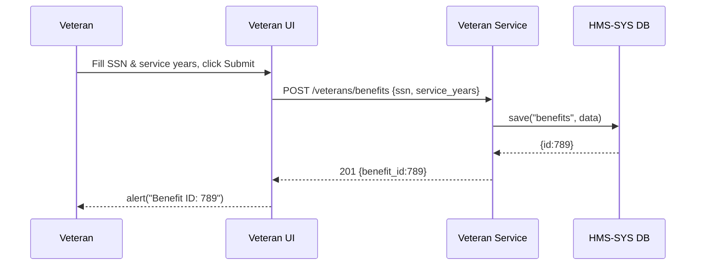

# Chapter 5: Specialized Domain Interfaces

In [Chapter 4: Frontend Interface (HMS-MFE)](04_frontend_interface__hms_mfe__.md), we built a generic container and shared UI components that any team can use. Now let’s zoom in on **Specialized Domain Interfaces**—tailor-made UI and service modules for specific sectors like healthcare, education, or finance. Think of separate counters in a government hall: one for veteran benefits, another for small business grants. Each interface “speaks the domain’s language” with custom forms, workflows, and validations.

---

## 1. Motivation: Why Specialized Domain Interfaces?

Imagine the **Department of Veterans Affairs** needs a front desk just for veteran benefit applications. They collect service records, discharge papers, and proof of dependency. Meanwhile, the **Small Business Administration** has a completely different intake: business plans, financial projections, and tax returns. 

If both offices used the same generic form, every veteran would see fields about business revenue, and every entrepreneur would see “branch of service” questions. That’s confusing. Instead, we build:

- A **Veteran Benefits Interface** with SSN, service years, discharge type.  
- A **Small Business Grant Interface** with revenue, years in business, % ownership.  

Each counter speaks its visitor’s language and enforces only the rules that matter.

---

## 2. Key Concepts

1. **Domain UI**  
   A micro-frontend or web page tailored to one government domain (health, education, veterans).  

2. **Domain Service**  
   A backend module (microservice or API routes) that validates and processes only that domain’s data.  

3. **Custom Forms & Workflows**  
   Bespoke form fields, step-by-step wizards, and approval flows unique to the domain.  

4. **Domain-Specific Validation**  
   Business rules that only apply to that sector (e.g., “service_years ≥ 1” for veterans, “years_in_business ≥ 2” for SBA).

---

## 3. Using a Specialized Interface: Veteran Benefits Example

### 3.1 Build the Veteran Benefits UI Micro-Frontend

```jsx
// file: src/veteran/VeteranForm.js
import React, {useState} from 'react'
import { Input, Button } from '@hms/shared-ui'

export default function VeteranForm() {
  const [ssn, setSsn] = useState('')
  const [years, setYears] = useState(0)

  const submit = () => {
    fetch('/veterans/benefits', {
      method: 'POST', headers:{'Content-Type':'application/json'},
      body: JSON.stringify({ ssn, service_years: years })
    })
    .then(r => r.json())
    .then(res => alert(`Benefit ID: ${res.benefit_id}`))
  }

  return (
    <div>
      <h2>Veteran Benefits Application</h2>
      <Input label="SSN" value={ssn} onChange={e=>setSsn(e.target.value)} />
      <Input label="Years of Service" type="number"
             value={years} onChange={e=>setYears(+e.target.value)} />
      <Button onClick={submit}>Submit</Button>
    </div>
  )
}
```

Explanation:
- We import our shared `<Input>` and `<Button>` from **HMS-MFE**.  
- On submit, we POST only the veteran-specific fields to `/veterans/benefits`.  

### 3.2 Expose the UI in the Container

```jsx
// file: src/veteran/index.js
import ReactDOM from 'react-dom'
import { registerMFE } from '@hms/mfe-container'
import VeteranForm from './VeteranForm'

registerMFE({
  name: 'veteran-benefits',
  mount: el => ReactDOM.render(<VeteranForm/>, el)
})
```

Explanation:
- The container will load this UI only when the “Veteran Benefits” counter is open.

### 3.3 Implement the Veteran Backend Service

```python
# file: services/veteran_service.py
from flask import Blueprint, request, jsonify
from hms_sys.db import HMSDatabase

vets = Blueprint('vets', __name__)
db = HMSDatabase.connect("veteran_db")

@vets.route('/benefits', methods=['POST'])
def apply_benefits():
    data = request.json
    errors = []
    if not data.get('ssn'): errors.append("SSN is required.")
    if data.get('service_years', 0) < 1:
        errors.append("At least 1 year of service required.")
    if errors:
        return jsonify({'errors': errors}), 400

    rec = db.save('benefits', data)
    return jsonify({'benefit_id': rec['id']}), 201
```

Explanation:
- This service only handles veteran benefits data.  
- We enforce domain-specific rules: SSN present, minimum service years.

---

## 4. Under the Hood: What Happens When a Veteran Submits



1. The veteran fills out the custom form in their browser.  
2. The **Veteran UI** posts data to the **Veteran Service** at `/veterans/benefits`.  
3. The service validates the data, saves it via [HMS-SYS](01_core_system_platform__hms_sys__.md), and returns an ID.  
4. The UI shows a confirmation with the new benefit ID.

---

## 5. Internal Composition of Domain Services

Sometimes you’ll host multiple domain services behind one gateway. Here’s how you might register them all:

```python
# file: services/__init__.py
from flask import Flask
from .veteran_service import vets
from .education_service import edu

app = Flask(__name__)
app.register_blueprint(vets, url_prefix='/veterans')
app.register_blueprint(edu, url_prefix='/education')
```

Explanation:
- We mount each domain’s `Blueprint` under a domain-specific URL.  
- The gateway routes `/veterans/*` to veteran code and `/education/*` to education code.

---

## 6. Conclusion

In this chapter, you learned how **Specialized Domain Interfaces** let you:

- Build **domain-specific UIs** that show only relevant forms and labels.  
- Implement **backend services** that enforce unique business rules.  
- Keep each interface as focused as its “counter” in a government building.

With these patterns, you can roll out tailored experiences for healthcare, finance, education, and beyond—each speaking the right language to its users.

Up next is the **Gov/Admin Platform**, where administrators manage these services in one place:

[Chapter 6: Gov/Admin Platform (HMS-GOV)](06_gov_admin_platform__hms_gov__.md)

---

Generated by [AI Codebase Knowledge Builder](https://github.com/The-Pocket/Tutorial-Codebase-Knowledge)