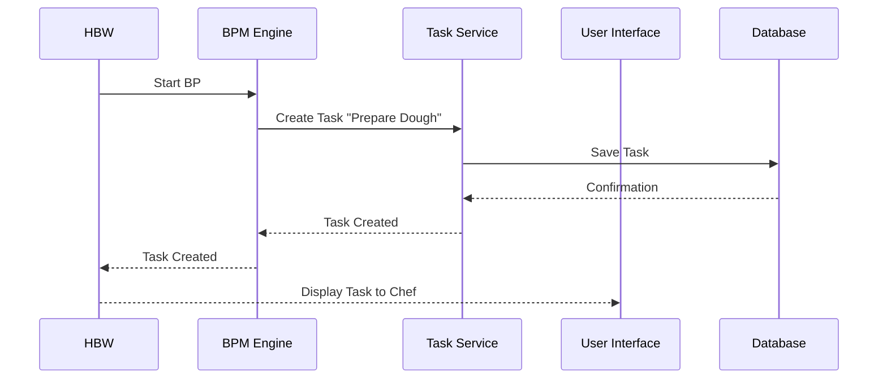

# Chapter 5: Task

Coming from learning about [Business Process (BP)](04_business_process__bp_.md), let's now explore the individual steps within those processes. Remember Alice's pizza order and the steps involved like "Prepare Dough", "Add Toppings", and "Bake"?  Each of these steps is represented as a `Task` in HMS-OMS.

## What is a Task?

A `Task` is a single unit of work within a [Business Process (BP)](04_business_process__bp_.md). Think of it like a single instruction in a recipe.  Just as a recipe has instructions like "Mix flour and water", a BP has tasks like "Prepare Dough".  Each task is assigned to a [User](01_user.md) and requires them to complete a form or take some action.

## Alice's Pizza: Preparing the Dough

Let's focus on the "Prepare Dough" task in Alice's pizza order. This task is assigned to the chef.  The chef needs to know what kind of dough to prepare (e.g., thin crust, deep dish). This information is provided to the chef through a form associated with the task.

## Key Concepts

* **Assigned User:** The [User](01_user.md) responsible for completing the task. In our example, it's the chef.
* **Form:** A collection of fields that the assigned user needs to fill out.  For "Prepare Dough", the form might include a field for "Dough Type".  You'll learn more about forms in the [Hydra BPM Widget (HBW)](08_hydra_bpm_widget__hbw_.md) and [Custom Fields](07_custom_fields.md) chapters.
* **Status:**  Indicates whether the task is `to_execute`, `in_progress`, or `done`.

## Completing the Task

When the chef logs into HMS-OMS, they see the "Prepare Dough" task assigned to them.  They open the task and see the form.  They select the correct "Dough Type" based on Alice's order and mark the task as `done`.

## Under the Hood

When a [Business Process (BP)](04_business_process__bp_.md) is started, the BPM engine creates the first `Task` and assigns it to the appropriate [User](01_user.md).



The `HBW::Task` model (located in `hbw/app/models/hbw/task.rb`) represents tasks within the BPM engine.

```ruby
# hbw/app/models/hbw/task.rb (simplified)
task = HBW::Task.get_task_by_id(task_id)
```

This code retrieves a specific task from the BPM engine.

The `HBW::Form` model (located in `hbw/app/models/hbw/form.rb`) is used to retrieve the form associated with the task.

```ruby
# hbw/app/models/hbw/form.rb (simplified)
form = HBW::Form.fetch(task_id, entity_class)
```

This code retrieves the form for the given task.

## Conclusion

You've learned about the `Task` concept and how it represents individual steps within a [Business Process (BP)](04_business_process__bp_.md). You've seen how tasks are assigned to [User](01_user.md)s and how they interact with forms. Next, let's explore how user roles and permissions are managed within HMS-OMS by looking at [Profile](06_profile.md)s. [Next: Profile](06_profile.md)


---

Generated by [AI Codebase Knowledge Builder](https://github.com/The-Pocket/Tutorial-Codebase-Knowledge)