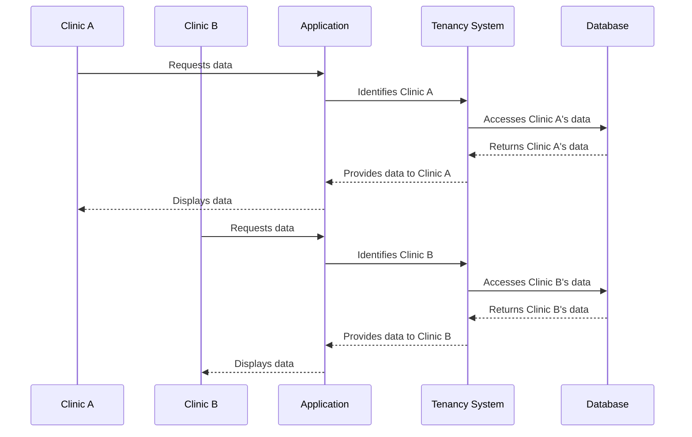

# Chapter 5: Tenancy

In the previous chapter, [Authentication (Auth)](04_authentication__auth__.md), we learned how to control who can access different parts of our application. Now, let's explore how to manage multiple separate instances of our application using *Tenancy*.

## The Use Case: Separate Clinics Using the Same App

Imagine you've built a fantastic health coaching application, and now multiple clinics want to use it.  You don't want Clinic A's data mixed up with Clinic B's data, right?  Tenancy solves this problem by creating isolated spaces for each clinic within your application.

## What Problem Does Tenancy Solve?

Without tenancy, you would need to create a completely separate copy of your application for each clinic. This would be a nightmare to maintain and update. Tenancy allows you to run a single application while keeping each clinic's data, users, and settings completely separate.

## Tenancy: The Apartment Building Analogy

Think of your application as a large apartment building. Each clinic is a tenant with its own apartment.  Each apartment has its own furniture, decorations, and residents (data, settings, and users).  While each apartment is separate, they all share the underlying infrastructure of the building (the application itself).

## Key Concepts

1. **Tenant:** A separate instance of your application, like a clinic.

2. **Data Isolation:** Each tenant's data is kept separate from other tenants' data.  Clinic A can't see Clinic B's patients or programs.

3. **Configuration:** Each tenant can have its own settings and configurations.  Clinic A might use a different payment gateway than Clinic B.

## Separate Clinics: Step-by-Step

Here's how tenancy works when Clinic A and Clinic B access the application:



## Under the Hood: Code Implementation

The `routes/tenant.php` file defines the routes that are specific to a tenant:

```php
// File: routes/tenant.php (simplified)

// ... other code ...

Route::group(['prefix' => 'program-sale'], function (): void {
    Route::post('buy', [TenantProgramSaleController::class, 'buy']);
});

// ... other code ...
```

**Explanation:**

This code defines a route for purchasing a program.  When a user from Clinic A purchases a program, the `TenantProgramSaleController`'s `buy` method is called.  The tenancy system ensures that the sale is recorded in Clinic A's isolated data.

The `InitializeTenancyByRequestData` middleware is crucial for identifying the tenant:

```php
// File: routes/tenant.php (simplified)

Route::middleware([InitializeTenancyByRequestData::class])->group(function (): void {
    // ... tenant-specific routes ...
});
```

**Explanation:**

This middleware intercepts each request and determines which tenant is making the request based on the request data (e.g., a subdomain or a header).  It then initializes the tenancy system so that all subsequent database queries and operations are scoped to the correct tenant.

## Conclusion

In this chapter, we explored the concept of Tenancy and how it allows us to manage multiple separate instances of our application.  We saw how data isolation and configuration are key benefits of tenancy and how middleware plays a crucial role in identifying the tenant. Next, we'll delve into [Middleware](06_middleware_.md) to understand how it can be used for various purposes, including authentication and authorization.


---

Generated by [AI Codebase Knowledge Builder](https://github.com/The-Pocket/Tutorial-Codebase-Knowledge)