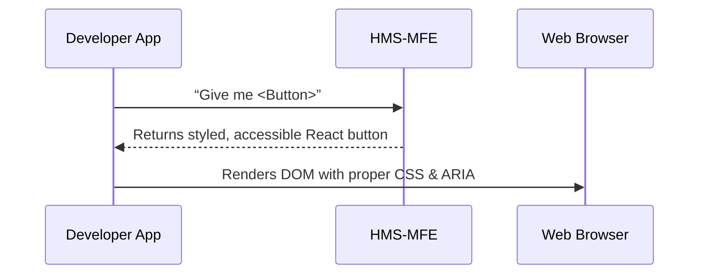

# Chapter 5: User Interface Components (HMS-MFE)

In [Chapter 4: Backend API (HMS-API / HMS-MKT)](04_backend_api__hms_api___hms_mkt__.md), we built a secure gateway for our services. Now it’s time to give users a polished front end without reinventing the wheel—enter **User Interface Components (HMS-MFE)**.

## Why HMS-MFE?

Imagine a federal education agency rolling out an online **Student Enrollment Wizard** for Pell Grants. Instead of hand-crafting buttons, forms, and status indicators every time, developers grab ready-made, accessible, branded components from HMS-MFE. This:

- Ensures a **consistent look & feel** across citizen portals and back-office tools  
- Speeds up new features—no more styling from scratch  
- Enforces **accessibility** and **agency branding** by default  

## Central Use Case: Enrollment Wizard

A DOE portal needs:
1. A multi-step enrollment form (personal info → program choice → review)  
2. Standardized buttons (“Next”, “Submit”)  
3. A real-time status tracker showing progress  

HMS-MFE gives you exactly those building blocks.

## Key Concepts

1. **Shared Toolkit**  
   A single library of UI pieces (buttons, inputs, tables).

2. **Consistency & Branding**  
   All components follow agency color schemes, fonts, and logos.

3. **Accessibility Out-of-the-Box**  
   Keyboard navigation, ARIA labels, high-contrast modes built in.

4. **Composable Building Blocks**  
   Small pieces (e.g., `TextInput`) that you assemble into larger widgets (e.g., `Wizard`).

5. **Theming & Customization**  
   Override default colors or add your agency’s logo via a theme provider.

## How to Use HMS-MFE

### 1. Basic Form with Button & TextInput

```jsx
// EnrollmentForm.js
import React from 'react'
import { TextInput, Button } from 'hms-mfe'

export function EnrollmentForm() {
  return (
    <div>
      <h1>Student Enrollment</h1>
      <TextInput label="Full Name" />
      <TextInput label="Email Address" />
      <Button onClick={() => alert('Enrollment submitted')}>
        Submit
      </Button>
    </div>
  )
}
```
- We import `TextInput` and `Button` from **hms-mfe**.  
- Labels, focus states, and brand colors are applied automatically.

### 2. Multi-Step Wizard

```jsx
// EnrollmentWizard.js
import React from 'react'
import { Wizard, Step } from 'hms-mfe'

export function EnrollmentWizard() {
  return (
    <Wizard>
      <Step title="Personal Info">{/* form fields here */}</Step>
      <Step title="Program Selection">{/* options here */}</Step>
      <Step title="Review">{/* summary here */}</Step>
    </Wizard>
  )
}
```
- `<Wizard>` handles navigation buttons and progress state.  
- Each `<Step>` gets a title and content area.

## What Happens Under the Hood?


1. Your app imports components from **hms-mfe**.  
2. HMS-MFE provides React components wired with styles, themes, and accessibility.  
3. The browser renders them consistently across the portal.

## Inside HMS-MFE: Component Code

### src/components/Button.js

```javascript
import React from 'react'
import './button.css' // shared styles, hover/focus states

export function Button({ onClick, children }) {
  return (
    <button className="hms-btn" onClick={onClick}>
      {children}
    </button>
  )
}
```
- `.hms-btn` applies brand colors, padding, focus rings, and keyboard support.

### src/components/Wizard.js

```javascript
import React, { useState } from 'react'

export function Wizard({ children }) {
  const [step, setStep] = useState(0)
  const steps = React.Children.toArray(children)

  return (
    <div>
      {steps[step]}
      <div className="wizard-nav">
        {step > 0 && <button onClick={() => setStep(step - 1)}>Back</button>}
        {step < steps.length - 1 &&
          <button onClick={() => setStep(step + 1)}>Next</button>}
      </div>
    </div>
  )
}
```
- Manages current step index and renders “Back”/“Next” buttons.  
- Consumes your `<Step>` elements as children.

## Summary

You’ve learned how **HMS-MFE** provides a toolbox of ready-to-use, consistent, and accessible UI components:

- Import buttons, inputs, wizards—no CSS headaches  
- Assemble multi-step forms with progress tracking  
- Rely on built-in branding and accessibility  

Next up: learn how to guide users dynamically based on their intentions in  
[Intention-Driven Navigation](06_intent_driven_navigation_.md).

---

Generated by [AI Codebase Knowledge Builder](https://github.com/The-Pocket/Tutorial-Codebase-Knowledge)