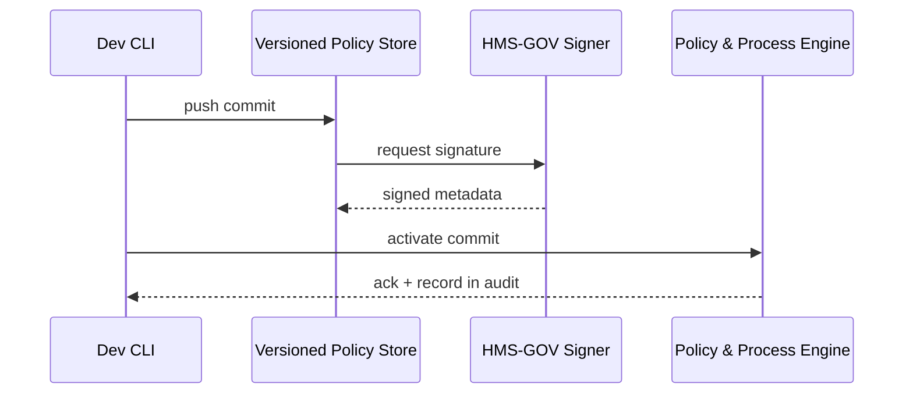

# Chapter 5: Versioned Policy Store  

*(A friendly sequel to [Policy & Process Engine](04_policy___process_engine_.md))*  

---

## 1. Why Do We Need a “Time-Machine” for Policies?

Imagine FEMA just shipped the *small-claim auto-approval* rule from the last chapter.  
A week later Congress raises the auto-approval limit from **$10 000** to **$15 000**.  
Two things must now be true:

1. **Future claims** follow the new \$15 000 rule.  
2. **Past approvals** (under \$10 000) stay legally defensible. Auditors must see the *exact* rule that existed on each decision date.

Hard-coding over yesterday’s YAML would erase history—illegal under the Federal Records Act and a nightmare for OIG audits.

The **Versioned Policy Store (VPS)** solves this by acting like **Git for government rules**:

• Every policy, AI model, or human override is  
  – **tagged** (unique ID)  
  – **signed** (who changed it)  
  – **time-stamped** (when)  
• Nothing is ever deleted—only **new versions** are added.  
• You can “checkout” any historical state, diff two versions, or roll back in one command.

Think of VPS as the National Archives, but for code & AI instead of parchment.

---

## 2. Key Concepts (Plain English)

| Term | What It Means |
|------|---------------|
| **Commit** | A snapshot of one or more files (policy, model, config). Immutable once written. |
| **Hash** | A short “fingerprint” (e.g., `3f2a9c`) that uniquely identifies a commit. |
| **Tag** | A human-friendly name for a commit like `v1.2-auto-approve`. |
| **Branch** | A parallel line of work (e.g., `draft/bipartisan-update`). |
| **Signature** | Metadata of *who* made the commit, cryptographically signed by HMS-GOV. |
| **Rollback** | Switching the active pointer back to an older, known-good commit. |
| **Audit Trail** | An exportable log of every commit with who/when/why—gold for IG investigators. |

---

## 3. A 4-Step Walk-Through: Updating the FEMA Rule

### 3.1 Cloning the Policy Repo (1 line)

```bash
hms vps clone fema/policies fema-policies
```

Explanation:  
Pulls the latest commits into a local folder `fema-policies`.

### 3.2 Editing the YAML (5 lines)

```diff
-  if: "event.amount_usd <= 10000"
+  if: "event.amount_usd <= 15000"
```

Only one line changes—the beauty of version control.

### 3.3 Committing and Pushing (4 lines)

```bash
git add small_claims.yaml
git commit -m "Raise limit to $15k per Public Law 118-7"
hms vps push
```

Output:

```
✓ Commit 7b1c2e tagged as v2024-05-01
✓ Signed by carlos.lopez@fema.gov
```

### 3.4 Activating the New Version in PPE (1 line)

```bash
hms ppe activate small_claims.yaml@v2024-05-01
```

From now on, PPE evaluates claims with the \$15 000 rule. Old claims still reference the earlier commit hash—history preserved.

---

## 4. Seeing History & Rolling Back

### 4.1 View the Ledger

```bash
hms vps log --limit 3
```

Sample output:

```
* 7b1c2e 2024-05-01 carlos.lopez  Raise limit to $15k
* 3f2a9c 2024-04-14 carlos.lopez  Initial auto-approve rule
```

### 4.2 Diff Two Versions

```bash
hms vps diff 3f2a9c 7b1c2e
```

Shows `10000` → `15000` change—nothing else.

### 4.3 Emergency Rollback

If auditors find an issue:

```bash
hms ppe activate small_claims.yaml@3f2a9c
```

One command, zero downtime.

---

## 5. Under the Hood: What Actually Happens?



Only 4 actors keep the flow easy to grasp.

---

## 6. Tiny Peek at the Storage Code (15 lines)

`store/commit.js`

```js
import crypto from 'crypto';
import fs from 'fs';

export function saveCommit(files, author) {
  // 1. Serialize & hash
  const blob = JSON.stringify(files);
  const hash = crypto.createHash('sha1').update(blob).digest('hex').slice(0,6);

  // 2. Write to disk (or S3)
  fs.writeFileSync(`./objects/${hash}.json`, blob);

  // 3. Sign metadata (simplified)
  const meta = { hash, author, ts: Date.now() };
  fs.writeFileSync(`./objects/${hash}.meta.json`, JSON.stringify(meta));

  return hash; // caller tags or activates later
}
```

Explanation:  
• Combines all changed files into one JSON blob.  
• Creates a short SHA-1 hash as the commit ID.  
• Saves both the data and metadata.  
Real VPS uses secure KMS keys and redundant storage, but the gist is the same.

---

## 7. How VPS Connects to Other HMS Layers

• [Policy & Process Engine](04_policy___process_engine_.md) **reads** policies by commit hash—guaranteed immutability.  
• [Governance Layer](03_governance_layer__hms_gov__.md) **signs** every commit and enforces who may push to which branch.  
• [Observability & Metrics Pipeline](13_observability___metrics_pipeline_.md) archives commit logs for long-term retention.  
• Future AI models in [AI Representative Agent](12_ai_representative_agent__hms_a2a__.md) will also store their training snapshots here.

---

## 8. Beginner FAQ

**Q: Do I need to learn Git?**  
A: Basic `git add/commit` is enough. HMS CLI wraps the rest (`hms vps push`, `hms vps diff`).

**Q: Can I delete a bad commit?**  
A: No—federal record laws forbid silent deletion. You can *revert* with a new commit or mark as “superseded.”

**Q: How big can objects be?**  
A: Tested up to 500 MB (for large AI models). VPS chunks & deduplicates, so storage costs stay low.

**Q: Is this the same as my agency’s GitLab?**  
A: Similar mechanics, but VPS adds mandatory signing, policy-aware permissions, and retention rules tailored to government compliance.

---

## 9. Quick-Start Checklist

1. `hms vps clone <namespace>`  
2. Edit YAML, JSON, or model files.  
3. `git add` & `git commit -m "why"`  
4. `hms vps push` (auto-signs & tags)  
5. `hms ppe activate file@tag` to go live  
6. Use `hms vps log/diff` anytime auditors ask “What changed?”

You now have a tamper-proof history of every rule and model—sleep easy!

---

## 10. Summary & What’s Next

In this chapter you learned:

• VPS is a Git-style, immutable ledger for policies, AI models, and overrides.  
• Every commit is tagged, signed, and time-stamped for perfect auditability.  
• Rolling forward or back requires one CLI line—no downtime.  
• VPS underpins compliance across all HMS layers.

Ready to see how services and actuators consume these versioned artifacts in production? Continue to [Management Layer (HMS-SVC & HMS-ACH)](06_management_layer__hms_svc___hms_ach__.md).

---

Generated by [AI Codebase Knowledge Builder](https://github.com/The-Pocket/Tutorial-Codebase-Knowledge)