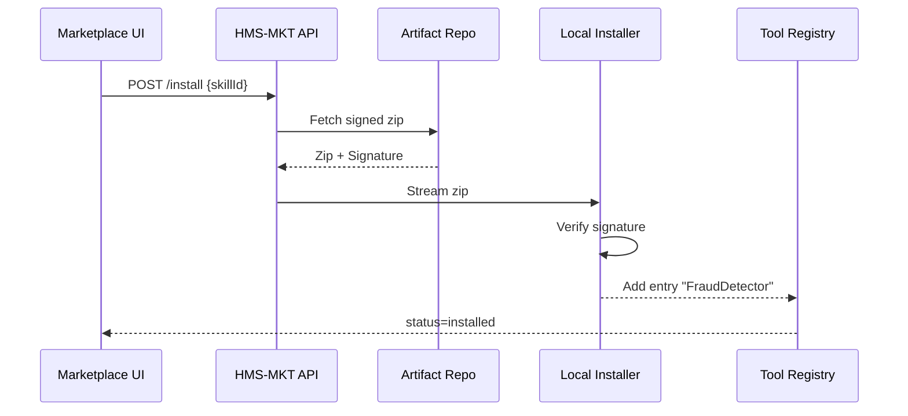

# Chapter 6: Agent Marketplace (HMS-MKT)


*(Coming from [Model Context Protocol (HMS-MCP)](05_model_context_protocol__hms_mcp__.md)?  
Great! Your agents can now “speak politely.”  
Next question: **where do you get those agents?***)

---

## 0. Motivation – “Couldn’t we just download a fraud-checker like an app?”

Picture **“Sunnyvale City Hall”** (population 31 000).  
Their clerk, Maya, must flag duplicate benefit applications. She has:

* zero data-science staff,  
* one overworked IT contractor,  
* a tight budget that hates year-long procurements.

Maya opens **HMS-MKT**—an *app store* of pre-vetted AI skills.  
She clicks **“Fraud Detector – Bronze Tier”**, sees a sandbox demo, and installs it in 90 seconds.  
Sunnyvale now runs the **same** model New York City uses—no reinventing wheels, no RFP paperwork.

---

## 1. Key Concepts (Plain English)

| Word | Think “plainly” |
|------|-----------------|
| Skill Card | A tile in the catalog (“Fraud Detector”, “Spanish → English Translator”). |
| Safety Badge | Color-coded trust level: 🟢 Federal-approved, 🟡 Agency-reviewed, 🔴 Experimental. |
| Sandbox Demo | Click-to-try playground that runs the skill on fake data—no install needed. |
| One-Click Install | Button that fetches, verifies, and registers the agent in your environment. |
| Subscription Plan | “Bronze / Silver / Gold” – limits on calls per month. |
| Procurement Log | Automatic PDF noting who installed what, when, and under which clause—compliance happy! |

---

## 2. 60-Second Tour – Installing a Translator Skill

### 2.1 Browse the Catalog

Maya searches “Translator” and sees:

```
🌐 Language Translator (Spanish↔English)
   • Safety: 🟢
   • Price: Free, 5 000 calls/mo
   [Try Sandbox]  [Install]
```

### 2.2 Try Before You Buy

Click **Try Sandbox** → a modal runs:

```yaml
Input:  "Buenos días, ¿en qué puedo ayudarle?"
Output: "Good morning, how can I help you?"
```

Happy, Maya hits **Install**.

### 2.3 One-Click Install (behind the curtain)

1. Browser POSTs `/api/marketplace/install` with `skillId=lang-es-en`.
2. Backend downloads the signed zip.
3. Signature verified.
4. Skill registered in `agents/installed.json`.
5. Marketplace shows **✅ Installed**.

Maya can now call the translator from any HMS workflow!

---

## 3. How YOU Do It – Minimal CLI Example

City admins may prefer the terminal. Below is a 14-line script:

```bash
# install_skill.sh
SKILL="fraud-detector-basic"
curl -X POST \
     -H "Authorization: Bearer $TOKEN" \
     -d "{\"skillId\":\"$SKILL\"}" \
     https://hms.gov/api/marketplace/install \
     | jq .
```

Beginner explanation:

1. `curl -X POST` talks to the Marketplace API.  
2. `$TOKEN` proves you have rights.  
3. Server replies JSON:

```json
{ "status":"installed", "path":"/opt/hms/agents/fraud-detector" }
```

That’s it—agent ready for use.

---

## 4. Using the New Skill in Code

Once installed, the agent appears in the **Tool Registry** exposed via MCP:

```js
import { mcpRequest } from './helpers/mcpRequest.js'

const res = await mcpRequest(
  'call',
  'FraudDetector.score',
  { applicantId: 12345 }
)

console.log(res.data)   // e.g., { score: 0.91, risk: "high" }
```

Under 10 lines, fully sandboxed.

---

## 5. What Happens Internally? (Step-by-Step)



*Only five moving parts—easy to audit.*

---

## 6. Peek Into the Installer Code (Node, 18 lines)

```js
// File: installer/installSkill.js
import { verifySig } from './verify.js'
import unzip from 'unzipper'
import fs from 'fs/promises'

export async function installSkill(zipBuf, meta){
  if(!verifySig(zipBuf, meta.signature))
      throw Error('Bad signature')

  // 1. unzip to /opt/hms/agents/<id>/
  const dir = `/opt/hms/agents/${meta.id}`
  await unzip.Open.buffer(zipBuf).then(d => d.extract({path:dir}))

  // 2. append to registry
  const reg = JSON.parse(await fs.readFile('agents/installed.json'))
  reg[meta.id] = { path:dir, safety:meta.safety }
  await fs.writeFile('agents/installed.json', JSON.stringify(reg,null,2))
}
```

Explanation:

1. `verifySig()` assures the artifact wasn’t tampered with.  
2. Zip is extracted.  
3. Registry updated so MCP can find the new tool.

---

## 7. Safety & Compliance Goodies

* **Auto Procurement PDF** – installer calls `/api/marketplace/receipt` which stores  
  * agency,  
  * skill id & version,  
  * license terms.  
  Compliance teams simply download the PDF later.

* **Rollback Button** – every skill keeps the previous version in `/backups`.  
  Click **Rollback** in the UI or run:

  ```bash
  hms rollback fraud-detector-basic
  ```

* **Safety Badges Enforced** – a 🟡 or 🔴 skill gets routed through [Human-in-the-Loop Oversight](11_human_in_the_loop_oversight__hitl__.md) before it can run.

---

## 8. Relationship to Other HMS Pieces

* Skills land in the local **Tool Registry** and are invoked via [Model Context Protocol](05_model_context_protocol__hms_mcp__.md).  
* Complex chains of skills are choreographed by the upcoming [Agent-Orchestrated Workflow Manager (HMS-ACT)](07_agent_orchestrated_workflow_manager__hms_act__.md).  
* The **Security & Authorization Layer** (see [Zero-Trust](09_security___authorization_layer__hms_sys__zero_trust__.md)) verifies each call uses allowed scopes.  
* Metrics from installed skills flow into [Metrics & Monitoring](14_metrics___monitoring__hms_ops___hms_act_telemetry__.md).

---

## 9. Quick FAQ

**Q:** Do I need a credit card?  
**A:** Most government deployments use *inter-agency charge codes*; Marketplace supports both credit card and Purchase Order numbers.

**Q:** Can I publish my own skill?  
**A:** Yes—submit a zip + metadata YAML; after a security scan it appears with a 🟡 badge.

**Q:** Offline data center?  
**A:** Download an *offline bundle* once, move via USB, then run `hms marketplace import bundle.zip`.

---

## 10. Summary & Next Steps

In this chapter you:

1. Saw the **Agent Marketplace** act like an app store for AI skills.  
2. Installed a translator in two clicks (or one line of CLI).  
3. Learned the internal steps—download, signature verify, registry update.  
4. Noted how safety badges and procurement logs keep auditors calm.

Ready to see those newly installed agents **coordinate full workflows** (e.g., detect fraud → notify clerk → update case)?  
Jump to [Agent-Orchestrated Workflow Manager (HMS-ACT)](07_agent_orchestrated_workflow_manager__hms_act__.md).

---

Generated by [AI Codebase Knowledge Builder](https://github.com/The-Pocket/Tutorial-Codebase-Knowledge)