# Chapter 6: Agent Orchestration Engine (HMS-ACT)

*[Jump back to Chapter 5: Backend Service Layer & APIs (HMS-SVC)](05_backend_service_layer___apis__hms_svc__.md)*  

---

## 1. Why Do We Need HMS-ACT?

Picture a blizzard about to hit Washington, D.C.  
Within minutes the city must:

1. Draft an **“Emergency Snow-Removal Plan.”** (done by the AI policy agent)  
2. Check the plan for **budget & union-rule compliance.** (done by the legal agent)  
3. **Dispatch plow crews** and notify residents. (done by several backend services)  
4. **Log every step** for a post-event audit.  

Without orchestration, each agent or service would shout orders at the same time—plows might leave before funding is cleared or the plan approved.

**HMS-ACT is the conductor.**  
It receives a *score* (an ordered list of tasks) and waves the baton so every agent plays in rhythm:

```
[ DraftPlan ] → [ LegalCheck ] → [ HumanApproval ] → [ DispatchCrews ] → [ NotifyCitizens ]
```

No task starts until the previous one finishes (or fails), and every outcome is written to the audit log.

---

## 2. Key Concepts in Plain English

| Term                | Analogy (Orchestra)                                 |
|---------------------|-----------------------------------------------------|
| Orchestration Plan  | The musical score—ordered list of steps.            |
| Task                | One measure in the score (e.g., “run legal check”). |
| Agent / Service     | A musician who knows one instrument.                |
| Runner              | The metronome—executes tasks in sequence.           |
| Execution Log       | The recording—timestamped history of the concert.   |

---

## 3. 3-Minute Hands-On Tour

We will orchestrate three toy steps:

1. `draft_policy` – pretend AI writes the snow plan.  
2. `legal_check` – second agent rubber-stamps it.  
3. `dispatch` – backend service “sends” the plows.

### 3.1 Submit a Plan to HMS-ACT (curl or fetch)

```bash
# submit_plan.sh  (≤10 lines)
curl -X POST https://api.hms/act/plans -H "Content-Type: application/json" -d '
{
  "title": "Snow Removal Blizzard 2025",
  "steps": [
    { "task": "draft_policy", "agent": "agx" },
    { "task": "legal_check",  "agent": "esq" },
    { "task": "dispatch",     "service": "svc.snow" }
  ]
}'
```

Expected JSON reply (abridged):

```json
{ "planId": "PLAN-123", "status": "PENDING" }
```

### 3.2 Poll Status

```bash
curl https://api.hms/act/plans/PLAN-123/status
# → {"currentStep": "legal_check", "overall": "IN_PROGRESS"}
```

When finished:

```bash
# → {"overall": "COMPLETED", "log": [ ... ] }
```

**What just happened?**  
You gave ACT a simple list of steps. It is now:

1. Telling **HMS-AGX** to draft.  
2. Waiting for **HMS-ESQ** to say “Legal ✅.”  
3. Calling the **Snow Dispatch Service** in [HMS-SVC](05_backend_service_layer___apis__hms_svc__.md).  
4. Writing every result to the log.

---

## 4. What Happens Behind the Curtain?

```mermaid
sequenceDiagram
    participant ACT  as HMS-ACT
    participant AGX  as Draft Agent
    participant ESQ  as Legal Agent
    participant SVC  as Snow Service
    ACT->>AGX: Run draft_policy
    AGX-->>ACT: ✅ draft complete
    ACT->>ESQ: Run legal_check
    ESQ-->>ACT: ✅ legal OK
    ACT->>SVC: POST /dispatch
    SVC-->>ACT: 🚚 crews rolling
    ACT-->>Caller: Plan COMPLETED
```



In plain English:

1. **ACT** reads step 1, calls AGX.  
2. Waits until AGX returns success.  
3. Proceeds to legal check, waits again.  
4. Finally hits the dispatch endpoint.  
5. Marks the whole plan *COMPLETED* (or *FAILED* if any step errors).

---

## 5. Inside the Engine (Tiny Code Peek)

### 5.1 Runner Loop (Node.js, 18 lines)

```js
// services/hms-act/runner.js
async function runPlan(plan) {
  for (const step of plan.steps) {
    log(plan.id, step.task, 'START');
    try {
      if (step.agent) await callAgent(step.agent, step.task, plan);
      if (step.service) await callService(step.service, step.task, plan);
      log(plan.id, step.task, 'SUCCESS');
    } catch (err) {
      log(plan.id, step.task, 'FAIL', err.message);
      await markPlan(plan.id, 'FAILED');
      return;
    }
  }
  await markPlan(plan.id, 'COMPLETED');
}
module.exports = runPlan;
```

Explanation:

• Iterates through `steps` one-by-one.  
• Uses helper `callAgent` or `callService` depending on who should act.  
• On error, stops the loop and labels the plan **FAILED**.  
• Each stage logs to the Execution Log stored in [Central Data Repository (HMS-DTA)](07_central_data_repository__hms_dta__.md).

### 5.2 callAgent Helper (Python-style pseudocode, 10 lines)

```python
def call_agent(name, task, plan):
    url = f"https://api.hms/{name}/{task}"
    r   = httpx.post(url, json={"planId": plan["id"]})
    r.raise_for_status()          # throws if 4xx / 5xx
```

One simple HTTP call hides the complexity of each specialist agent.

### 5.3 Log Storage Schema (SQL, 6 lines)

```sql
CREATE TABLE act_logs (
  id        SERIAL PRIMARY KEY,
  plan_id   TEXT,
  step      TEXT,
  status    TEXT,     -- START / SUCCESS / FAIL
  ts        TIMESTAMP DEFAULT now(),
  message   TEXT
);
```

Every row is a breadcrumb for auditors.

---

## 6. How HMS-ACT Connects to Other Layers

| Layer | Interaction |
|-------|-------------|
| [HMS-AGX](02_ai_representative_agent__hms_agx__.md) | Receives **task commands** like `draft_policy`. |
| [HMS-ESQ](08_legal___compliance_module__hms_esq__.md) | Performs legal checks as a task. |
| [HMS-SVC](05_backend_service_layer___apis__hms_svc__.md) | Executes concrete services (`/dispatch`, `/bill`). |
| [HMS-GOV](01_governance_layer___admin_portal__hms_gov__.md) | Shows plan status & lets admins cancel or retry. |
| [HITL](03_human_in_the_loop__hitl__oversight_.md) | Can inject a **HumanApproval** task before execution. |

---

## 7. Frequently Asked Questions

**“Can tasks run in parallel?”**  
Yes. Add `"parallel": true` to a step group. The runner spawns them concurrently and waits for all to finish before moving on.

**“What if a step needs manual retry?”**  
HMS-GOV exposes a **Retry** button that reinvokes `runPlan` starting at the failed step.

**“Is sequencing fixed?”**  
A plan is just JSON. You can dynamically build it (e.g., AGX adds extra legal checks for international treaties).

---

## 8. What You Learned

• HMS-ACT is the **conductor** ensuring agents and services perform in the right order.  
• You submitted a 3-step emergency snow plan and watched ACT drive it to completion.  
• Under the hood, a tiny runner loop, simple HTTP calls, and an execution log do the magic.  

Ready to see **where** all those logs and plans live?  
Continue to [Central Data Repository (HMS-DTA)](07_central_data_repository__hms_dta__.md).

---

Generated by [AI Codebase Knowledge Builder](https://github.com/The-Pocket/Tutorial-Codebase-Knowledge)