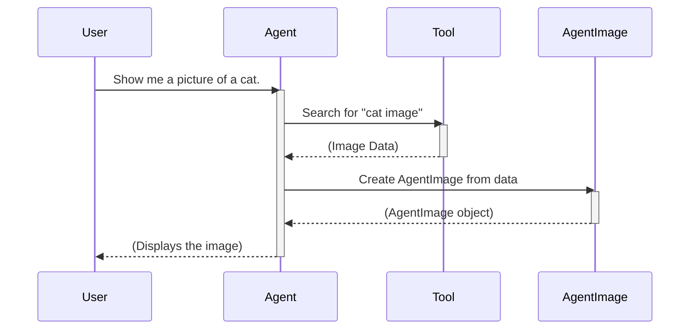

# Chapter 6: Agent Types

In the previous chapter, [Gradio UI](05_gradio_ui.md), we learned how to interact with our agent through a visual interface. Now, let's explore how our agent can handle different kinds of data, like text, images, and audio.  These different kinds of data are called **Agent Types**.

Imagine our chef agent again.  A chef works with various ingredients: vegetables, meat, spices, etc. Each ingredient requires different handling. You wouldn't chop spices the same way you chop vegetables, right? Similarly, an agent needs to handle different data types differently. Text needs to be read, images need to be viewed, and audio needs to be heard.  Agent Types ensure the agent can process and understand these various input and output formats.

## What are Agent Types?

Agent types represent the different kinds of data the agent can handle.  They're like the ingredients for our chef agent.  The main agent types are:

- `AgentText`:  Represents text, like a recipe or cooking instructions.
- `AgentImage`: Represents images, like a picture of a finished dish.
- `AgentAudio`: Represents audio, like a recording of someone describing a recipe.

These types ensure that the agent can correctly process and understand various input and output formats.

## Using Agent Types

Let's see a simple example of using `AgentText`:

```python
from smolagents import AgentText

text = AgentText("Hello, world!")
print(text)  # Output: Hello, world!
```

This code creates an `AgentText` object containing the string "Hello, world!".  Printing the object displays the text.

Now, let's see an example with `AgentImage`:

```python
from smolagents import AgentImage
from PIL import Image

image = Image.new("RGB", (100, 100), color = "red") # Create a simple red image
agent_image = AgentImage(image)
agent_image.show() # Displays the image
```

This code creates a simple red image using the PIL library and then converts it to an `AgentImage`. Calling `.show()` will display the image.

## Inside Agent Types

Here's a simplified sequence diagram showing how an agent might use an `AgentImage`:



1. The user asks the agent to show a cat picture.
2. The agent uses a tool to search for a cat image.
3. The tool returns the image data.
4. The agent creates an `AgentImage` from the data.
5. The agent displays the image to the user.

The `agent_types.py` file contains the implementation of these types.  Here's a simplified snippet for `AgentImage`:

```python
# Simplified code from agent_types.py
from PIL import Image

class AgentImage(AgentType, Image.Image):
    def __init__(self, value):
        # ... (Initialization logic)

    def to_raw(self):
        # ... (Returns the PIL Image object)

    def to_string(self):
        # ... (Returns a path to the saved image file)

    def show(self):
        # ... (Displays the image)
```

The `AgentImage` class inherits from both `AgentType` and `PIL.Image.Image`, allowing it to behave like a regular image while also providing methods like `to_string()` for serialization and `to_raw()` for accessing the underlying PIL Image object.

## Conclusion

In this chapter, we learned about `Agent Types` in `smolagents` and how they allow agents to handle different kinds of data like text, images, and audio. We saw examples of using `AgentText` and `AgentImage` and explored their internal implementation. Next, we'll learn about the [Local Python Executor](07_local_python_executor.md) and how it allows agents to execute Python code.


---

Generated by [AI Codebase Knowledge Builder](https://github.com/The-Pocket/Tutorial-Codebase-Knowledge)