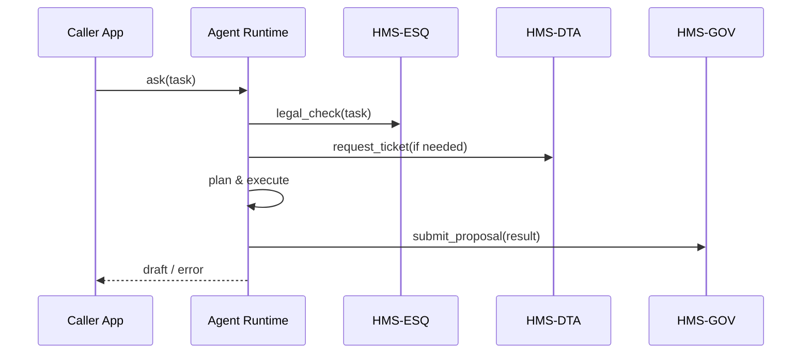

# Chapter 6: AI Agent Framework (HMS-AGT / HMS-AGX)

[← Back to Chapter 5: Data & Privacy Management Hub (HMS-DTA)](05_data___privacy_management_hub__hms_dta__.md)

---

## 1. Why Do We Need “Digital Civil Servants”?

Imagine the **Department of Motor Vehicles (DMV)** receives a new state law:  

> “Citizens must be able to schedule REAL-ID appointments online and choose a curb-side document pre-check.”

The backlog is huge, clerks are overloaded, and a contractor wants \$2 million and 9 months to redesign the flow.

Instead, HMS lets you spin-up **a small troop of AI agents** that:

1. Read the new law from [HMS-CDF](02_policy_lifecycle_engine__hms_cdf__.md).  
2. Check legal constraints with [HMS-ESQ](04_compliance___legal_reasoning_engine__hms_esq__.md).  
3. Request only the citizen data they’re allowed to see via [HMS-DTA](05_data___privacy_management_hub__hms_dta__.md).  
4. Draft the new appointment workflow in 30 minutes, then submit it to the [Governance Layer](03_governance_layer___human_in_the_loop__hitl__.md) for human sign-off.

That “troop” is built with the **AI Agent Framework**:

* **HMS-AGT** – the basic uniform and boot-camp.  
* **HMS-AGX** – specialist badges: health-care, finance, logistics, etc.

---

## 2. Key Concepts in Plain English

| Concept | DMV Analogy | 1-Sentence Meaning |
|---------|-------------|--------------------|
| Agent | A single DMV clerk | One autonomous process that can read, reason, and act. |
| Skill Pack (AGX) | Clerk’s certification (e.g., eye-test) | Plug-in bundle adding domain skills & vocab. |
| Registry | HR roster | Database of who’s on duty, their skills & status. |
| Guardrails | Employee handbook | Automatic checks (law, data privacy, budget caps). |
| Lifecycle | Hire → Shift → Retire | How an agent is created, scaled, paused, or deleted. |

> 💡 If HMS-AGT is the *job description*, HMS-AGX is the *special license*.

---

## 3. Spinning-Up Your First Agent (End-to-End in <20 Lines)

Below we create an **AppointmentFlowAgent** to redesign the DMV page.

```python
# file: create_dmv_agent.py  (19 lines)
from hms_agt import Agent, ask           # pip install hms-agt
from hms_agx import WorkflowSkillPack    # domain pack

# 1. Define the agent
dmv_agent = Agent(
    name="dmv_appointment_flow",
    description="Drafts online REAL-ID appointment workflow",
    skills=[WorkflowSkillPack()]
)

# 2. Register the agent (writes to the Registry DB)
dmv_agent.register()

# 3. Give it a task
task = {
    "objective": "Add curb-side document pre-check step",
    "deadline": "2024-09-01"
}
reply = ask("dmv_appointment_flow", task)

print(reply.summary)     # "Draft V1 flow with 4 screens ready for review."
```

What just happened?

1. We **declared** an agent and the skill pack it needs.  
2. A single call to `.register()` stores it in the **Agent Registry** (Postgres table).  
3. The `ask()` helper forwards our task; the agent returns a human-readable draft.

---

## 4. Scaling Out: “Give Me 50 Auditors, Please”

```python
from hms_agt import scale

scale(
    base_agent="dmv_appointment_flow",
    replicas=50,
    as_pool="dmv_flow_team"
)
```

Within seconds 50 pods (or processes) spin up, each inheriting the same skills but its own memory.

> Retire them with `scale(..., replicas=0)`—no orphaned containers!

---

## 5. How Guardrails Keep Us Safe

Every agent call automatically passes through **three checkpoints**:

1. **Legal** – HMS-ESQ blocks illegal actions.  
2. **Data** – HMS-DTA ensures tickets exist before any data pull.  
3. **Governance** – HMS-GOV requires human approval for impactful changes.

### Quick Demo: Data Access Denied

```python
reply = ask("dmv_appointment_flow", {
    "objective": "Download full citizen SSN list"
})
print(reply.error)   # "403 – Ticket missing for restricted dataset."
```

The agent is politely stopped long before damage occurs.

---

## 6. Peek Under the Hood

### 6.1 High-Level Flow



Only **5 participants**, easy to grasp.

### 6.2 Minimal Agent Class (15 Lines)

```python
# hms_agt/core.py  (simplified)
class Agent:
    def __init__(self, name, description="", skills=None):
        self.id = name
        self.desc = description
        self.skills = skills or []

    def register(self):
        db.save("agents", self.__dict__)   # ← registry

    def handle(self, task):
        for skill in self.skills:
            if skill.can_handle(task):
                return skill.run(task)
        return {"error": "skill_not_found"}
```

In real life `.run()` may invoke an LLM, call APIs, or delegate to another agent—but the skeleton stays this small.

### 6.3 Skill Pack Interface (12 Lines)

```python
class SkillPack:
    name = "base"
    def can_handle(self, task): ...
    def run(self, task): ...
```

Specialist packs (AGX) just subclass this and bundle prompts, regex rules, or API clients.

---

## 7. Integrating With Other Layers

| Layer | What It Provides to Agents | Example |
|-------|----------------------------|---------|
| [HMS-DTA](05_data___privacy_management_hub__hms_dta__.md) | Data tickets & encryption keys | `dta.request_ticket()` |
| [HMS-ESQ](04_compliance___legal_reasoning_engine__hms_esq__.md) | Legal yes/no & citations | `esq.ask("Is step X allowed?")` |
| [HMS-GOV](03_governance_layer___human_in_the_loop__hitl__.md) | Human approval & audit log | `gov.submit(proposal)` |
| [HMS-OMS / HMS-ACT](07_workflow_orchestration___task_queues__hms_oms___hms_act__.md) | Queues & scheduling (next chapter) | Agents listen on task queues. |

All traffic is **middle-floor first**; agents never touch basement DBs directly.

---

## 8. Hands-On Lab (2 Minutes)

```bash
git clone hms-utl
cd hms-utl/demo
docker compose up agt esq dta gov   # spin up minimal stack
python create_dmv_agent.py          # register agent & get first draft
```

Open `http://localhost:8050/registry` to see your agent roster live.  
Terminate with `docker compose down`.

---

## 9. Recap & What’s Next

You now know:

✓ Why HMS-AGT and HMS-AGX give us **scalable digital civil servants**  
✓ The five key concepts: Agent, Skill Pack, Registry, Guardrails, Lifecycle  
✓ How to launch, scale, and retire agents in a handful of lines  
✓ How built-in checkpoints keep the DMV (and you) out of trouble  
✓ Where agents sit inside the larger three-floor HMS building

Ready to orchestrate hundreds of these agents without chaos?  
Jump to [Workflow Orchestration & Task Queues (HMS-OMS / HMS-ACT)](07_workflow_orchestration___task_queues__hms_oms___hms_act__.md) to learn how.

---

Generated by [AI Codebase Knowledge Builder](https://github.com/The-Pocket/Tutorial-Codebase-Knowledge)