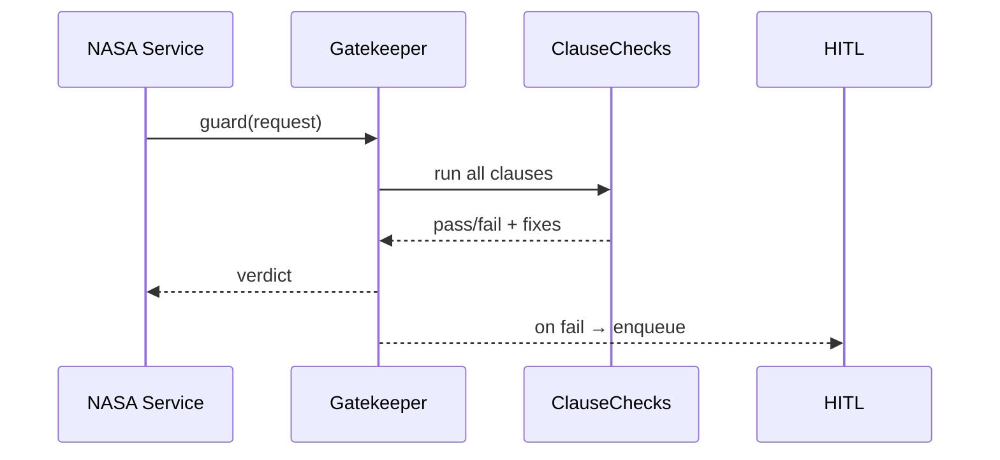
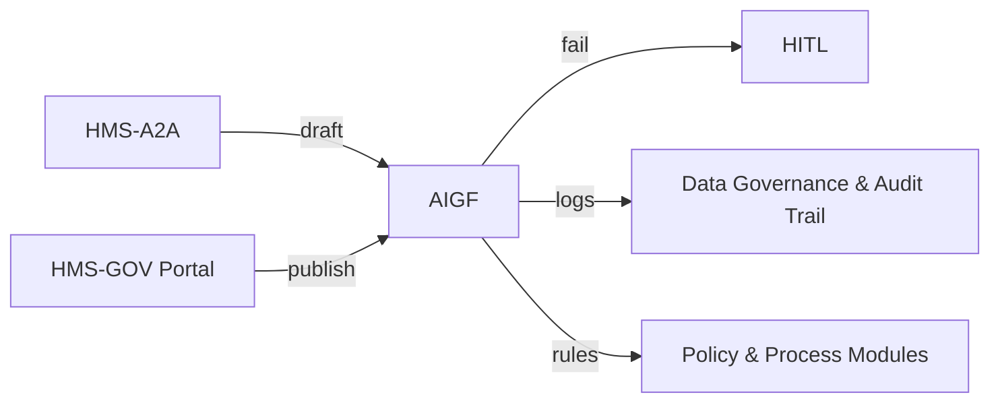

# Chapter 6: AI Governance Framework  
*A gentle sequel to [Human-in-the-Loop Oversight (HITL)](05_human_in_the_loop_oversight__hitl__.md)*  

---

## 1. Why Do We Need a “Constitution for Code”?

Picture **Dana**, an analyst at **NASA’s Earth Science Division**.  
Tonight she wants to auto-publish fresh satellite imagery of U.S. farmland.  
Hidden risk:

* Images at **10 cm resolution** can reveal individual farm workers → **PII leak**.  
* The AI enhancement model sometimes paints greener fields in drought zones → **data bias**.

Without guardrails Dana could:

1. Harm privacy.  
2. Mislead policy makers about drought relief.  

**AI Governance Framework (AIGF)** is the *constitution* that stops such accidents before they reach the public.

---

## 2. What Exactly Is AIGF?

| Term        | Friendly Analogy | What It Does |
|-------------|------------------|--------------|
| Clause      | Law paragraph    | Rule like “No PII in images” |
| Check       | Smoke detector   | Code that scans data / models for violations |
| Gatekeeper  | Security guard   | Service that blocks deployment if a check fails |
| Verdict     | Stamp “Pass/Fail”| Result stored in audit trail |
| Remedy      | First-aid kit    | Automatic redaction or escalation to reviewers |

Think of each **AI component** (model, prompt, dataset, policy) as a **bill**.  
It must pass every **clause** before becoming **law** in production.

---

## 3. 5-Minute Hands-On: Stop a PII Leak

### 3.1 Create a Tiny Constitution File

```yaml
# nasa-aigf.yaml
clauses:
  - id: no_face_pixels
    description: "Block images where a face is identifiable"
    check: detect.faces < 1
    remedy: "blur_faces"
  - id: bias_check
    description: "Ensure color enhancement keeps mean NDVI ±5%"
    check: abs(ndvi_change) <= 0.05
    remedy: "recalibrate_model"
```

### 3.2 Scan a Dataset

```bash
npm i -g @hms-sme/gov-cli      # if not installed
hms-gov guard nasa-aigf.yaml \
  --dataset ./imagery/latest.tif
```

Console:

```
✔ Clause bias_check … PASS
✖ Clause no_face_pixels … FAIL (3 faces found)
→ Remedy applied: blur_faces
Summary: 1 violation fixed, deployment blocked for review.
```

What just happened?  
1. The CLI ran each **check**.  
2. It auto-blurred faces (remedy).  
3. Because a clause was violated, the Gatekeeper pushed the item into the [HITL queue](05_human_in_the_loop_oversight__hitl__.md) for final approval.

---

## 4. Plugging AIGF Into Your Service

### 4.1 Pre-Deployment Guard (Node.js, 9 lines)

```ts
import { guard } from '@hms-sme/aigf-sdk';

export async function publishImage(img) {
  const verdict = await guard('nasa-aigf.yaml', img);
  if (!verdict.pass) throw 'Governance fail → routed to HITL';
  // safe to continue
  await storage.pushPublic(img);
}
```

Explanation:  
`guard()` loads the constitution file, executes clause checks, and returns `pass: true/false`.

### 4.2 Runtime API Middleware (Express, 12 lines)

```ts
import { runtimeGate } from '@hms-sme/aigf-sdk';

app.post('/predict', runtimeGate(), async (req,res)=>{
  // only reaches here if request+model obey every clause
  const result = model.predict(req.body);
  res.json(result);
});
```

`runtimeGate()` inspects incoming payloads + model metadata on the fly.

---

## 5. What Happens Under the Hood?



Plain English:  
1. Service asks Gatekeeper.  
2. Gatekeeper calls lightweight check functions.  
3. If *any* clause fails, it blocks and notifies reviewers.

---

## 6. Mini Implementation Tour

### 6.1 Define a Clause (6 lines)

```ts
// clauses/no_face_pixels.ts
export const noFacePixels = {
  id: 'no_face_pixels',
  run: img => detectFaces(img) < 1,
  remedy: img => blurFaces(img)
};
```

### 6.2 Gatekeeper Core (14 lines)

```ts
// core/gatekeeper.ts
export async function guard(file, subject){
  const clauses = loadYaml(file).clauses;
  for (const c of clauses){
    const ok = await runClause(c, subject);
    if(!ok){ await remedy(c, subject);
             enqueueHitl(subject, c); return {pass:false}; }
  }
  logAudit(subject, 'PASS');
  return {pass:true};
}
```

Beginner notes:  
* `loadYaml` loads constitution.  
* `runClause` executes each check.  
* If a clause fails → call `remedy()` and send to HITL.

---

## 7. Extending the Constitution

Want to add **Fairness for Loan Models** used by the *U.S. Small Business Administration*?

```yaml
- id: sba_fairness
  description: "Disparate impact < 10% across demographics"
  check: di_index <= 0.10
  remedy: "re-train_with_weights"
```

No code change—just append YAML and commit.

---

## 8. How AIGF Interacts With Other Chapters



* AI drafts from [AI Representative Agent](04_ai_representative_agent__hms_a2a__.md)  
* Policies stored in [Policy & Process Modules](07_policy___process_modules__hms_svc__.md)  
* Decisions logged to [Data Governance & Audit Trail](11_data_governance___audit_trail_.md)

---

## 9. Recap & Next Steps

Today you:

• Saw why an AI constitution prevents privacy leaks and bias.  
• Scanned a dataset and auto-blurred faces in 3 minutes.  
• Wired a one-line Gatekeeper into an API.  
• Learned how AIGF partners with HITL, A2A, and Audit Trail.

Ready to *encode* those approved policies and processes for real-time execution?  
Jump to [Policy & Process Modules (HMS-SVC)](07_policy___process_modules__hms_svc__.md).

---

---

Generated by [AI Codebase Knowledge Builder](https://github.com/The-Pocket/Tutorial-Codebase-Knowledge)