# Chapter 6: AI Governance Model
[← Back to Chapter 5: Specialized AI Agents (HMS-A2A)](05_specialized_ai_agents__hms_a2a__.md)

---

## 0. Why Do Algorithms Need a “Constitution”?

Imagine the **Internal Revenue Service (IRS)** launches an AI agent that can
“clean-up” old tax-credit forms.  
Without guard-rails the agent **might**:

* silently delete required wording,  
* expose Social Security numbers, **or**  
* generate advice that conflicts with statute.

To keep trust (and stay legal) every algorithm in HMS must pass through a
shared **AI Governance Model**—our digital Constitution.  
It enforces a *separation of powers* between:

| Branch | What it Protects | Quick Example |
|--------|------------------|---------------|
| Transparency | You can see why a change happened | Agent explains “Rule §12 requires dual approval.” |
| Truth | Facts & calculations are correct | Checks math on a refund amount |
| Safety | No harm to systems or citizens | Blocks infinite e-mail loops |
| Ethics | Fair & unbiased | Rejects loan scores using race |
| Privacy | PII stays protected | Masks SSNs before logs |

Before any agent action reaches production, these five “justices” vote 👩‍⚖️👨‍⚖️.

---

## 1. Key Concepts in Plain English

| Term | Analogy | Why Beginners Care |
|------|---------|--------------------|
| Governance Contract | Seat-belt sensor | Won’t start unless buckled |
| Policy Filter | Airport security | Screens each suitcase (action) |
| Risk Tier | Yellow / Orange / Red badge | Dictates how strict the scan is |
| Governance Hook | Emergency brake | Single line of code agents call |
| Decision Record | Court docket | Immutable proof of what was allowed or blocked |
| Appeal Path | Filing a motion | Humans can override with reason |

Keep this cheat-sheet nearby!

---

## 2. A 5-Minute Walk-Through  
### Use Case: “Form Fixer” Agent

Last chapter we built a VA wait-time agent.  
Now picture an IRS **Form Fixer** agent that wants to update wording on
*Form 1040-EZ*.

We will:

1. Assign it a **Risk Tier** (`medium_risk`),  
2. Add a **Governance Contract** that forbids changes to legal clauses,  
3. Watch the action flow through the Policy Filter.

---

### 2.1 Declare the Governance Profile (YAML – 14 lines)
```yaml
# profiles/medium_risk.yaml
id: medium_risk
description: “Content edits on public tax forms”
checks:
  - privacy     # no PII exposure
  - truth       # keep numeric values
  - ethics      # no biased language
  - safety      # size < 2 MB
  - transparency:
      explanation_required: true
oversight: "HITL"
```
• `checks` list the five powers.  
• `oversight: "HITL"` demands human sign-off (see next chapter).

---

### 2.2 Attach It to the Agent (snippet – 6 lines)
```yaml
# missions/form_fixer.yaml   (excerpt)
...
governance_profile: "medium_risk"
```
One line—yet it activates the entire Constitution.

---

### 2.3 Agent Calls the Hook (TypeScript – 15 lines)
```ts
// agents/formFixer.ts  (excerpt)
const patch = {
  formId: '1040EZ',
  replace: 'Your SSN' , with: 'Taxpayer ID'
};

if (await ctx.governance.allowed('FORM_EDIT', patch)) {
  await ctx.propose({ type:'FORM_EDIT', ...patch });
}
```
`ctx.governance.allowed()` is the **governance hook**.  
If **any** branch objects, the promise resolves `false` and the proposal dies.

---

## 3. What Happens Under the Hood (No-Code Walk-Through)

```mermaid
sequenceDiagram
    participant AG as 🤖 Form Fixer Agent
    participant GOV as 🛡️ Policy Filter
    participant DB as 📜 Rule Store
    participant HITL as 🧑‍💼 Reviewer
    participant SVC as HMS-SVC

    AG->>GOV: allowed?(FORM_EDIT, patch)
    GOV->>DB: fetch medium_risk rules
    DB-->>GOV: rule set
    GOV-->>HITL: needs approval (if all checks pass)
    HITL-->>SVC: Approve / Reject
```



1. **Policy Filter** runs the five checks.  
2. If they pass, the action is queued for HITL (because the profile says so).  
3. Every step is logged as a **Decision Record**.

---

## 4. Writing Your First Rule  
Suppose Congress just banned *“unnecessary abbreviation removal.”*

```json
// rules/form_edit.json   (12 lines)
{
  "action": "FORM_EDIT",
  "forbiddenPatterns": ["abbr\\.", "SSN.*be"],
  "maxCharsChanged": 500,
  "requiresLegalReview": true
}
```

No code changes—Governance reads JSON at runtime.

---

### 4.1 Minimal Enforcement Function (10 lines)
```ts
// governance/enforce.ts
export function checkFormEdit(patch, rule) {
  if (patch.text.match(rule.forbiddenPatterns.join('|')))
    return 'Violates abbreviation ban';
  if (patch.diff.length > rule.maxCharsChanged)
    return 'Too large';
  return 'OK';
}
```
Each checker returns `"OK"` or a **block reason**.

---

## 5. Folder Blueprint

```
hms-governance/
 ├─ profiles/          # risk tiers (YAML)
 ├─ rules/             # action-specific JSON
 ├─ engines/           # code checkers
 └─ ledger/            # signed decisions (append-only)
```
Keeping rules & code separate lets lawyers edit YAML/JSON without touching TypeScript.

---

## 6. Relationship to Other HMS Pieces

* Agents obtain the hook from [Specialized AI Agents (HMS-A2A)](05_specialized_ai_agents__hms_a2a__.md).  
* Human reviews happen in [Human-in-the-Loop (HITL) Oversight](07_human_in_the_loop__hitl__oversight_.md).  
* Final Decision Records are stored in the immutable ledger explained in  
  [Role-Based Access Control & Accountability Ledger](09_role_based_access_control___accountability_ledger_.md).

---

## 7. Mini-FAQ

**Q:** Can I bypass Governance in emergencies?  
**A:** Yes—with a temporary “waiver” entry in the ledger, signed by two senior officials. The waiver auto-expires.

**Q:** How fast is the check?  
**A:** Median 45 ms; rules are in-memory and parallelized.

**Q:** Does this cover *all* AI models?  
**A:** Yes—LLMs, heuristics, even simple regex scripts must call the same hook.

---

## 8. Recap & Next Steps

You learned:

1. Why HMS uses a **digital Constitution** for every algorithm.  
2. Key ideas: Governance Contract, Policy Filter, Risk Tier, and Decision Record.  
3. How an agent attaches a profile and calls `governance.allowed()`.  
4. Where rules live and how they block risky actions.

Next we’ll meet the **humans** who give the final thumbs-up:
[Chapter 7: Human-in-the-Loop (HITL) Oversight](07_human_in_the_loop__hitl__oversight_.md) →

---

Generated by [AI Codebase Knowledge Builder](https://github.com/The-Pocket/Tutorial-Codebase-Knowledge)