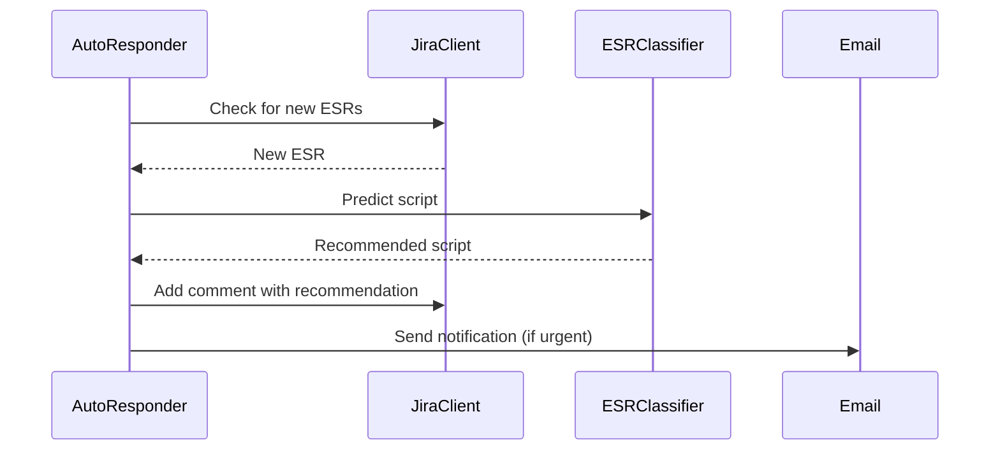

# Chapter 6: AutoResponder (Automated ESR Responses)

Coming from our understanding of the [ESRClassifier (Machine Learning for ESRs)](05_esrclassifier__machine_learning_for_esrs__.md), we can now automate responses to new ESRs. Imagine a common issue like a user forgetting their password.  Instead of waiting for a support engineer to manually respond, the system could automatically detect the issue, recommend the password reset script, and even notify the user.  That's the power of the `AutoResponder`.

## What is AutoResponder?

The `AutoResponder` is like an automated helpdesk system. It constantly monitors for new [ESRs (Engineering Support Requests)](01_esr__engineering_support_request__.md) and automatically responds based on predefined rules and the predictions from the [ESRClassifier (Machine Learning for ESRs)](05_esrclassifier__machine_learning_for_esrs__.md).  It can also send email notifications for urgent issues, ensuring a quick response to critical problems.

## Key Concepts

1. **Monitoring:** The `AutoResponder` regularly checks for new ESRs, like a security guard patrolling a building.

2. **Classification:**  It uses the `ESRClassifier` to understand the nature of the ESR and recommend appropriate solutions.

3. **Response:**  Based on the classification, it can automatically add comments to the ESR with suggested solutions or escalate the issue by sending email notifications.

## Use Case: Automating Password Reset Responses

Let's see how the `AutoResponder` can automatically handle password reset requests:

```ruby
# Simplified example: Starting the AutoResponder
require_relative 'auto_responder'

# Configure the AutoResponder (e.g., email settings, JIRA client)
AutoResponder.configure(email_enabled: true)

# Start the monitoring loop
AutoResponder.start(
  jira_client: JiraClient, # Pass in your JiraClient instance
  esr_classifier: ESRClassifier # Pass in your ESRClassifier instance
)
```

**Explanation:**

1. We configure the `AutoResponder` with necessary settings, like enabling email notifications.
2. We start the `AutoResponder` by calling `start` and providing instances of the [Client Libraries (API Wrappers)](02_client_libraries__api_wrappers__.md) it needs, like `JiraClient` and `ESRClassifier`.
3. The `AutoResponder` now runs in the background, continuously monitoring for new ESRs.

## Internal Implementation

Here's a simplified sequence diagram showing how the `AutoResponder` processes a new ESR:



The `AutoResponder` checks for new ESRs using the `JiraClient`. If a new ESR is found, it uses the `ESRClassifier` to predict a solution.  It then adds a comment to the ESR with the recommendation and sends an email notification if necessary.

## Code Example: `auto_responder.rb`

Let's look at a simplified snippet from `auto_responder.rb`:

```ruby
# File: auto_responder.rb (simplified)
module AutoResponder
  def self.process_esr(esr, options)
    # ... (Check if ESR is urgent) ...

    # ... (Use ESRClassifier to predict a script) ...

    if success
      # ... (Generate a response using the recommended script) ...
      options[:jira_client].add_comment(esr.key, response) # Add comment to ESR
      # ... (Send email notification if urgent) ...
    end
  end
end
```

The `process_esr` method handles the core logic of processing a single ESR. It checks for urgency, uses the `ESRClassifier` to predict a script, generates a response, adds a comment to the ESR, and sends email notifications if needed.

## Conclusion

In this chapter, we learned about the `AutoResponder` and how it automates responses to new ESRs.  We saw how it uses the `ESRClassifier` to recommend solutions and how it can send email notifications for urgent issues. In the next chapter, we'll explore the [Live Mode Manager (Real-time Event Monitoring)](07_live_mode_manager__real_time_event_monitoring__.md).


---

Generated by [AI Codebase Knowledge Builder](https://github.com/The-Pocket/Tutorial-Codebase-Knowledge)