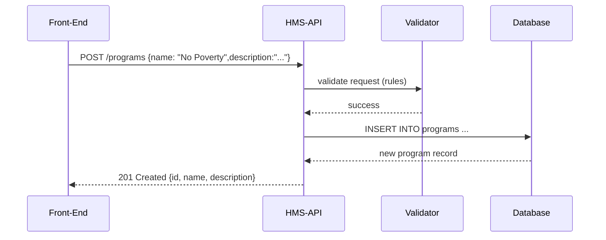

# Chapter 6: Backend API Endpoints

In the previous chapter, you learned how to secure your API with [Authentication & Authorization](05_authentication___authorization_.md). Now we’ll see **how front-ends actually talk to HMS-API**—the controller routes and methods, aka “Backend API Endpoints.”

---

## 1. Why Do We Need Endpoints?

Imagine a government portal where:

- A citizen clicks “View Programs” to see all social initiatives.
- An admin clicks “Edit Protocol” to update a workflow step.
- A mobile app calls “Create Protocol” when a clerk starts a new policy.

Each of these actions must go through an **official door**—a defined URL and HTTP method that:

- Validates inputs (no bad data allowed).
- Checks permissions (only officers can edit).
- Returns clear JSON responses.

These endpoints are the **front gate** of HMS-API, enforcing security and consistency—just like real-world government channels.

---

## 2. Key Concepts

1. **Route**  
   Maps a URL and HTTP method (GET, POST, PUT, DELETE) to a controller action.

2. **Controller**  
   A PHP class grouping related methods (e.g., `ProgramController`).

3. **Request Validation**  
   A set of rules that input data must satisfy before your controller runs.

4. **Middleware**  
   Reusable filters (e.g., `auth:sanctum`) that run before or after a request.

5. **Response**  
   A structured JSON payload with status codes (200, 201, 400, 404, etc.).

---

## 3. Defining Routes

In `routes/api.php`, we declare endpoints:

```php
use App\Http\Controllers\ProgramController;

Route::middleware('auth:sanctum')->group(function () {
  Route::get('/programs', [ProgramController::class, 'index']);
  Route::post('/programs', [ProgramController::class, 'store']);
  Route::put('/programs/{id}', [ProgramController::class, 'update']);
});
```

Explanation:
- `GET /programs` lists all programs.
- `POST /programs` creates a new program.
- `PUT /programs/{id}` updates an existing program.
- All routes require a valid token (`auth:sanctum`).

---

## 4. A Simple Create-Program Flow

### 4.1 Controller Method

File: `app/Http/Controllers/ProgramController.php`

```php
public function store(ProgramRequest $req)
{
  // 1. Data is already validated
  $data = $req->validated();

  // 2. Create and save
  $program = \App\Models\Core\Program\Program::create($data);

  // 3. Return JSON with 201 status
  return response()->json($program, 201);
}
```

Explanation:
1. `ProgramRequest` runs validation rules.  
2. We call Eloquent’s `create()` to insert the record.  
3. We send back the new program object with HTTP 201 Created.

### 4.2 Validation Rules

File: `app/Http/Requests/ProgramRequest.php`

```php
public function rules()
{
  return [
    'name'        => 'required|string|max:255',
    'description' => 'nullable|string'
  ];
}
```

Explanation:
- Ensures `name` is present and is text.
- `description` is optional but must be a string if given.
- If validation fails, Laravel returns `422 Unprocessable Entity` with errors.

---

## 5. Sequence Diagram

Here’s what happens when a front-end calls **POST /programs**:



1. The request hits our route.  
2. Laravel runs `ProgramRequest` validation.  
3. On success, the model saves data to the DB.  
4. We return the saved object.

---

## 6. Querying & Updating

### 6.1 Listing Programs

```php
public function index()
{
  $programs = \App\Models\Core\Program\Program::all();
  return response()->json($programs);
}
```

Explanation:
- Fetches all programs.
- Returns a JSON array.

### 6.2 Updating a Program

```php
public function update(ProgramRequest $req, $id)
{
  $program = Program::findOrFail($id);
  $program->update($req->validated());
  return response()->json($program);
}
```

Explanation:
1. `findOrFail()` returns 404 if not found.  
2. `update()` modifies allowed fields.  
3. We send back the updated record (200 OK).

---

## 7. Under the Hood: Route → Controller

1. **Route Matching**: Laravel finds the route in `api.php`.  
2. **Middleware**: `auth:sanctum` checks the token.  
3. **Validation**: A `FormRequest` runs rules.  
4. **Controller**: Your method executes.  
5. **Model**: Eloquent talks to the database.  
6. **Response**: JSON is sent back.

This flow ensures every request is validated, secure, and consistent—just like filing government forms through official channels.

---

## Conclusion

In this chapter, you learned how to:

- Define **routes** in `routes/api.php`  
- Write **controller** methods for listing, creating, and updating  
- Apply **validation** with FormRequests  
- Understand the **middleware** and request lifecycle  

With these building blocks, your front-end can safely manage **Programs** and **Protocols** in HMS-API. Next up: handling data per agency with **[Tenant Management](07_tenant_management_.md)**.

---

Generated by [AI Codebase Knowledge Builder](https://github.com/The-Pocket/Tutorial-Codebase-Knowledge)