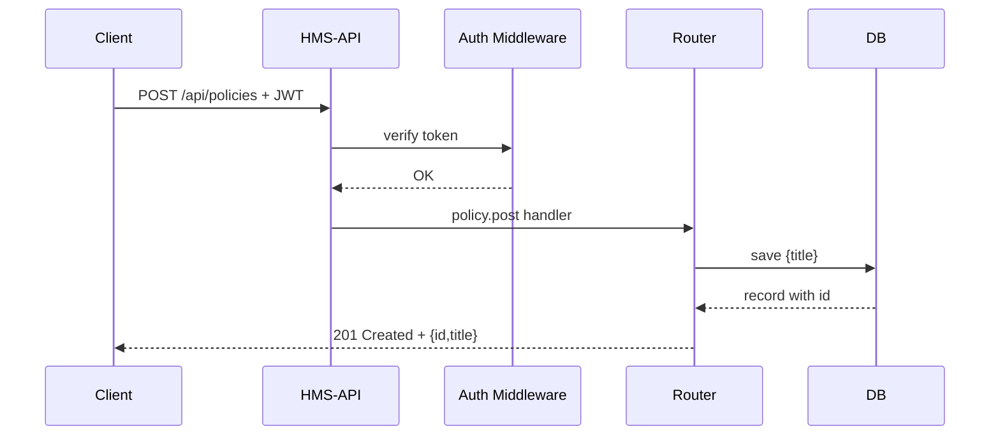

# Chapter 6: Backend API Layer (HMS-API/HMS-MKT)

Welcome back! Now that you’ve seen how our AI agents coordinate tasks in the [AI Agent Framework (HMS-A2A)](05_ai_agent_framework__hms_a2a__.md), it’s time to expose those capabilities—and everything else—through a secure, standardized **Backend API Layer**. Think of it as the menu and ordering system at a restaurant: front-end apps and external systems place “orders” (requests) and get back dishes (responses).

---

## 1. Motivation & Central Use Case

Imagine a state agency web portal needs to:
1. Create a new policy document  
2. Fetch policy details  
3. Sync approved policies with an external archive  

Rather than each front end reinventing security, validation, and routing, we build a single **HMS-API** that:
- Exposes endpoints like `POST /api/policies` or `GET /api/policies/:id`  
- Enforces authentication, rate‐limiting, and input validation  
- Logs every request for compliance with government IT standards  

This ensures any client—web, mobile, or partner system—“orders” policy services in a safe, uniform way.

---

## 2. Key Concepts

1. **Endpoint**  
   A URL path (e.g. `/api/policies`) paired with an HTTP verb (`GET`, `POST`).

2. **Middleware**  
   Pluggable functions that run before your handler—e.g., checking JWT tokens or rate‐limits.

3. **Controller (Handler)**  
   The function that receives validated input, talks to your database or services, and returns a response.

4. **Validation**  
   Ensuring incoming data matches a schema (e.g., policy title must be a non-empty string).

5. **Rate‐Limiting**  
   Throttling clients (e.g., max 100 requests/min) to prevent abuse and ensure fairness.

---

## 3. Hands-On: Building a Minimal Policy API

We’ll create a tiny Node.js/Express service with:
- Authentication middleware  
- A `POST /api/policies` endpoint  
- A `GET /api/policies/:id` endpoint  

### 3.1 Basic Server Setup

File: server.js  
```js
const express = require('express');
const auth = require('./middleware/auth');
const policyRoutes = require('./routes/policy');
const app = express();

app.use(express.json());
app.use('/api/policies', auth, policyRoutes);

app.listen(3000, () => console.log('API listening on :3000'));
```
> We mount our JSON parser, then all `/api/policies` routes behind `auth` middleware.

### 3.2 Authentication Middleware

File: middleware/auth.js  
```js
module.exports = function(req, res, next) {
  const token = req.headers.authorization;
  if (token === 'Bearer gov-secret') return next();
  res.status(401).json({ error: 'Unauthorized' });
};
```
> Every request needs an `Authorization` header. In real life, you’d verify JWTs or OAuth tokens.

### 3.3 Policy Routes

File: routes/policy.js  
```js
const express = require('express');
const router = express.Router();
const db = {}; // pretend in-memory DB

router.post('/', (req, res) => {
  const id = Date.now();
  db[id] = { id, title: req.body.title };
  res.status(201).json(db[id]);
});

router.get('/:id', (req, res) => {
  const policy = db[req.params.id];
  if (!policy) return res.status(404).end();
  res.json(policy);
});

module.exports = router;
```
> Our “database” is a simple object. `POST` creates a policy; `GET` retrieves it.

### 3.4 Calling the API from a Front-End

```js
// Example in a browser console or front-end code:
fetch('/api/policies', {
  method: 'POST',
  headers: { 'Content-Type': 'application/json','Authorization':'Bearer gov-secret' },
  body: JSON.stringify({ title: 'Data Protection Policy' })
})
  .then(res => res.json())
  .then(console.log);
```
> You’ll see a JSON response like `{ id: 1616161616, title: 'Data Protection Policy' }`.

---

## 4. What Happens Under the Hood?



---

## 5. Internal Implementation Walkthrough

### 5.1 Non-Code Steps

1. **Request Arrives** at `/api/policies`  
2. **Auth Middleware** checks the token  
3. **Express Router** dispatches to the right handler  
4. **Handler** validates input, writes to DB  
5. **Response** is sent back, and logs are written for audit

### 5.2 Core Files & Code

#### server.js  
```js
const express = require('express');
const app = express();
app.use(express.json());                     // parse JSON bodies
app.use('/api/policies', require('./middleware/auth'), require('./routes/policy'));
app.listen(3000);
```

#### middleware/auth.js  
```js
module.exports = (req, res, next) => {
  // In reality, verify JWT/OAuth here.
  if (req.headers.authorization === 'Bearer gov-secret') return next();
  res.status(401).json({ error: 'Unauthorized' });
};
```

#### routes/policy.js  
```js
const r = require('express').Router(), db = {};
r.post('/', (req, res) => {
  const id = Date.now();
  db[id] = { id, title: req.body.title };
  res.status(201).json(db[id]);
});
r.get('/:id', (req, res) => {
  const p = db[req.params.id];
  if (!p) return res.status(404).end();
  res.json(p);
});
module.exports = r;
```

> These files show the minimal structure: server setup, middleware, and route handlers.

---

## 6. Summary & Next Steps

In this chapter you learned how **HMS-API/HMS-MKT**:

- Exposes **endpoints** for policy creation and retrieval  
- Applies **middleware** for authentication and input validation  
- Structures **controllers** (route handlers) to keep things organized  
- Logs and throttles requests to meet government IT standards  

Next up, we’ll see how to keep these APIs in sync with outside systems in [External System Synchronization](07_external_system_synchronization_.md). Happy coding!

---

Generated by [AI Codebase Knowledge Builder](https://github.com/The-Pocket/Tutorial-Codebase-Knowledge)