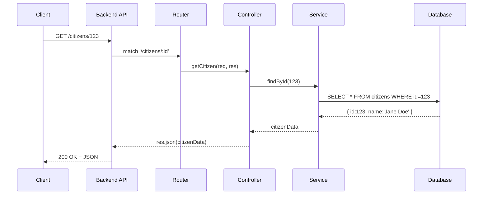

# Chapter 6: Backend API

In [Chapter 5: Intent-Driven Navigation](05_intent_driven_navigation_.md) we learned how users pick what they want to do. Now it’s time to see **how our front end talks to real data**—the **Backend API**. Think of this as the government records office counter: it accepts your requests to create, read, update, or delete (CRUD) data and policies, and returns official results.

---

## Why a Backend API?

Imagine a citizen portal where:

- An admin adds a new benefit policy.
- A public form fetches an applicant’s data.
- Both the Admin Portal and the public site share the same data source.

We need a programmatic gateway that:

- Exposes HTTP endpoints (e.g. `GET /citizens/123`)
- Implements business logic (create, read, update, delete)
- Talks to a database or policy store
- Enforces security and validation

This is our **Backend API**—the single source of truth for all data operations.

---

## Central Use Case: Citizen Records Service

Use case: The Admin Portal wants to update a citizen’s record (address change).  
1. Admin UI calls `PUT /api/citizens/123` with new address.  
2. Backend API validates the request.  
3. It updates the database and returns the updated record.  
4. The UI shows “Address updated!”  

Both Admin and public apps rely on the same endpoints, so our data stays consistent.

---

## Key Concepts

- **Endpoint**  
  A URL + HTTP verb (e.g. `GET /policies`, `POST /citizens`).  
- **Router**  
  Maps URLs to handler functions.  
- **Controller**  
  Receives the request, calls the service, sends the HTTP response.  
- **Service Layer**  
  Contains business logic and talks to the database or policy store.  
- **Data Model / DB**  
  Actual storage (SQL, NoSQL, in-memory).  
- **Middleware**  
  Hooks that run before controllers (e.g. authentication, logging, validation).

---

## 1. Calling the API from the Front End

Here’s how a Vue or React app fetches a citizen record:

```js
// interface/src/api.js
export async function fetchCitizen(id) {
  const res = await fetch(`/api/citizens/${id}`)
  if (!res.ok) throw new Error('Failed to load citizen')
  return res.json() // returns { id: 123, name: 'Jane Doe', ... }
}
```

Explanation:
- We call `GET /api/citizens/123`.  
- If the network is OK, we parse the JSON and return a JavaScript object.  

On success, your UI can display the data; on failure, show an error message.

---

## 2. What Happens Under the Hood?

Let’s follow a single request:



Step-by-step:
1. **Client** sends HTTP request.  
2. **Router** matches URL to a controller method.  
3. **Controller** calls the **Service**.  
4. **Service** queries the **Database**.  
5. Data flows back to the client as JSON.

---

## 3. Inside the Backend: Core Files

Below is a minimal Express.js example. Each code block is under 20 lines.

### 3.1 app.js

```js
// backend/app.js
const express = require('express')
const app = express()

app.use(express.json())              // parse JSON bodies
app.use('/citizens', require('./routes/citizenRoutes'))
app.use('/policies', require('./routes/policyRoutes'))

module.exports = app
```

Explanation:
- We register two routers: `/citizens` and `/policies`.  
- `express.json()` lets us read `req.body` as JSON.

---

### 3.2 routes/citizenRoutes.js

```js
// backend/routes/citizenRoutes.js
const router = require('express').Router()
const ctrl = require('../controllers/citizenController')

// CRUD endpoints
router.post('/',   ctrl.createCitizen)
router.get('/:id', ctrl.getCitizen)
router.put('/:id', ctrl.updateCitizen)
router.delete('/:id', ctrl.deleteCitizen)

module.exports = router
```

Explanation:
- Defines four endpoints for citizens.  
- Each route calls a controller method.

---

### 3.3 controllers/citizenController.js

```js
// backend/controllers/citizenController.js
const service = require('../services/citizenService')

exports.getCitizen = async (req, res) => {
  const data = await service.findById(req.params.id)
  res.json(data) // sends 200 OK + JSON
}
```

Explanation:
- Retrieves `id` from `req.params`.  
- Calls the service and returns JSON.

---

### 3.4 services/citizenService.js

```js
// backend/services/citizenService.js
const db = require('../models/db')

exports.findById = async id => {
  // Simplified DB query
  const result = await db.query(
    'SELECT * FROM citizens WHERE id = $1', [id]
  )
  return result.rows[0]
}
```

Explanation:
- Executes a SQL query to fetch one row.  
- Returns the first record.

---

### 3.5 models/db.js

```js
// backend/models/db.js
const { Pool } = require('pg')
const pool = new Pool({ connectionString: process.env.DATABASE_URL })

module.exports = {
  query: (text, params) => pool.query(text, params)
}
```

Explanation:
- A simple Postgres client.  
- All services call `db.query(...)` to access data.

---

## Conclusion

You’ve seen how our **Backend API**:

- Exposes CRUD endpoints via HTTP  
- Routes requests through Express routers  
- Uses controllers, services, and models to isolate logic  
- Powers both admin and public interfaces via the same gateway  

Next up, we’ll decompose these APIs into independent services in [Microservices Architecture](07_microservices_architecture_.md).

---

Generated by [AI Codebase Knowledge Builder](https://github.com/The-Pocket/Tutorial-Codebase-Knowledge)