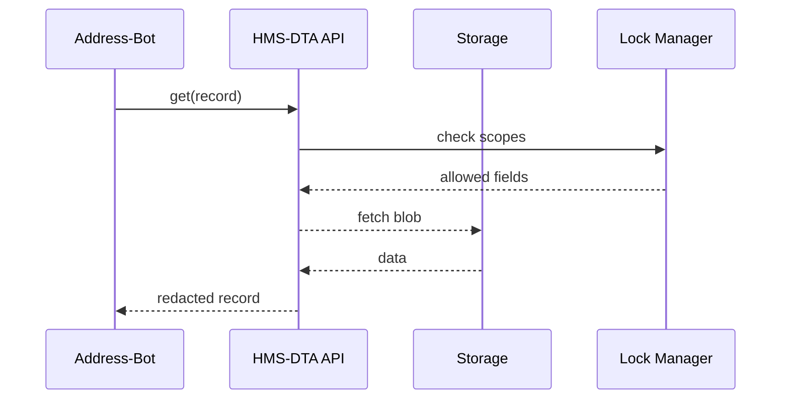

# Chapter 6: Central Data Repository (HMS-DTA)

*(The “National Archives in a thumb-drive, yet no one can peek without a key)*  

[← Back to Chapter 5: Core Agent Framework (HMS-AGT)](05_core_agent_framework__hms_agt__.md)

---

## 1. Why Do We Need HMS-DTA?

Picture this:  
1. A citizen uploads proof of residence to finish an online passport renewal.  
2. Ten minutes later an AI **Address-Bot** (built in [HMS-AGT](05_core_agent_framework__hms_agt__.md)) verifies the ZIP + 4.  
3. Six months later a congressional audit checks whether documents were kept no longer than 180 days.

All three moments touch the *same* file, yet with *different* rules:

• The citizen may overwrite the file during a grace period.  
• Address-Bot can only read the “address” field, not the photo ID.  
• The auditor sees meta-data, never the image itself.

HMS-DTA is the **one vault** that makes these promises stick—no matter how many panes, agents, or external APIs come and go.

---

## 2. Key Concepts (Archive Room Analogies)

| HMS-DTA Term | Archive-Room Analogy | Plain English |
|--------------|---------------------|---------------|
| Record       | Single folder       | One JSON doc, image, or log line. |
| Collection   | Filing cabinet      | Group of related records (e.g., “passport-2024”). |
| Version      | Draft stamp (“v2”)  | Every change is stored, nothing overwritten. |
| Lock         | Restricted drawer   | Who may see or edit fields. |
| Retention    | Shred-after date    | Auto-delete or archive rule. |
| Query        | Index card search   | Fast way to find records you are allowed to see. |

Remember these six words; everything else is just plumbing.

---

## 3. A 3-Minute Hands-On Tour

We will:

1. Store a new passport file.  
2. Retrieve it with privacy filters.  
3. Auto-expire it after 180 days.

*(All code under 20 lines—promise!)*

### 3.1 Save a Record

```js
// save-record.js
import { put } from 'hms-dta';

await put({
  collection : 'passport-2024',
  recordId   : 'user-123/photo-id',
  data       : { name:'Maya', address:'123 Elm', photoBlob },
  lock       : ['citizen:Maya', 'agent:Address-Bot'], // who can read
  retention  : 'P180D'        // ISO-8601 duration (180 days)
});
```

Explanation  
`put` drops the record in the vault, tags who may read it, and starts the retention timer.

---

### 3.2 Read It Back (Address-Bot)

```js
// address-bot.js (inside agent.handle)
import { get } from 'hms-dta';

const record = await get('passport-2024', 'user-123/photo-id');
console.log(record.data.address);  // ✓ Allowed
console.log(record.data.photoBlob); // ❌ redacted
```

Explanation  
When the bot lacks permission for a field, HMS-DTA automatically redacts it (returns `undefined`).

---

### 3.3 Query All “Expiring Soon” Files (Auditor)

```js
// audit-query.js
import { query } from 'hms-dta';

const hits = await query({
  collection : 'passport-2024',
  where      : { daysToDelete: { lt: 7 } },  // < 7 days left
  select     : ['recordId','retention']
});
console.table(hits);
```

Explanation  
The auditor never sees personal data—only meta-data columns they request.

---

## 4. What Happens Behind the Scenes?

### 4.1 Step-by-Step (Plain English)

1. `put` lands in **Ingest Buffer** → basic schema check.  
2. **Lock Manager** stamps a row in the ACL table (`citizen:Maya`, `agent:Address-Bot`).  
3. Data blob is written to **Object Storage** (`s3://hms-dta/…`).  
4. Index pointers go to **Query Index** (a SQL or Elastic table).  
5. A **Retention Worker** schedules an “expire” job at `now + 180 days`.  
6. `get` checks the caller’s badge scopes against ACL → redacts fields → streams data out.

### 4.2 Mini Sequence Diagram



---

## 5. A Gentle Peek at the Internals

*(Code snippets cut to the bone; real code uses durable stores.)*

### 5.1 The ACL Check (8 lines)

```js
// dta/acl.js
export function filterData(userScopes, record){
  const allowed = record.lock.some(scope => userScopes.includes(scope));
  if (!allowed) throw '403 Forbidden';

  // Redact field-level locks (simplified)
  for (const k in record.data)
    if (!userScopes.includes(record.lockMap[k])) delete record.data[k];

  return record;
}
```

Explanation  
• First gate: can you see the record at all?  
• Second gate: can you see each field? Deleted keys appear as `undefined`.

---

### 5.2 Retention Worker (11 lines)

```js
// dta/retention.js
import { listExpiring, deleteRecord } from './store.js';

setInterval(async () => {
  const expiring = await listExpiring(Date.now());
  for (const rec of expiring)
      await deleteRecord(rec.collection, rec.recordId);
}, 60_000); // runs every minute
```

Explanation  
Every 60 seconds we query for anything past its shred-after date and delete it.  
*(Production runs hourly with audit logging, but the idea is identical.)*

---

## 6. Where HMS-DTA Fits in the Bigger Picture

1. **Agents** ([HMS-AGT](05_core_agent_framework__hms_agt__.md)) use HMS-DTA to store task outputs and pull previous context.  
2. **Workflows** ([HMS-ACT](04_agent_orchestration___workflow__hms_act__.md)) rely on versioned records to resume after failures.  
3. **Security & Compliance Engine** ([Chapter 10](10_security___compliance_engine__hms_esq___hms_ops__.md)) audits every access via DTA’s immutable logs.  
4. **Human-in-the-Loop** reviewers (next chapter) open files straight from HMS-DTA with their own scoped locks.

Think of HMS-DTA as the **single source of truth** every other layer leans on.

---

## 7. Frequently Asked Questions

1. **Can I store large videos?**  
   Yes—up to 5 GB per record by default. Data is chunked; indexes keep only pointers.

2. **What about schema migrations?**  
   Add new fields any time. Old versions stay intact; queries can request `version:latest`.

3. **How fast are queries?**  
   Meta-data queries are sub-second. Pulling blobs depends on size but streams begin immediately.

4. **Can two agents edit the same record?**  
   Yes—optimistic locking with versions. If a newer version exists, `put` fails with `409 Conflict`.

5. **Is encryption at rest?**  
   Always—AES-256 with per-collection keys managed by the Security Engine.

---

## 8. Summary & What’s Next

In this chapter you:

* Learned six core concepts of HMS-DTA (record, collection, version, lock, retention, query).  
* Stored, retrieved, and auto-deleted a passport record with less than 20 lines of code.  
* Peeked inside the ACL and retention workers that keep data private and temporary.  
* Saw how every other HMS layer leans on this central vault.

Next we’ll hand some of these records to real humans for spot-checks in  
[Chapter 7: Human-in-the-Loop Oversight (HITL)](07_human_in_the_loop_oversight__hitl__.md)  

Onward to better oversight!

---

Generated by [AI Codebase Knowledge Builder](https://github.com/The-Pocket/Tutorial-Codebase-Knowledge)