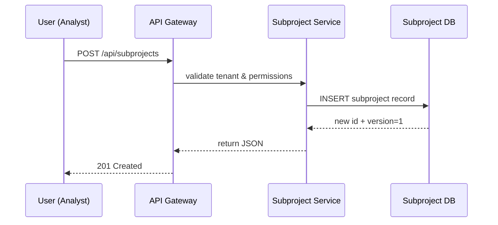

# Chapter 6: CodifySubproject

Welcome back! In [Chapter 5: Policy Management API](05_policy_management_api_.md), you learned how to draft, version, and enforce high-level policies. Now we’ll break those big policies or programs into focused “subprojects”—think of them like special committees under a broader legislative goal—using the **CodifySubproject** abstraction.

---

## 6.1 Why CodifySubproject?

Imagine your government has a big goal: **“End Poverty in All Its Forms Everywhere.”** That broad goal spawns several task forces:

- A **Housing Subsidy Task Force** tackling affordable housing  
- A **Food Security Task Force** ensuring nutrition assistance  
- A **Job Training Task Force** helping citizens gain employment  

Each task force has its own steps, documents, and stakeholders, but they all report to the same poverty-reduction agenda. **CodifySubproject** lets you group, version, and collaborate on these smaller initiatives without losing sight of the big picture.

Use Case  
The State Legislature uses HMS-API to:

1. Create a **No Poverty** program.  
2. Spin off a **Housing Subsidy** subproject to draft rules and budgets.  
3. Let policy analysts and AI agents iterate on housing criteria.  
4. Track versions and approvals for that subproject—while still linking it back to “No Poverty.”

---

## 6.2 Key Concepts

1. **Subproject**  
   A focused initiative under a parent policy or program (e.g., “Housing Subsidy Task Force”).  

2. **Parent Reference**  
   Every Subproject points back to its parent `program_id` or `policy_id` so you maintain context.  

3. **Stakeholders**  
   Humans or AI agents assigned roles—like “Lead Analyst” or “BudgetBot”—collaborate on a Subproject.  

4. **Versioning**  
   Each update to a Subproject (its charter, status, documents) increments a version, so you can audit every change.  

5. **Collaboration**  
   Subprojects have their own comments, attachments, and state machine (e.g., Draft → Review → Approved).

---

## 6.3 How to Use CodifySubproject

### 6.3.1 Create a Subproject

```http
POST /api/subprojects
Content-Type: application/json

{
  "parent_program_id": "prog_no_poverty",
  "name": "Housing Subsidy Task Force",
  "description": "Define subsidy criteria for low-income households"
}
```

What happens:  
- HMS-API checks your tenant and `create_subproject` permission.  
- Inserts a new subproject with version `1`.  
- Returns the subproject record:

```json
{
  "id": "subproj_001",
  "parent_program_id": "prog_no_poverty",
  "name": "Housing Subsidy Task Force",
  "version": 1,
  "status": "draft"
}
```

### 6.3.2 List Subprojects for a Program

```http
GET /api/programs/prog_no_poverty/subprojects
X-Tenant-ID: tenant_state_123
```

Response: an array of all Subprojects linked to `prog_no_poverty`.

### 6.3.3 Update a Subproject

```http
PUT /api/subprojects/subproj_001
Content-Type: application/json

{
  "description": "Add income cap and location requirements",
  "status": "review"
}
```

- Creates version `2` of `subproj_001`.  
- Returns the updated record with `version: 2` and `status: "review"`.

---

## 6.4 What Happens Under the Hood?



1. API Gateway authenticates and checks `X-Tenant-ID`.  
2. Subproject Service handles business rules (linking to parent).  
3. Database stores the new Subproject and version.  
4. Response goes back to the user.

---

## 6.5 Internal Implementation

### File: models/subproject_model.js

```js
// models/subproject_model.js
class Subproject {
  constructor(data) {
    Object.assign(this, data);
  }

  static async create({ parent_program_id, name, description }) {
    // Simplified DB insert, returns full record
    const record = await db.insert('subprojects', {
      parent_program_id, name, description,
      version: 1, status: 'draft'
    });
    return new Subproject(record);
  }
}
module.exports = Subproject;
```

This model:
- Takes `parent_program_id`, `name`, and `description`.  
- Sets initial `version` to 1 and `status` to `draft`.

### File: middleware/subproject.js

```js
// middleware/subproject.js
const Subproject = require('../models/subproject_model');

async function requireSubproject(req, res, next) {
  const sp = await Subproject.findById(req.params.subprojectId);
  if (!sp) return res.status(404).json({ error: 'Subproject not found' });
  req.subproject = sp;
  next();
}
module.exports = requireSubproject;
```

This middleware:
1. Looks up the Subproject by ID.  
2. Attaches it to `req.subproject` for downstream handlers.

---

## Conclusion

You’ve learned how **CodifySubproject** helps you split big policies or programs into manageable, versioned initiatives—just like special committees under a broader legislative goal. Next up, we’ll explore how to plug in reusable pieces with the [Module System](07_module_system_.md).

---

Generated by [AI Codebase Knowledge Builder](https://github.com/The-Pocket/Tutorial-Codebase-Knowledge)