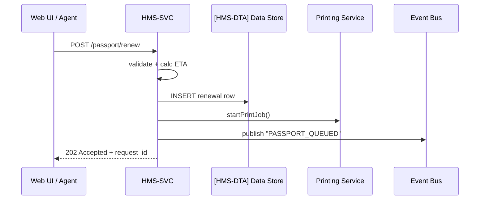

# Chapter 6: Core Backend Services (HMS-SVC)
*(linked from [Accountability & Performance Metrics Tracker](05_accountability___performance_metrics_tracker_.md))*  

---

## 1. Why Do We Need a “Warehouse Behind the Counter”?

In the last chapter we built a **scoreboard** that tracks who is doing a good job.  
But where are the *actual* jobs—grant applications, license renewals, budget transfers—processed?

Think of your favorite government website.  
You fill out a form, press **Submit**, and *something* checks it, stores it, and sends you a tracking number.  
That *something* is **Core Backend Services (HMS-SVC)**.

> Analogy: The city clerk’s window (UI) smiles and takes your papers, but the warehouse behind the door (SVC) stamps, sorts, and forwards them.

---

## 2. A Concrete Use-Case—“90-Minute Passport Renewal”

The **U.S. Department of State** wants to pilot a *fast-lane* passport renewal:

1. A citizen uploads a new photo.  
2. An AI agent says, “Photo meets requirements.”  
3. HMS-SVC must:  
   • Validate the form data.  
   • Calculate an estimated completion time (≤ 90 minutes).  
   • Record the request in the database.  
   • Fire an event so that printing & mailing services begin.

Let’s see how SVC makes this happen.

---

## 3. Key Concepts (Plain English)

| Concept | What It Really Means | Friendly Analogy |
|---------|---------------------|------------------|
| Endpoint | A URL you call—`/passport/renew`—to start work. | Post-office intake slot. |
| Validation | Quick checks: is the photo JPEG? Is the fee paid? | Clerk eyeballing your paperwork. |
| Business Rule Engine | Calculates things like turn-around time or fee waivers. | An experienced supervisor doing mental math. |
| Downstream Call | SVC contacting another micro-service (e.g., Printing). | Warehouse clerk phoning the print shop. |
| Event | JSON message broadcast: “Passport #123 queued.” | Intercom announcement in the facility. |

---

## 4. Using HMS-SVC: 15 Lines to File a Renewal

```python
# file: demo_renew_passport.py
import requests, json

payload = {
    "citizen_id": "CIT-9001",
    "old_passport": "P123456",
    "photo_url": "https://photos.gov/alice.jpg",
    "fee_txn": "ACH-7788"
}

# 1. Submit form to SVC
r = requests.post("https://svc.gov/passport/renew", json=payload)

print(r.status_code)               # 202 = accepted
print(r.json())
```

Sample output:

```json
{
  "request_id": "R-2024-0042",
  "eta_minutes": 87,
  "status": "QUEUED"
}
```

Explanation:

1. One POST request starts the process.  
2. SVC immediately replies with a tracking ID and an ETA—calculated by the Business Rule Engine.  
3. Behind the scenes, events are already flying to Printing & Mailing.

---

## 5. What Happened Behind the Curtain?



Five actors, no mystery.

---

## 6. Under-the-Hood Code Peeks (All ≤ 20 Lines)

### 6.1 The Endpoint (`svc/api_passport.py`)

```python
from fastapi import APIRouter, HTTPException
from .rules import estimate_eta, valid_photo
from .store import save_row, emit_event, start_print

router = APIRouter()

@router.post("/passport/renew", status_code=202)
def renew(req: dict):
    if not valid_photo(req["photo_url"]):
        raise HTTPException(400, "Bad photo")

    eta = estimate_eta(req)
    row_id = save_row("passport_renewals", {**req, "eta": eta})
    start_print(row_id)

    emit_event("PASSPORT_QUEUED", {"id": row_id, "eta": eta})
    return {"request_id": row_id, "eta_minutes": eta, "status": "QUEUED"}
```

What you should notice:

* **7 functional lines**—all heavy lifting is delegated to helpers.  
* Helpers are **pure functions** → easy to unit-test.  

### 6.2 Business Rule Helper (`svc/rules.py`)

```python
def estimate_eta(req):
    if req.get("expedite"):
        return 30
    return 90           # default fast-lane SLA

def valid_photo(url):
    return url.endswith(".jpg") or url.endswith(".jpeg")
```

Beginner-friendly: only string checks and a single *if* statement.

---

## 7. Integrating With Other Layers

• Events land in [Central Data Repository (HMS-DTA)](07_central_data_repository__hms_dta__.md) for long-term storage.  
• Payment status (`fee_txn`) will be confirmed by [Financial Transaction Hub (HMS-ACH)](08_financial_transaction_hub__hms_ach__.md).  
• Any human override (e.g., bad photo) is handled via [Human-in-the-Loop Oversight (HITL)](04_human_in_the_loop_oversight__hitl__.md).  
• Performance metrics (ETA accuracy) flow to [Accountability & Performance Metrics Tracker](05_accountability___performance_metrics_tracker_.md).

---

## 8. Hands-On Mini-Lab (5 Minutes)

1. Clone demo repo  
   `git clone https://github.com/example/hms-nfo.git`  
2. Start mock SVC server  
   `python -m svc.mock_server`  
3. Run the script above (`python demo_renew_passport.py`).  
4. `curl http://localhost:8001/status/R-2024-0042` to watch the status move from `QUEUED` → `PRINTING` → `SHIPPED`.

Congratulations—you just processed a passport in under 90 minutes (simulated)!

---

## 9. Recap & What’s Next

* **HMS-SVC** is the “warehouse” that hosts business logic, validation, and event firing.  
* One simple POST request kicks off a chain of deterministic, auditable steps.  
* Small helper functions keep code readable and testable.  

Next, we’ll zoom into that **data store** we depended on:  
[Central Data Repository (HMS-DTA)](07_central_data_repository__hms_dta__.md) – the beating heart where every record lives.

---

Generated by [AI Codebase Knowledge Builder](https://github.com/The-Pocket/Tutorial-Codebase-Knowledge)