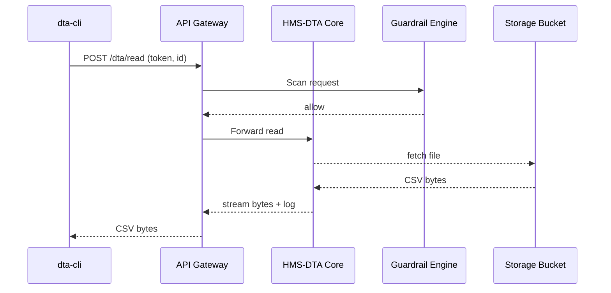

# Chapter 6: Data Repository & Governance (HMS-DTA)

*(continuing from [Security, Privacy & Legal Guardrails (HMS-ESQ + Platform Controls)](05_security__privacy___legal_guardrails__hms_esq___platform_controls__.md))*  

---

## 1. Why Do We Need a “Library of Data”?

Picture the **National Weather Service (NWS)** producing hourly storm-track datasets while the **Center for Food Safety and Applied Nutrition (CFSAN)** analyzes food-borne illness reports.  
Three things must be true:

1. Each dataset is stored **once**, not emailed around as mystery CSVs.  
2. Every access is recorded—*Who* opened it, *When*, and *Why*—to satisfy FOIA or GDPR-style audits.  
3. Legal rules (retention, privacy, classification) follow the data automatically.

HMS-DTA is that ultra-secure library. You “check out” data the same way you’d borrow a book—*scan your badge, state your purpose, get logged*.

---

## 2. Key Concepts (Plain-English Cheat-Sheet)

| Concept | Library Analogy | One-Sentence Explanation |
|---------|-----------------|--------------------------|
| Dataset Shelf | Bookcase | Physical/Cloud bucket where raw files live. |
| Catalog Card | Book’s index card | Metadata record: owner, schema, privacy tag. |
| Checkout Slip | Slip inside book | Immutable log entry each time a user reads/changes data. |
| Retention Clock | Due-date stamp | Timer that auto-deletes or archives after X years. |
| Lineage Map | Footnotes | Shows how one dataset was derived from others. |

---

## 3. 5-Minute “Hello Dataset” Walk-Through

Goal: Ingest a storm-track CSV, tag it as “PUBLIC”, and later prove Jane Analyst accessed it.  
We will fake **all storage** with a local `./data` folder so you can follow along.

### 3.1 Install Mini CLI

```bash
npm install -g @hms/dta-cli   # tiny helper (~30 kB)
```

### 3.2 Ingest the File

```bash
dta ingest \
  --file ./storms_2024_04.csv \
  --datasetId nws.storm_tracks.2024.apr \
  --privacy PUBLIC \
  --retention "3y"
```

**What happens?**  
1. File is copied to `data/nws/storm_tracks/2024/apr/` (our *shelf*).  
2. A catalog card is written to `catalog.json`.  
3. A “created” checkout slip is appended to `audit.log`.

*Excerpt of `catalog.json`*:

```json
{
  "id": "nws.storm_tracks.2024.apr",
  "owner": "nws",
  "privacy": "PUBLIC",
  "schema": { "storm_id":"string", "lat":"float", "lon":"float" },
  "retention": "2027-04-30T00:00:00Z"
}
```

### 3.3 Read the Dataset (and Get Logged)

```bash
dta read --datasetId nws.storm_tracks.2024.apr --as jane_analyst
```

Output:

```
storm_id,lat,lon
AL0424,29.4,-80.1
...
```

A new line is appended to `audit.log`:

```
2024-04-18T14:32Z | READ | jane_analyst | nws.storm_tracks.2024.apr
```

You just proved an *audit trail* with two commands!

---

## 4. How Does DTA Decide Who May Read?

HMS-DTA never bypasses security. It calls:

* [Identity & Access Management (IAM)](04_identity___access_management__iam__.md) — verifies the user’s token.  
* [Security, Privacy & Legal Guardrails (HMS-ESQ)](05_security__privacy___legal_guardrails__hms_esq___platform_controls__.md) — blocks reads that violate privacy tags.

The CLI you ran silently passed your IAM token to DTA’s REST API behind the scenes.

---

## 5. What Happens Under the Hood?



*Only* after ESQ says “allow” does the file stream back.

---

## 6. Peek Inside HMS-DTA Code (Beginner Edition)

### 6.1 Read Endpoint (14 lines)

`svc/read.js`

```js
import { getMeta, addAudit } from './meta.js';
import fs from 'node:fs';

export async function read(req, res) {
  const id = req.body.datasetId;
  const user = req.user.sub;              // set by IAM middleware

  const meta = await getMeta(id);         // fetch catalog card
  if (meta.privacy === 'SECRET')          // extra manual check
    return res.status(403).send('Forbidden');

  const stream = fs.createReadStream(meta.path);
  addAudit({ user, action:'READ', id });

  stream.pipe(res);                       // send file to caller
}
```

*Key takeaways*  
1. The *privacy tag* is honored before streaming.  
2. `addAudit` writes the checkout slip synchronously for immutability.

### 6.2 Automatic Retention Job (10 lines)

`jobs/retention.js`

```js
import { listExpired } from './meta.js';
import fs from 'node:fs/promises';

export async function sweep() {
  const ids = await listExpired(Date.now());
  for (const id of ids) {
    const { path } = await getMeta(id);
    await fs.unlink(path);                // delete file
    await addAudit({ action:'DELETE', id });
  }
}
```

Run hourly via `cron`—no user can “forget” to delete data after its legal lifespan.

---

## 7. Understanding Lineage (Where Did This Data Come From?)

Every time a workflow **derives** a new dataset (e.g., aggregated monthly storms), it calls:

```bash
dta register-lineage \
  --child nws.storm_tracks.2024.apr.summary \
  --parent nws.storm_tracks.2024.apr
```

Later you can ask:

```bash
dta lineage --datasetId nws.storm_tracks.2024.apr.summary
```

Output:

```
nws.storm_tracks.2024.apr  -->  nws.storm_tracks.2024.apr.summary
```

Auditors now know the exact ancestry—crucial for error tracing or public data challenges.

---

## 8. Common Beginner Questions

**Q: Can I store machine-learning features?**  
A: Yes. Tag them `INTERNAL` or `PII_RESTRICTED` and the same checkout rules apply.

**Q: Is HMS-DTA a data lake or a data warehouse?**  
A: Both! Raw files sit in an object store (lake). Optional SQL views on top give warehouse-style analytics.

**Q: Who sets privacy tags?**  
A: The dataset owner during `dta ingest`. HMS-ESQ enforces them; owners can update but every change is audited.

**Q: How large can files be?**  
A: In cloud mode, terabytes. The CLI streams in chunks; memory use stays low.

---

## 9. Recap

You learned that HMS-DTA:

• Stores every government dataset in one verifiable “library.”  
• Tags data with privacy & retention metadata.  
• Creates immutable checkout slips for audits.  
• Keeps lineage so any data point can be traced back to its source.

Now that data is safely stored, we need reliable *assembly lines* to transform it.  
Next up: orchestrating jobs and human approvals with **HMS-ACT / HMS-OMS**.

👉 Continue to [Workflow Orchestrator (HMS-ACT / HMS-OMS)](07_workflow_orchestrator__hms_act___hms_oms__.md)

---

Generated by [AI Codebase Knowledge Builder](https://github.com/The-Pocket/Tutorial-Codebase-Knowledge)