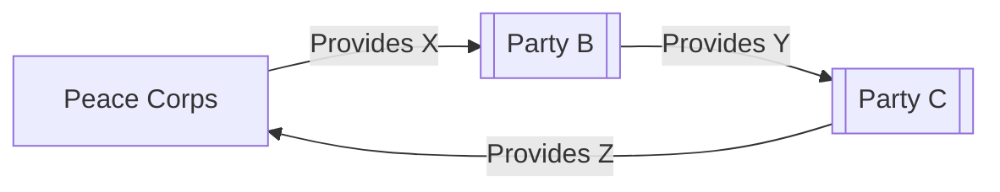
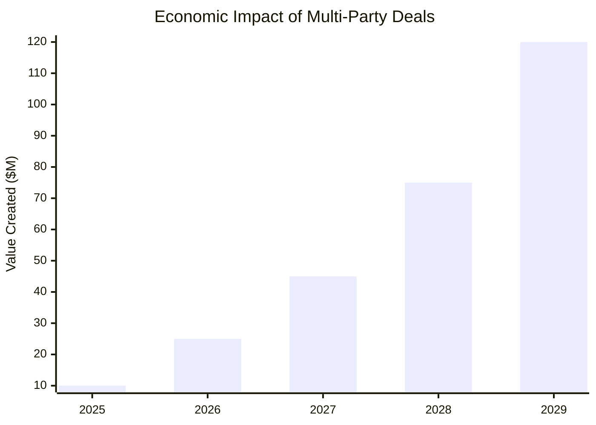

# Abundance-Based Economic Model Integration

This section describes how Peace Corps integrates with the HMS abundance-based economic model and participates in the multi-party deal framework.

## Economic Model Overview

The HMS governance system is built on an economic foundation that prioritizes abundance over scarcity. This model centers around the concept of "Deals" with special emphasis on Nth degree deals (where 3 or more parties collaborate to create greater value than possible through bilateral agreements). At its heart, every government agency functions as an economic actor, coordinating resources and creating value at scale.

## Peace Corps's Role in the Economic Framework

Peace Corps participates in the abundance-based economic model through the following key roles:

1. **Resource Provider**: development funds, technical assistance, and coordination expertise
2. **Deal Facilitator**: creating international partnerships and multi-stakeholder projects
3. **Value Creator**: generating sustainable development outcomes through collaborative models
4. **Network Participant**: connecting international development stakeholders across sectors

## Multi-Party Deal Examples

### Example 1: Multi-Stakeholder Resource Optimization



In this example, Peace Corps facilitates a three-party deal by:
1. [DESCRIBE STEP 1]
2. [DESCRIBE STEP 2]
3. [DESCRIBE STEP 3]

The total value created through this multi-party collaboration exceeds the sum of bilateral exchanges by [VALUE_DELTA]%.

### Example 2: [ANOTHER_DEAL_NAME]

[DESCRIBE ANOTHER RELEVANT MULTI-PARTY DEAL EXAMPLE]

## Moneyball Analytics Integration

Peace Corps leverages the HMS-NFO Moneyball Analytics Framework to optimize its participation in the economic system:

1. **Opportunity Identification**: [DESCRIBE HOW THE AGENCY IDENTIFIES OPPORTUNITIES]
2. **Deal Optimization**: [DESCRIBE HOW THE AGENCY OPTIMIZES DEAL STRUCTURES]
3. **Impact Assessment**: [DESCRIBE HOW THE AGENCY MEASURES ECONOMIC IMPACT]

## Technical Implementation

The abundance-based economic model is implemented through the following technical components:

```mermaid
flowchart TD
    APeace Corps -->|Deal Proposals| B[HMS-CDF]
    A -->|Resource Registration| C[HMS-NFO]
    B -->|Deal Processing| D[HMS-A2A]
    C -->|Analytics| D
    D -->|Deal Execution| E[HMS-ACH]
    E -->|Settlement| A
```

### Integration Points

1. **HMS-CDF Connection**: [DESCRIBE HOW THE AGENCY CONNECTS TO THE DEAL PROCESS ENGINE]
2. **HMS-A2A Agents**: [DESCRIBE THE SPECIALIZED AGENTS USED BY THE AGENCY]
3. **HMS-NFO Analytics**: [DESCRIBE HOW THE AGENCY USES TRADE ANALYTICS]
4. **HMS-ACH Settlement**: [DESCRIBE HOW TRANSACTIONS ARE SETTLED]

## Economic Impact

The implementation of the abundance-based economic model has yielded the following impacts for Peace Corps:

1. **Efficiency Gains**: [DESCRIBE EFFICIENCY IMPROVEMENTS]
2. **Value Creation**: [DESCRIBE NEW VALUE CREATED]
3. **Network Effects**: [DESCRIBE NETWORK EFFECTS ACHIEVED]
4. **Resource Optimization**: [DESCRIBE OPTIMIZED RESOURCE ALLOCATION]

## Visualization

### Multi-Party Deal Flow

```mermaid
sankey-beta
    AGENCY_NAME [RESOURCE_1] => PARTY_B 5
    PARTY_B [RESOURCE_2] => PARTY_C 8
    PARTY_C [RESOURCE_3] => AGENCY_NAME 10
    PARTY_C [RESOURCE_4] => PARTY_D 4
    PARTY_D [RESOURCE_5] => AGENCY_NAME 6
```

### Economic Impact Projection



## Implementation Roadmap

1. **Phase 1**: [DESCRIBE INITIAL IMPLEMENTATION]
2. **Phase 2**: [DESCRIBE EXPANSION PHASE]
3. **Phase 3**: [DESCRIBE OPTIMIZATION PHASE]
4. **Phase 4**: [DESCRIBE ADVANCED INTEGRATION PHASE]

## Conclusion

The abundance-based economic model provides Peace Corps with a powerful framework for creating, measuring, and distributing value in ways that transcend traditional zero-sum approaches. By participating in multi-party deals facilitated by the HMS system, the agency contributes to a more collaborative, efficient, and value-oriented economic ecosystem.