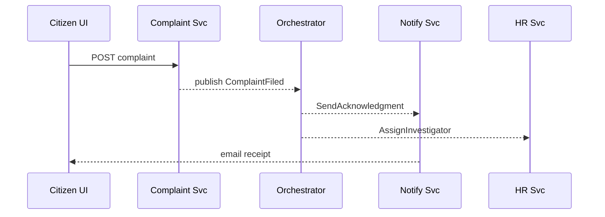

# Chapter 6: Event-Driven Workflow Orchestration
*Coming from [Management Layer (HMS-SVC & HMS-SYS)](05_management_layer__hms_svc___hms_sys__.md).*

---

## 1. Why Do We Need It? – A 90-Second Story  

Picture the **Wage & Hour Division**.  
A citizen submits an online *overtime-pay complaint* at 9 a.m.  

What must happen next?

1. Instantly email an acknowledgment.  
2. Forward the file to the correct regional office.  
3. Trigger analytics to spot repeat offenders.  
4. Update the public dashboard.  

If every microservice *called the next one manually*, we’d grow miles of “spaghetti code.”  
Instead, HMS-SCM treats **every important change as an *event***.  
A lightweight **orchestrator** watches these events and decides “what’s the next step?”—just like an air-traffic-control tower sequencing planes.

Result: real-time reactions *without* tightly coupling services.

---

## 2. Mental Model in Plain English  

| Analogy                         | Real Term                 | Beginner Explanation |
|---------------------------------|---------------------------|----------------------|
| Air-traffic control blip        | **Event**                 | Tiny fact: “Complaint C-991 filed.” |
| Radio frequency                 | **Topic / Channel**       | Where blips are broadcast (“complaints.v1”). |
| Pilot                           | **Producer**              | Service that *sends* the event. |
| Ground crew                     | **Consumer / Listener**   | Service that *reacts* to events. |
| Chief dispatcher                | **Orchestrator**          | Decides the ordered follow-up tasks. |

Keep these five words in mind—everything else is detail.

---

## 3. The Complaint-to-Resolution Use Case  

We will build a **3-step mini flow**:

1. **Complaint Service** publishes `ComplaintFiled`.  
2. **Workflow Orchestrator** receives it and emits two *new* events:  
   • `SendAcknowledgment`  
   • `AssignInvestigator`  
3. Downstream services listen and act (send email, create task).

Goal: all code < 20 lines per file.

---

## 4. Step-By-Step Walk-Through  

### 4.1 The Producer – Complaint Service

```python
# complaint_service.py
import json, pika, uuid
def file_complaint(payload):
    cid = f"C-{uuid.uuid4().hex[:4]}"
    event = {"type": "ComplaintFiled", "id": cid, "data": payload}
    pika.BlockingConnection().channel().basic_publish(
        exchange="hms", routing_key="complaints.v1",
        body=json.dumps(event))
    return cid
```

Explanation:  
1. Generates a complaint ID.  
2. Publishes a JSON event to RabbitMQ exchange `hms` on topic `complaints.v1`.  
3. **No idea who will handle it**—that’s the beauty.

---

### 4.2 The Orchestrator  

```python
# orchestrator.py
import json, pika
ch = pika.BlockingConnection().channel()
ch.exchange_declare(exchange="hms")
q = ch.queue_declare(queue='', exclusive=True).method.queue
ch.queue_bind(exchange="hms", queue=q, routing_key="complaints.v1")

def on_event(_, __, ___, body):
    ev = json.loads(body)
    if ev["type"] == "ComplaintFiled":
        # 1) ask Notify Svc to email citizen
        ch.basic_publish(exchange="hms", routing_key="notify.v1",
            body=json.dumps({"type":"SendAcknowledgment","id":ev["id"]}))
        # 2) ask HR Svc to assign investigator
        ch.basic_publish(exchange="hms", routing_key="hr.v1",
            body=json.dumps({"type":"AssignInvestigator","id":ev["id"]}))

ch.basic_consume(queue=q, on_message_callback=on_event, auto_ack=True)
print("Orchestrator running..."); ch.start_consuming()
```

Explanation:  
• Subscribes to `complaints.v1`.  
• Upon each `ComplaintFiled`, it *publishes* two new events to topics `notify.v1` and `hr.v1`.  
• Keeps workflow logic *central*, leaving each microservice tiny.

---

### 4.3 A Consumer – Notification Service

```python
# notify_service.py
import json, pika, smtplib
def send(to, subject):
    # stub: real code would use SMTP creds
    print(f"📧 email to {to}: {subject}")

ch = pika.BlockingConnection().channel()
q = ch.queue_declare('', exclusive=True).method.queue
ch.queue_bind(exchange="hms", queue=q, routing_key="notify.v1")

def on_event(_, __, ___, body):
    ev = json.loads(body)
    if ev["type"] == "SendAcknowledgment":
        send("citizen@example.gov", f"Received complaint {ev['id']}")

ch.basic_consume(queue=q, on_message_callback=on_event, auto_ack=True)
print("Notify Svc running..."); ch.start_consuming()
```

Explanation:  
Listens to `notify.v1`, sends an email, and is blissfully ignorant of the orchestrator’s existence.

---

## 5. What Happens Under the Hood? (Bird’s-Eye View)



Five actors, clear paths, *no direct calls* between business services.

---

## 6. Why This Beats Point-to-Point Calls  

1. **Loose Coupling** – Services only know *event names*, not endpoints.  
2. **Real-Time Fan-Out** – Add a “Data Lake Listener” later → zero code change.  
3. **Resilience** – If HR Service is down, the event waits in the queue; the Complaint Service still responds instantly.  
4. **Audit-Friendly** – Every event is a durable record, perfect for inspectors or FOIA requests.

---

## 7. Inside the Orchestrator – 4 Core Responsibilities  

| Responsibility | 1-Sentence Description |
|----------------|------------------------|
| Listen | Subscribe to 1-N topics that start a workflow. |
| Decide | Evaluate rules (often YAML from [Process & Policy Module](03_process___policy_module_.md)). |
| Emit | Publish new events to move the flow forward. |
| Track | Optionally checkpoint progress in a DB for retries & auditing. |

A full production orchestrator also enforces policies from [HMS-GOV](02_governance_layer__hms_gov__.md) and **writes metrics** to the layer discussed in [Monitoring, Telemetry, and KPIs](08_monitoring__telemetry__and_kpis_.md).

---

### 7.1 Minimal Rule Engine (Optional Peek)

```python
# rules.yml  (very small)
- when: ComplaintFiled
  then:
    - SendAcknowledgment
    - AssignInvestigator
```

The orchestrator could read this YAML and loop over `then:` instead of hard-coding events—keeping workflow logic editable without redeploying.

---

## 8. Debugging Tips for Beginners  

1. **Print topic names** whenever you publish.  
2. Use RabbitMQ’s web UI or `kubectl logs` to see stuck events.  
3. Add a `correlationId` (just the complaint ID here) to trace across services.  
4. Keep event payloads *small*; put large PDFs in object storage and reference the URL.

---

## 9. Beyond Complaints – Other Government Scenarios  

• **Uniformed Services University** admissions: `ApplicationSubmitted` → `RunEligibilityCheck`, `ScheduleInterview`.  
• **National Indian Gaming Commission** licensing: `CasinoAuditCompleted` → `GenerateReport`, `NotifyTribeCouncil`.  
• **Legislative Tracking**: `BillSigned` → `UpdateStatutes`, `AlertAgencies`, `ArchivePDF`.

The pattern is identical—swap event names, keep the plumbing.

---

## 10. Key Takeaways  

1. **Events are facts**, not commands—“something happened.”  
2. A **Workflow Orchestrator** turns those facts into ordered next steps.  
3. Code stays tiny and independent; orchestration logic lives in one place.  
4. This design scales from a single complaint to thousands of concurrent government processes.

---

## 11. What’s Next?

Events produce a treasure-trove of fresh data.  
In [Data Pipeline & Real-Time Analytics](07_data_pipeline___real_time_analytics_.md) we’ll stream those same events into dashboards and machine-learning models—no extra code required!

[Continue to Chapter 7 →](07_data_pipeline___real_time_analytics_.md)

---

Generated by [AI Codebase Knowledge Builder](https://github.com/The-Pocket/Tutorial-Codebase-Knowledge)