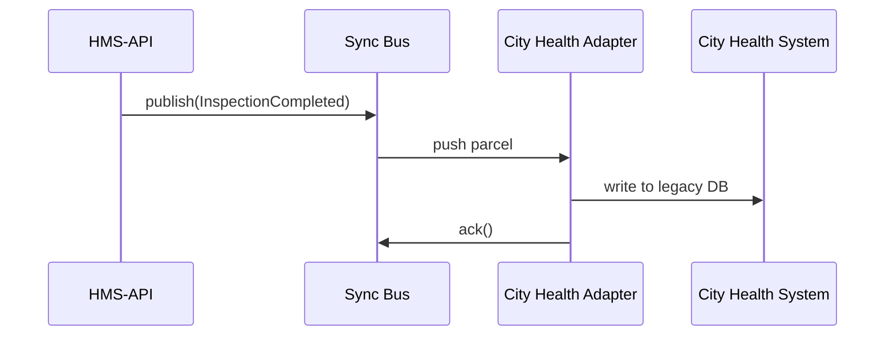

# Chapter 6: External System Sync Bus
*(jumped in from [Interface Layer (HMS-MFE / GOV Portals)](05_interface_layer__hms_mfe___gov_portals__.md))*  

---

## 1 — Why Do We Need a “Sync Bus”?

Picture a **HUD housing inspector** opening the HMS portal at 10:02 AM and changing an apartment’s status from *“Scheduled”* to *“Completed”*.  
At 10:03 AM the local **City Health Department** still uses its own legacy calendar (built in 2003!) to decide when to mail residents a lead-paint notice.

Two options:

1. Ask every agency in the country to throw away software they already paid for.  
2. Leave their systems in place **but mirror the data in real-time**.

The **External System Sync Bus** is option #2—a conveyor belt that:

1. Grabs every important change inside HMS.  
2. Packages it as a tiny JSON parcel (“event”).  
3. Ships it instantly to any registered *adapter* (EHRs, payroll, inspection calendars, etc.).  
4. Accepts events coming **back** the other way so HMS stays in sync.  

Result: HUD inspectors, City Health, and even a hospital EHR all see the same “Completed” status **within seconds**.

---

## 2 — Key Ideas in Plain English

| “Conveyor-Belt” Word | Think of it as… |
|----------------------|-----------------|
| Event Topic          | A label on the belt—“`inspections.status`” |
| Producer             | Who drops a parcel on the belt (HMS-API, EHR) |
| Consumer             | Who picks parcels up (City Health calendar) |
| Adapter              | The plug between the belt and a legacy system |
| QoS Level            | Delivery guarantee (“at least once” vs “exactly once”) |
| Replay Window        | How far back you can *rewind* the belt (e.g., 7 days) |

Keep these six words: **Topic, Producer, Consumer, Adapter, QoS, Replay**.

---

## 3 — 60-Second Code Tour (Send & Receive)

Below is **all** you need to publish an event in Laravel (HMS-API) and pick it up in a tiny Node adapter.

### 3.1  Producer (Laravel ≤ 20 lines)

```php
// app/Events/InspectionCompleted.php
class InspectionCompleted implements ShouldBroadcast
{
    use SerializesModels;

    public function __construct(
        public int $inspectionId,
        public string $completedBy,
        public string $timestamp
    ) {}

    public function broadcastOn(): array
    {
        return ['inspections.status'];  // Topic name
    }
}
```

```php
// When the inspector clicks “Complete”
event(new InspectionCompleted($id, auth()->user()->name, now()));
```

What happens?  
• HMS-API serializes the object to JSON.  
• It pushes the parcel to the **`inspections.status`** topic on the Sync Bus (Redis Streams, Kafka, or NATS—implementation-agnostic).

---

### 3.2  Consumer + Adapter (Node ≤ 20 lines)

```js
// adapters/cityHealth/index.js
import { connect } from "@hms-sync/client";      // tiny wrapper around NATS

const bus = await connect();
const sub = bus.subscribe("inspections.status");

for await (const msg of sub) {
  const { inspectionId } = JSON.parse(msg.data);
  await updateLegacyCalendar(inspectionId);      // pseudo-function
  msg.ack();                                     // exactly-once QoS
}
```

Explanation:  
1. The adapter **subscribes** to the topic.  
2. For every parcel it **safely acknowledges** (`ack()`) after the legacy DB is updated.  
3. If the adapter crashes before `ack()`, the bus re-delivers the event—no data lost.

---

## 4 — Anatomy of a Sync Message

```json
{
  "topic": "inspections.status",
  "version": 1,
  "payload": {
    "inspectionId": 42,
    "newStatus": "Completed",
    "completedBy": "INSPECTOR_1337",
    "timestamp": "2024-04-23T15:02:11Z"
  },
  "qos": "exactly_once",
  "replayable_until": "2024-04-30T15:02:11Z"
}
```

Fields in plain English:

* `topic` – the belt label.  
* `version` – schema edition (see [Data Lake & Schema Registry](08_data_lake___schema_registry__hms_dta__.md)).  
* `payload` – the useful stuff.  
* `qos` – your delivery guarantee.  
* `replayable_until` – how long the parcel is stored for rewinds.

---

## 5 — What Happens Under the Hood?



1. HMS-API publishes.  
2. Bus forwards to every **active adapter**.  
3. Each adapter writes into its local system.  
4. Adapter acknowledges; Bus marks parcel “delivered”.

---

## 6 — Inside the Bus (File Tour)

```
hms-sync/
 ├─ broker.js          (NATS/Kafka wrapper)
 ├─ topics.yaml        (registry + QoS rules)
 └─ adapters/          (external connectors)
      ├─ ehr-clinic/
      └─ city-health/
```

### 6.1  Topic Registry Snippet (topics.yaml ≤ 10 lines)

```yaml
inspections.status:
  qos:          exactly_once
  retention:    7d          # replay window
  schema:       v1
  producers:    [hms-api]
  consumers:    [city-health, ehr-clinic]
```

The Bus boots, loads `topics.yaml`, and configures the broker automatically—no manual edits.

---

## 7 — Adding a New External System (Step-by-Step)

1. **Request a Topic**  
   Submit a PR to `topics.yaml`; get it merged and approved by [Governance Layer](03_governance_layer__hms_sys___hms_cdf__.md).

2. **Scaffold an Adapter**

```bash
npx create-hms-adapter treasury-payroll
```

3. **Subscribe**

```js
const sub = bus.subscribe("payments.issued");
```

4. **Map Fields to Legacy Columns**  
   Simple `payload.amount` → `PAY_AMT` SQL insert.

5. **Run `npm start` on the agency server** (Docker recommended).  
   Done—payroll mirrors HMS within seconds.

---

## 8 — Government Analogy Cheat-Sheet

Sync-Bus Term | Real-World Counterpart
--------------|------------------------
Topic         | “Outgoing mail slot marked ‘Building Inspections’”
Parcel/Event  | Single envelope with a stamped form
Producer      | Clerk dropping envelopes into the slot
Consumer      | Courier picking envelopes up for delivery
Adapter       | Translation desk turning English letters into Morse code for an old system
Replay Window | Archive where unclaimed mail is stored for 7 days

---

## 9 — Common Beginner Pitfalls

1. **Adapter forgets `ack()`**  
   ➜ Parcel re-delivers forever—watch for duplicates.  
2. **Breaking the schema**  
   ➜ Always bump `version` in `topics.yaml`; consumers can then opt-in.  
3. **Mixed QoS**  
   ➜ Do not mix `at_least_once` and `exactly_once` on the same topic.  
4. **Missing Replay**  
   ➜ New adapters should “rewind” to catch events from before they went live.

---

## 10 — Mini-Exercise

1. Publish a fake event:

```bash
hms-sync publish inspections.status '{"inspectionId":99,"newStatus":"Completed"}'
```

2. Write a 10-line Node script that subscribes and logs payloads.  
3. Kill the script, publish another event, then restart **with replay**:

```bash
hms-sync subscribe inspections.status --since=10m
```

4. Confirm you see *both* events—proof the replay window works!

---

## 11 — Recap & What’s Next

You learned how the **External System Sync Bus**:

* Acts as a **real-time conveyor belt** connecting HMS to legacy software.  
* Guarantees delivery with configurable **QoS** and **replay windows**.  
* Lets you publish/consume events with <20 lines of code.  

Now that external tools are in sync, let’s see how **different agencies talk directly to each other** inside HMS: head to [Inter-Agency Communication Layer (HMS-A2A)](07_inter_agency_communication_layer__hms_a2a__.md).

---

Generated by [AI Codebase Knowledge Builder](https://github.com/The-Pocket/Tutorial-Codebase-Knowledge)