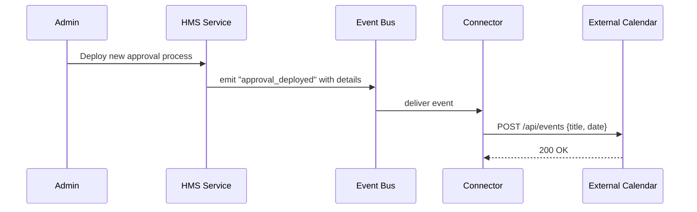

# Chapter 6: External System Synchronization

In the last chapter, we saw how the [Backend API](05_backend_api_.md) routes requests to our microservices. Now we’ll learn how HMS-DEV keeps data in real time sync with outside systems—like calendars or case-management tools—so that nothing ever gets out of date.

---

## 6.1 Motivation: Why Sync with External Systems?

Imagine the Railroad Retirement Board (RRB) has just deployed a **new claim-approval workflow** in HMS. Case workers use Outlook calendars and a third-party case-management system to track tasks. Without live sync:

- They’d miss newly assigned approvals  
- Old workflows would still show on their calendars  
- Confusion, delays, and duplicate work  

**External System Synchronization** works like a mirror: as soon as HMS publishes a new process, connected calendars and case-management tools update instantly.

---

## 6.2 Key Concepts

1. Event Bus  
   A central hub where HMS publishes events (e.g. `approval_deployed`).  

2. Connector  
   A small service that listens for specific events and calls external APIs.  

3. Webhook / API Call  
   The mechanism to push data out to third-party systems.  

4. Transformation  
   Mapping HMS event data into the format the external system expects.  

5. Retry & Resilience  
   Handling network failures with retries or dead-letter queues.

---

## 6.3 Using External System Synchronization

1. Define your connectors in a YAML file:
   
   ```yaml
   # sync_config.yaml
   connectors:
     - name: rr_calendar
       event: approval_deployed
       url: "https://calendar.example.gov/api/events"
       headers:
         Authorization: "Bearer abcd1234"
   ```
   *This tells HMS: “When an `approval_deployed` event happens, POST to this calendar API.”*

2. HMS emits an event whenever a new approval process goes live.

3. A tiny script reads the config, listens for events, and pushes updates:

   ```python
   # hms_sync.py
   import yaml, requests

   cfg = yaml.safe_load(open("sync_config.yaml"))
   def on_event(evt):
       for c in cfg["connectors"]:
           if evt["type"] == c["event"]:
               payload = {"title": evt["workflow_name"], "date": evt["timestamp"]}
               requests.post(c["url"], json=payload, headers=c["headers"])
   ```
   *Every time HMS calls `on_event`, the external calendar is updated.*

---

## 6.4 Under the Hood: Sequence Walkthrough



1. **Admin** pushes a workflow change to HMS.  
2. HMS emits an `approval_deployed` event to the **Event Bus**.  
3. **Connector** picks it up and transforms the data.  
4. Connector calls the **External Calendar API**, creating a new event.  
5. Calendar returns success, and Connector logs it.

---

## 6.5 Inside the Connector Service

Here’s a simplified Python connector:

```python
# connector_service.py
import requests, time

def handle_event(evt, cfg):
    if evt["type"] != cfg["event"]:
        return
    payload = {"title": evt["workflow"], "when": evt["time"]}
    send_with_retry(cfg["url"], payload, cfg["headers"])

def send_with_retry(url, data, headers, retries=3):
    for i in range(retries):
        resp = requests.post(url, json=data, headers=headers)
        if resp.ok:
            print("Synced:", data)
            return
        time.sleep(1)
    print("Failed to sync after retries:", url)
```

- `handle_event` filters only the events you care about.  
- `send_with_retry` posts the data and retries on failure.  

---

## 6.6 Conclusion

In this chapter, you learned how **External System Synchronization**:

- Uses an **Event Bus** to broadcast real-time changes.  
- Employs lightweight **Connector** services to call third-party APIs.  
- Transforms and retries requests so calendars and case-management tools stay up to date.  

Next up, we’ll build reusable UI pieces in the [Frontend Component Library](07_frontend_component_library_.md).

---

Generated by [AI Codebase Knowledge Builder](https://github.com/The-Pocket/Tutorial-Codebase-Knowledge)