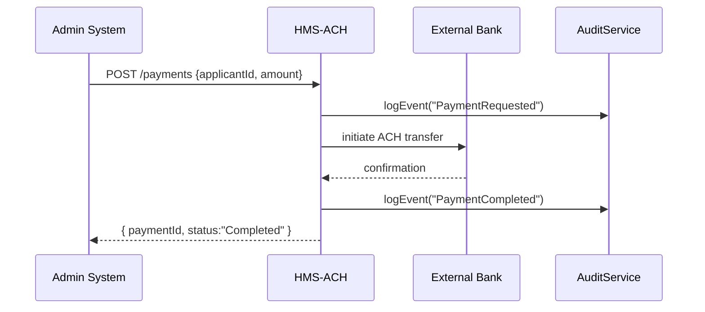

# Chapter 6: Financial System (HMS-ACH)

In [Chapter 5: Backend Services (HMS-SVC)](05_backend_services__hms_svc__.md) we built specialized microservices for cases, documents, and notifications. Now it’s time to handle money—grants, fees, reimbursements—just like the Treasury’s central clearinghouse. Welcome to **HMS-ACH**, our Financial System.

## Why HMS-ACH?

Imagine the Department of Energy needs to send a $600 subsidy to every approved solar installer after a policy update. HMS-ACH:

- Applies compliance rules (regulations, policy limits)  
- Creates and tracks electronic fund transfers (ACH)  
- Maintains a full audit trail for transparency  

No more manual checks or spreadsheets—HMS-ACH automates secure payments and rigorous audit logs.

### Central Use Case: Adjusting Subsidy Rates

1. A policy update increases the solar subsidy from \$500 → \$600.  
2. HMS-ACH reads approved applicant IDs from the Case Service.  
3. It issues \$600 payments to each applicant via the banking network.  
4. Every step is logged for audit and reporting.

## Key Concepts

- **ACH Transaction**  
  An automatic clearinghouse transfer between government and bank accounts.

- **Ledger**  
  A master record of every request, approval, and payment.

- **Compliance Rules**  
  Regulatory checks (e.g. budget caps, date ranges) run before sending funds.

- **Audit Trail**  
  Time-stamped events (requested, processed, completed) stored for review.

## Using HMS-ACH in Your Code

Here’s how your Admin Portal or Management Layer can create a payment request:

```js
// src/achClient.js
async function requestPayment(applicantId, amount) {
  const res = await fetch('/api/hms-ach/payments', {
    method: 'POST',
    headers: { 'Content-Type': 'application/json' },
    body: JSON.stringify({ applicantId, amount })
  });
  return res.json(); // { paymentId: 'abc123', status: 'Pending' }
}
```
*We send an applicant ID and amount, then get back a pending payment ID.*

To check status later:

```js
// src/achClient.js
async function getPaymentStatus(paymentId) {
  const res = await fetch(`/api/hms-ach/payments/${paymentId}`);
  return res.json(); // { paymentId, status: 'Completed', timestamp: '...' }
}
```
*This returns real-time status from the ledger.*

## What Happens Under the Hood?



1. **Request**: Admin calls `/payments`.  
2. **Audit**: HMS-ACH logs “PaymentRequested.”  
3. **Transfer**: HMS-ACH calls the bank’s ACH API.  
4. **Confirm**: Bank replies “OK.”  
5. **Audit**: HMS-ACH logs “PaymentCompleted.”  
6. **Response**: Admin sees “Completed.”

## Inside HMS-ACH: Code Walk-Through

### 1. Route Definition (`src/ach/routes.js`)

```js
const router = require('express').Router();

// POST /api/hms-ach/payments
router.post('/payments', async (req, res) => {
  const { applicantId, amount } = req.body;
  // 1. Run compliance rules (budget, dates...)
  // 2. Save a ledger entry with status "Pending"
  // 3. Kick off processPayment in background
  res.status(202).json({ paymentId: 'abc123', status: 'Pending' });
});

module.exports = router;
```
*We accept a payment request, do quick checks, store a pending ledger entry, and return.*

### 2. Payment Processor (`src/ach/processor.js`)

```js
const bankAPI = require('./bankAPI');
const audit = require('./audit');

async function processPayment(payment) {
  audit.logEvent(payment.id, 'PaymentRequested');
  await bankAPI.transfer(payment.applicantId, payment.amount);
  audit.logEvent(payment.id, 'PaymentCompleted');
  // Update ledger entry to "Completed"
}

module.exports = { processPayment };
```
*This background job runs compliance, calls the bank, logs every step, and updates the ledger.*

### 3. Audit Logging (`src/ach/audit.js`)

```js
function logEvent(paymentId, eventType) {
  const entry = { paymentId, eventType, at: new Date().toISOString() };
  // save entry to audit database (omitted)
}

module.exports = { logEvent };
```
*Every event—requested, completed—is time-stamped and stored for an audit trail.*

## Conclusion

You’ve seen how **HMS-ACH** automates government-to-bank payments: running compliance checks, performing ACH transfers, and maintaining a full audit trail. Next up, we’ll explore how AI agents can use these payments in automated workflows in [Chapter 7: AI Agent Framework (HMS-A2A)](07_ai_agent_framework__hms_a2a__.md).

---

Generated by [AI Codebase Knowledge Builder](https://github.com/The-Pocket/Tutorial-Codebase-Knowledge)