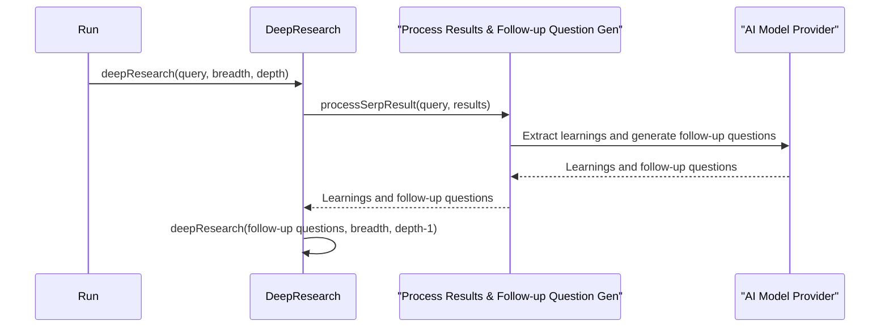

# Chapter 6: Follow-up Question Generation

In the previous chapter, [Learning Extraction](05_learning_extraction_.md), we learned how the Deep Research Agent extracts key information from search results. Now, let's explore how it generates follow-up questions to delve even deeper into the research topic using *Follow-up Question Generation*.

Imagine you're researching the benefits of electric cars. You've learned that they produce zero tailpipe emissions and are cheaper to fuel than gasoline cars.  But what about their range? How long do they take to charge?  These are natural follow-up questions that can guide your research further.  The Deep Research Agent uses AI to automatically generate these kinds of questions, just like a curious student asking for more information.

## What is Follow-up Question Generation?

Follow-up Question Generation is the process of creating new questions based on what the agent has learned so far. It's like having a conversation with a knowledgeable expert who asks insightful questions to help you explore all aspects of a topic.  These follow-up questions are then used to generate new search queries, leading to a more comprehensive understanding.

## Using Follow-up Question Generation

Let's continue with our electric car example.  If the agent has learned that electric cars are environmentally friendly and economical, it might generate the following follow-up questions:

- What is the average range of an electric car on a single charge?
- How long does it take to fully charge an electric car?
- What are the environmental impacts of producing electric car batteries?

These follow-up questions help the agent explore more specific aspects of electric cars, leading to a more complete understanding of their advantages and disadvantages.

## Inside the Deep Research Agent with Follow-up Question Generation

Here's a simplified sequence diagram showing how Follow-up Question Generation fits into the research process:



1. The `deepResearch` function calls `processSerpResult`.
2. `processSerpResult` sends the search results to the [AI Model Provider](08_ai_model_provider_.md).
3. The AI model extracts learnings and generates follow-up questions.
4. These follow-up questions are returned to `deepResearch`, which uses them for the next level of [Iterative Deepening](03_iterative_deepening_.md).

## Diving Deeper into `processSerpResult`

The `processSerpResult` function is where the follow-up questions are generated.  Here's a simplified version:

```typescript
// src/deep-research.ts
async function processSerpResult({ query, result, numFollowUpQuestions = 3 }) {
  const contents = compact(result.data.map(item => item.markdown));

  // ... (Uses AI to extract learnings and follow-up questions from the contents)
  const res = await generateObject({
    // ... (parameters for the AI model, including the search result contents)
    prompt: `Given the following contents..., generate a list of learnings and follow-up questions...`,
    schema: z.object({
      learnings: z.array(z.string()),
      followUpQuestions: z.array(z.string()),
    }),
  });
  return res.object;
}
```

This function uses the `generateObject` function from the [AI Model Provider](08_ai_model_provider_.md). The prompt instructs the AI to generate both learnings and follow-up questions based on the search results. The `numFollowUpQuestions` parameter controls how many questions are generated.

The AI model uses the provided content and the original query to generate relevant and insightful follow-up questions. These questions are designed to explore different aspects of the topic and guide the research further.

## Conclusion

This chapter explained how Follow-up Question Generation helps the Deep Research Agent delve deeper into a topic by generating intelligent follow-up questions. These questions guide the next iteration of the research process, leading to a more comprehensive understanding. In the next chapter, [Report Generation](07_report_generation_.md), we'll learn how the agent compiles all the gathered information into a final report.


---

Generated by [AI Codebase Knowledge Builder](https://github.com/The-Pocket/Tutorial-Codebase-Knowledge)