# Chapter 6: Front-End Micro-Frontends (HMS-MFE)

*(If you just arrived, peek at the plugin “app-store” we built in [Chapter 5: Marketplace & Discovery (HMS-MKT)](05_marketplace___discovery__hms_mkt__.md).)*  

---

## 1. Why Do We Need “Micro-Frontends”?

Imagine FEMA and the Department of Agriculture co-hosting a **Disaster Relief Portal**:

1. FEMA shows a **Shelter Map** that refreshes every 30 sec.  
2. USDA embeds a **Benefits Calculator** to estimate food-stamp aid.  
3. A local state office adds a **Debris Pickup Form** next week.

If the whole portal were one giant web app, any small change could break or delay all three teams.  
**Micro-frontends** let each team ship its tile **independently**—like LEGO bricks that snap into one citizen-facing wall.

---

## 2. The 15-Second Elevator Pitch

• Each agency owns **one brick** (micro-frontend).  
• A lightweight **Shell** loads bricks at runtime.  
• **Design tokens** + **shared components** keep everything visually and accessibly consistent.

```mermaid
flowchart LR
  Shell["🖥️ Portal Shell"] --> |import| Map["🏠 Shelter Map (FEMA)"]
  Shell --> |import| Calc["🧮 Benefits Calculator (USDA)"]
  Shell --> |import| Form["📄 Debris Pickup Form (Local)"]
```



---

## 3. Key Concepts (One-by-One)

| Term | Beginner Analogy | What It Means in HMS-MFE |
|------|------------------|--------------------------|
| Micro-frontend (“MFE”) | Individual LEGO brick | Self-contained JS/CSS/HTML bundle |
| Portal Shell | LEGO base-plate | Loads & arranges bricks |
| Import Map / Module Federation | Address book | Tells browser **where** bricks live |
| Design Tokens | Paint swatches | Single source of truth for colors, spacing, fonts |
| Shared Component Library | Federal style guide | Pre-built buttons, tables, alerts—all 508 compliant |
| Routing Contract | Mall directory | Which brick handles `/benefits/*` vs. `/map/*` |
| Version Pinning | “Edition” sticker | Shell can choose `calculator@2.x` while testing `3.x` |

---

## 4. A Tiny Walk-Through: Adding the “Benefits Calculator” Brick

We will:

1. scaffold the calculator,  
2. publish it to the marketplace,  
3. let the shell consume it.

### 4.1 Scaffold the Brick (19 lines)

```bash
# create project
hms mfe init benefits-calculator
cd benefits-calculator
```

```typescript
// src/index.tsx   (≤ 19 lines)
import React from "react";
import {Button, Input} from "@hms/design";   // shared lib

export default function App({mountPoint}: {mountPoint: HTMLElement}) {
  const [income,setIncome] = React.useState(0);
  const eligible = income < 20000;            // toy logic
  return (
    <div>
      <h3>Benefits Calculator</h3>
      <Input label="Annual Income" onChange={e=>setIncome(+e.target.value)}/>
      {income>0 && <p>{eligible?"✅ Eligible":"❌ Not eligible"}</p>}
      <Button onClick={()=>alert("Saved!")}>Save</Button>
    </div>
  );
}
```

Explanation:  
• Uses **shared components** (`@hms/design`) so it inherits federal fonts & colors automatically.  
• Exports a default function the shell can mount anywhere.

### 4.2 Declare an Import Map (4 lines)

```json
// benefits-calculator.import.json
{
  "imports": {
    "benefits-calculator": "https://cdn.gov/hms/benefits-calculator@1.0.0/index.js"
  }
}
```

### 4.3 Publish to Marketplace

```bash
hms mkt publish benefits-calculator
```

Behind the scenes HMS-MKT will:

1. run the 508 accessibility linter,  
2. scan for security issues (via [HMS-ESQ](18_security__compliance___legal_reasoning__hms_esq__.md)),  
3. attach the `import.json` to the listing.

---

## 5. Consuming Bricks Inside the Portal Shell

Below is the **entire** shell loader:

```html
<!-- public/index.html  (≤ 20 lines)-->
<!DOCTYPE html><html><head>
  <script type="importmap" src="/import-map.json"></script>
</head><body>
  <div id="benefits-zone"></div>
  <script type="module">
    import calc from "benefits-calculator";      // ① pull brick
    const mount = document.getElementById("benefits-zone");
    calc({mountPoint: mount});                   // ② mount brick
  </script>
</body></html>
```

Explanation:  
① Browser fetches the brick JS from the CDN listed in `import-map.json`.  
② Brick function renders React UI inside `#benefits-zone`.

---

## 6. What Happens When a Citizen Loads the Page?


Only **4 actors**: Browser, Shell, CDN, the Brick.  
No server redeploy was needed for the shell to gain new features.

---

## 7. Under the Hood (Mini Code Tour)

### 7.1 Design Tokens (SCSS, 8 lines)

```scss
// tokens.scss
$color-primary: #0b4d91;  // federal blue
$font-base: "Public Sans", sans-serif;
$sp-1: 4px;
$sp-2: 8px;
// exported via CSS variables:
:root{ --color-primary:$color-primary; --sp-2:$sp-2; }
```

All HMS UI bricks read these CSS variables—instant visual harmony.

### 7.2 Shared Component (Button, 14 lines)

```tsx
// packages/design/Button.tsx
import styled from "styled-components";
export const Button = styled.button`
  background: var(--color-primary);
  padding: var(--sp-2);
  border:none;color:#fff;border-radius:4px;
  &:focus{outline:2px solid #ffbf47;}  /* 508 focus ring */
`;
```

508 compliance (keyboard focus, contrast) is built in once for all bricks.

### 7.3 Shell Routing Table (YAML, 10 lines)

```yaml
# shell/routes.yml
"/benefits/**": "benefits-calculator"
"/map/**":      "shelter-map"
"/debris/**":   "debris-form"
```

The shell’s router lazy-loads only the brick needed for the current path.

---

## 8. Common Beginner Questions

| Question | Quick Fix |
|----------|-----------|
| “My brick’s CSS overrides the whole page!” | Add a CSS module or prefix classes; design tokens should be read-only. |
| “How do I debug version mismatches?” | Check `import-map.json`; pin exact versions (`@1.0.2`). |
| “Can bricks call backend APIs directly?” | Yes—use the endpoints exposed in [Backend API Layer (HMS-SVC & HMS-API)](04_backend_api_layer__hms_svc___hms_api__.md). |

---

## 9. How HMS-MFE Fits Into the Big Picture

```mermaid
graph TD
  MFE["🎫 HMS-MFE (UI bricks)"] --> API["🔗 HMS-API (v1/v2)"]
  MFE --> OPS["🔭 HMS-OPS (logs)"]
  MFE <-- MKT["🏬 HMS-MKT (marketplace)"]
```

1. New bricks are published via **HMS-MKT**.  
2. Bricks talk to backend endpoints defined in **HMS-API**.  
3. Usage & errors flow to **HMS-OPS** for monitoring.

---

## 10. Hands-On Recap

You just:

1. Built a 19-line **Benefits Calculator** brick.  
2. Published it to the **Marketplace** with one command.  
3. Loaded it in the **Portal Shell** by adding a single `importmap` entry.  
4. Saw how design tokens & shared components keep every brick on-brand and accessible.

---

## 11. What’s Next?

Bricks are great, but what about **domain-specific power packs**—whole healthcare, education, or mobility modules that bundle both front-end and back-end pieces?  
That’s coming up in [Chapter 7: Domain-Specific Modules (HMS-MED, HMS-UHC, HMS-MBL, etc.)](07_domain_specific_modules__hms_med__hms_uhc__hms_mbl__etc___.md).

---

---

Generated by [AI Codebase Knowledge Builder](https://github.com/The-Pocket/Tutorial-Codebase-Knowledge)