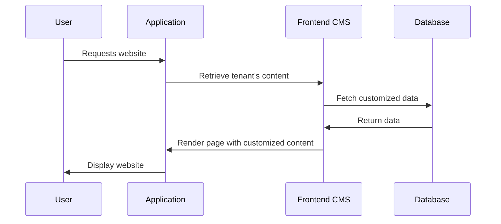

# Chapter 6: Frontend CMS

In the previous chapter, [Module](05_module.md), we learned how to group related [Tasks](04_task.md) within a [Protocol](03_protocol.md). This chapter introduces the Frontend CMS, which empowers your tenants to customize their websites without needing to write any code.

## What is a Frontend CMS?

Imagine your application provides online courses. Each [Tenant](01_tenant.md) wants their website to look unique and showcase their specific branding and course offerings.  The Frontend CMS allows them to do just that!  It's like a website builder tailored for your application, letting tenants modify the content and appearance of their site directly through a visual interface.

## Key Concepts

* **Customization:** Tenants can change text, images, layouts, and other elements on their website.
* **No Coding Required:**  The Frontend CMS provides a user-friendly interface, eliminating the need for technical expertise.
* **Templates:** You can provide pre-designed templates that tenants can use as a starting point for their website.
* **Components:**  Think of components as building blocks.  These could be things like image sliders, testimonials, or call-to-action buttons that tenants can drag and drop onto their pages.

## Using the Frontend CMS

Let's say a tenant wants to change the hero image on their homepage. Using the Frontend CMS, they could simply:

1. Navigate to the homepage editor.
2. Click on the hero image component.
3. Upload a new image.
4. Save the changes.

The Frontend CMS would handle updating the website content without the tenant needing to touch any code.

## Under the Hood

When a user visits a tenant's website, the Frontend CMS retrieves the customized content for that tenant and renders the page accordingly.



### Internal Implementation

The `FrontendCmsEntity` model (located in `app/Models/Tenant/FrontendCMS/FrontendCmsEntity.php` and `app/Models/Core/FrontendCMS/FrontendCmsEntity.php`) represents a page or section of the website.  It's linked to `FrontendCmsContainer` which represents a specific area on the page where content can be placed.

```php
// Inside the FrontendCmsEntity model (simplified)
public function containers()
{
    return $this->hasMany(FrontendCmsContainer::class);
}
```

This code defines a relationship where a `FrontendCmsEntity` has many `FrontendCmsContainer` instances.

The `FrontendCmsContainer` model (located in `app/Models/Tenant/FrontendCMS/FrontendCmsContainer.php` and `app/Models/Core/FrontendCMS/FrontendCmsContainer.php`) stores the configuration for each container, such as its type and allowed components.  It's linked to `FrontendCmsContainerInstance` which holds the actual content for a specific tenant.

```php
// Inside the FrontendCmsContainer model (simplified)
public function instances()
{
    return $this->hasMany(FrontendCmsContainerInstance::class);
}
```

This code defines a relationship where a `FrontendCmsContainer` has many `FrontendCmsContainerInstance` instances.

Finally, the `FrontendCmsContainerInstance` model (located in `app/Models/Tenant/FrontendCMS/FrontendCmsContainerInstance.php` and `app/Models/Core/FrontendCMS/FrontendCmsContainerInstance.php`) stores the actual content entered by the tenant.

```php
// Inside the FrontendCmsContainerInstance model (simplified)
public function data()
{
    return $this->hasMany(FrontendCmsFieldValue::class, 'instance_id');
}
```

This code defines a relationship where a `FrontendCmsContainerInstance` has many `FrontendCmsFieldValue` instances, which store the individual field values for the container.

## Conclusion

In this chapter, we explored the Frontend CMS, a powerful tool that allows tenants to customize their websites without writing code. We learned about its key concepts and how it works under the hood. In the next chapter, we'll learn about integrating [Stripe Payment](07_stripe_payment.md).


---

Generated by [AI Codebase Knowledge Builder](https://github.com/The-Pocket/Tutorial-Codebase-Knowledge)