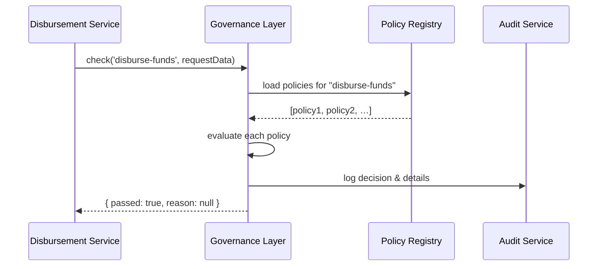

# Chapter 6: Governance Layer

Continuing from [Chapter 5: HMS-SYS Core Infrastructure](05_hms_sys_core_infrastructure_.md), we now add the “city council” of our architecture: the **Governance Layer**. This chapter shows how to define and enforce policies, compliance checks, and oversight to keep every action legal, ethical, and transparent.

---

## 1. Motivation & Central Use Case

Imagine a **Benefit Disbursement Service** that sends unemployment checks to citizens. Before sending funds, we must ensure:

- The applicant meets eligibility rules (caps, income limits).  
- All personal data is handled with privacy safeguards.  
- Every transaction is logged for auditors.  
- If a rule changes (e.g., new income threshold), we can update it without redeploying all services.

The **Governance Layer** sits between services (like our disbursement API) and the core infrastructure. It acts like a city council: it reviews each request against policies, logs for transparency, and blocks any action that violates regulations.

---

## 2. Key Concepts

1. **Policy Definitions**  
   Named rules (e.g., `maxIncome`, `ageLimit`) describing what’s allowed.

2. **Compliance Checks**  
   Functions that accept request data and return “pass” or “fail.”

3. **Oversight & Logging**  
   Every decision is recorded so auditors can review who did what and when.

4. **Policy Updates**  
   Ability to change rules at runtime (like passing a new city ordinance).

---

## 3. Using the Governance Layer

Below is a minimal example of how a Disbursement Service calls the Governance Layer before issuing funds.

```js
// disbursement-service.js
import { Governance } from 'hms-sme-governance';

const gov = new Governance();
gov.loadPolicies('governance/policies.js'); // Load rules

async function disburseFunds(request) {
  // Check compliance first
  const report = await gov.check('disburse-funds', request);
  if (!report.passed) {
    throw new Error(`Governance failed: ${report.reason}`);
  }
  // Proceed: call payment via HMS-SYS
  return core.discovery.find('payment-service')
    .then(pay => pay.request('POST', '/api/v1/pay', request));
}
```

- We create a `Governance` instance.  
- `loadPolicies()` reads our rule set.  
- `check('disburse-funds', data)` runs all relevant policies and returns a report.  
- Only if `report.passed` do we continue to disburse funds.

---

## 4. Under the Hood: Sequence Walkthrough

Here’s what happens when the service calls `gov.check()`:



1. **Disbursement Service** asks the Governance Layer to check a request.  
2. **Governance Layer** retrieves the set of policies from the registry.  
3. It evaluates each policy function against the request data.  
4. It sends a log entry to the **Audit Service**.  
5. It returns a pass/fail report to the caller.

---

## 5. Inside the Governance Layer

### a) Defining Policies

File: `governance/policies.js`
```js
module.exports = {
  "disburse-funds": [
    // Policy: income must not exceed $10,000
    (req) => req.income <= 10000 || 'Income too high',
    // Policy: age must be over 18
    (req) => req.age >= 18 || 'Applicant underage'
  ]
};
```
- Policies are keyed by operation name.  
- Each entry is a function returning `true` or an error string.

### b) Policy Engine

File: `hms-sme-governance/src/index.js`
```js
export class Governance {
  constructor(auditClient) {
    this.policies = {};
    this.audit = auditClient || console;
  }
  loadPolicies(path) {
    this.policies = require(path);
  }
  async check(action, req) {
    const rules = this.policies[action] || [];
    for (const rule of rules) {
      const result = rule(req);
      if (result !== true) {
        this.audit.log({ action, req, passed: false, reason: result });
        return { passed: false, reason: result };
      }
    }
    this.audit.log({ action, req, passed: true });
    return { passed: true, reason: null };
  }
}
```
- `loadPolicies()` imports our policy definitions.  
- `check()` runs each rule; on the first failure it logs and returns `passed: false`.  
- Successful checks are also logged for transparency.

---

## 6. What You’ve Learned

- The **Governance Layer** acts like a city council: it enforces policies, logs decisions, and blocks disallowed actions.  
- How to define simple JavaScript policy functions in `policies.js`.  
- How a service calls `gov.check()` before proceeding to sensitive operations.  
- An internal view of policy loading, evaluation, and audit logging.

Next, we’ll see how administrators and managers control day-to-day operations in  
[Chapter 7: Management Layer](07_management_layer_.md).

---

Generated by [AI Codebase Knowledge Builder](https://github.com/The-Pocket/Tutorial-Codebase-Knowledge)