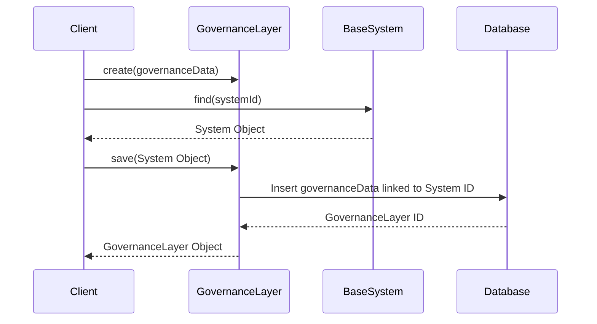

# Chapter 6: GovernanceLayer

In the previous chapter, [ManagementProgram](05_managementprogram.md), we learned how Sunnyside Elementary manages specific after-school programs like the Chess Club.  But what rules does the Chess Club have to follow?  Are there school-wide policies about student conduct or resource allocation? This is where the `GovernanceLayer` comes in.

## What problem does GovernanceLayer solve?

Imagine Sunnyside Elementary needs to establish rules for all its after-school programs.  These rules might include things like maximum student capacity, required adult supervision, and equipment usage guidelines. The `GovernanceLayer` represents the rule-making part of the system, like the legal department of a company. It manages policies and regulations that govern the system's operation. It ensures compliance and maintains order within the system.

## Key Concepts

1. **Policies:** These are the specific rules and regulations managed by the `GovernanceLayer`, like a "Code of Conduct" or a "Resource Allocation Policy." We'll learn more about policies in the next chapter, [GovernancePolicy](07_governancepolicy.md).

2. **Compliance:** This refers to how well the system adheres to the established policies. The `GovernanceLayer` helps track and ensure compliance.

3. **Oversight:** The `GovernanceLayer` provides a way to monitor and enforce the rules, ensuring everyone follows them.

## Using GovernanceLayer: Setting Rules for Sunnyside Elementary

Let's create a `GovernanceLayer` for Sunnyside Elementary.

```php
// Simplified example - see GovernanceLayer.php for full implementation
use App\Models\GovernanceLayer;
use App\Models\BaseSystem;

$school = BaseSystem::find(1); // Assuming Sunnyside Elementary has ID 1

$governanceLayer = new GovernanceLayer([
    'url' => 'https://sunnyside.edu/governance', // Example governance portal URL
]);

$school->governanceLayer()->save($governanceLayer);
```

This code creates a `GovernanceLayer` for Sunnyside Elementary and links it to the `BaseSystem`.  This sets up the framework for managing school-wide policies.

## Internal Implementation

When you call `save` on the `governanceLayer` relationship, it creates a new entry in the database representing the `GovernanceLayer` and links it to the corresponding `BaseSystem`.



The code for saving the `GovernanceLayer` leverages the relationship defined in `Gov/Entities/Base/BaseSystem.php`:

```php
// Gov/Entities/Base/BaseSystem.php (simplified)
public function governanceLayer(): HasOne
{
    return $this->hasOne(GovernanceLayer::class);
}
```

And in `Gov/Entities/GovernanceLayer.php`:

```php
// Gov/Entities/GovernanceLayer.php (simplified)
public function system(): BelongsTo
{
    return $this->belongsTo(BaseSystem::class);
}
```

These code snippets define the relationship between the `BaseSystem` and the `GovernanceLayer`.

## Conclusion

In this chapter, we learned about the `GovernanceLayer`, which manages the rules and policies of a system. We saw how to create a `GovernanceLayer` for Sunnyside Elementary. In the next chapter, [GovernancePolicy](07_governancepolicy.md), we'll explore the details of creating and managing individual policies within the `GovernanceLayer`.


---

Generated by [AI Codebase Knowledge Builder](https://github.com/The-Pocket/Tutorial-Codebase-Knowledge)