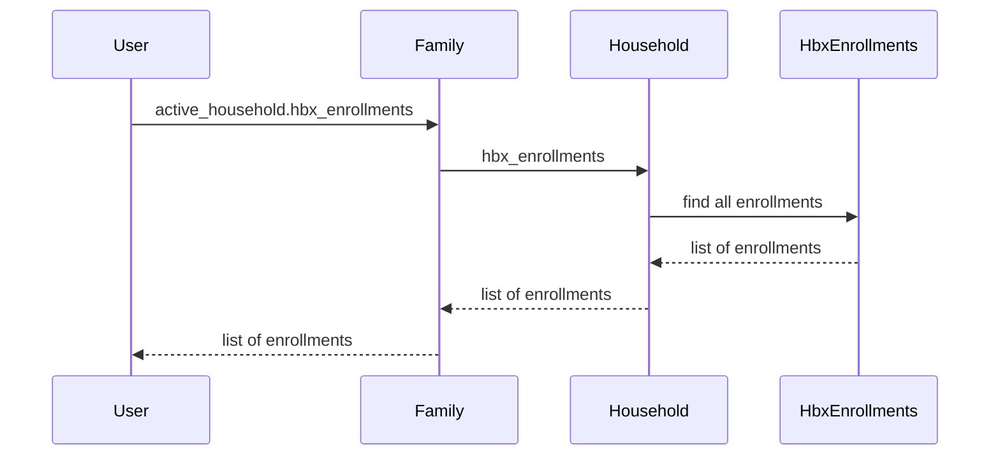

# Chapter 6: HbxEnrollment

In the previous chapter, [BenefitGroup](05_benefitgroup.md), we learned how employers offer a set of health plans. This chapter introduces the `HbxEnrollment` concept, which represents an individual or family's enrollment in a specific health plan.  Think of it as your health plan confirmation slip.

## What problem does `HbxEnrollment` solve?

Imagine Alice, from our [Family](02_family.md) example, has chosen a health plan from Acme Corp's [BenefitGroup](05_benefitgroup.md). How do we record which plan she chose, who is covered under the plan (Alice, Bob, and Charlie), when the coverage starts, and how much it costs? The `HbxEnrollment` model solves this. It's the official record of Alice's family's health coverage.

## Key Concepts:

1. **Plan Selection:** An `HbxEnrollment` is associated with a specific [Plan](XX_plan.md) (e.g., "Acme Corp Silver Plan"). This indicates which plan the family has chosen.

2. **Covered Members:**  An `HbxEnrollment` has `hbx_enrollment_members`, which are links to the [FamilyMember](XX_familymember.md) objects representing the individuals covered under the plan (Alice, Bob, and Charlie).

3. **Effective Dates:**  The `effective_on` date indicates when the coverage starts.  The `terminated_on` date, if present, indicates when the coverage ended.

4. **Financial Assistance:**  The `applied_aptc_amount` field stores the amount of financial assistance (APTC) applied to the enrollment.

5. **Kind:** The `kind` field indicates the type of enrollment (e.g., `employer_sponsored`, `individual`).

6. **Workflow State:** The `aasm_state` field tracks the status of the enrollment (e.g., `coverage_selected`, `enrolled`, `coverage_terminated`).

## Using the `HbxEnrollment` model

Let's say we want to find all active enrollments for Alice's family:

```ruby
# ... other code ...

family = Family.find_by(hbx_assigned_id: 12345) # Assuming Alice's family ID is 12345
active_enrollments = family.active_household.hbx_enrollments.where(:aasm_state.in => HbxEnrollment::ENROLLED_STATUSES)

active_enrollments.each do |enrollment|
  puts "Plan: #{enrollment.plan.name}"
  puts "Effective Date: #{enrollment.effective_on}"
end

# ... other code ...
```

This code finds Alice's family, retrieves their active household, and then finds all `HbxEnrollment` records with an `aasm_state` indicating active coverage.  It then prints the plan name and effective date for each enrollment.

## Under the Hood

When you call `family.active_household.hbx_enrollments`, the following happens:

1. **Retrieve Household:** The `Family` model retrieves the active [Household](XX_household.md).

2. **Retrieve Enrollments:** The `Household` model retrieves all associated `HbxEnrollment` objects.



The code for retrieving enrollments is in `household.rb`:

```ruby
# household.rb
class Household
  # ... other code ...

  has_many :hbx_enrollments

  # ... other code ...
end
```

This simplified code snippet shows the `has_many` association that links the `Household` model to its `HbxEnrollment` records.

## Conclusion

This chapter introduced the `HbxEnrollment` model, which represents an enrollment in a health plan. We learned about its key attributes and how it's used. In the next chapter, we'll explore [PlanCostDecorator](07_plancostdecorator.md), which helps calculate the cost of a plan.


---

Generated by [AI Codebase Knowledge Builder](https://github.com/The-Pocket/Tutorial-Codebase-Knowledge)