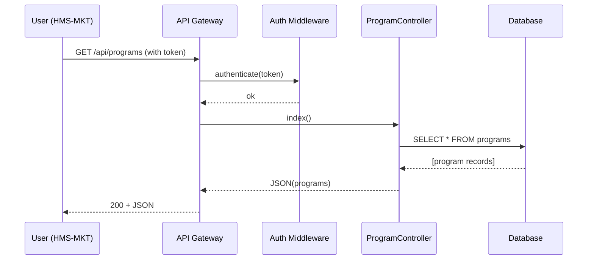

# Chapter 6: HMS-API (Backend API)

In [Chapter 5: Human-In-The-Loop (HITL)](05_human_in_the_loop__hitl__.md) we added a human review step for AI decisions. Now we’ll look at the **HMS-API**, our central “city hall” that all frontends and services call to read or update data.

---

## 1. Why HMS-API Matters

Imagine:

- A **citizen** on HMS-MKT wants to see available assistance programs.
- An **administrator** in HMS-GOV configures new programs.
- An **agent** calls partner systems via HMS-A2A.

All of these clients send HTTP requests to one place: **HMS-API**. It:

1. **Receives** requests (like “list programs”).  
2. **Checks** authentication and policies.  
3. **Invokes** controllers & business logic.  
4. **Returns** JSON data.

This keeps data, rules, and security centralized—just like a city hall managing all local services.

---

## 2. Core Concepts

We break HMS-API into four pieces:

1. **Routes**  
   Define URL paths (e.g. `/api/programs`) and HTTP methods.

2. **Controllers**  
   Receive requests, call models or business modules, and return JSON.

3. **Models**  
   Map to database tables (e.g. `Program`, `User`, `Tenant`).

4. **Middleware**  
   Run before controllers to handle auth, rate-limits, CORS, etc.

---

## 3. Example Use Case: Listing Programs

Let’s build the simplest endpoint: **GET /api/programs**  
A citizen portal fetches available programs to show on a dropdown.

### 3.1 Define the Route

File: routes/api.php  
```php
<?php
use Illuminate\Support\Facades\Route;

Route::middleware('auth:api')
     ->get('/programs', 'API\ProgramController@index');
```
This says:  
- Apply `auth:api` to protect the endpoint.  
- On `GET /api/programs`, call `ProgramController@index`.

### 3.2 Create the Controller

File: app/Http/Controllers/API/ProgramController.php  
```php
<?php
namespace App\Http\Controllers\API;

use App\Http\Controllers\Controller;
use App\Models\Core\Program\Program;

class ProgramController extends Controller
{
  public function index()
  {
    $programs = Program::all();         // Fetch all programs
    return response()->json($programs); // Return JSON array
  }
}
```
Here we:  
1. Import the `Program` model from [Chapter 2](02_program___protocol_models_.md).  
2. Call `Program::all()` to load every record.  
3. Return it as JSON.

---

## 4. What Happens Under the Hood



1. The user’s client sends a GET.  
2. The **Auth Middleware** verifies the token.  
3. The **Controller** queries the **Database** via the **Model**.  
4. JSON is returned to the client.

---

## 5. Adding a Create Endpoint

Let’s also let administrators add a new program:

### 5.1 Route

```php
Route::middleware(['auth:api','can:create,App\Models\Core\Program\Program'])
     ->post('/programs', 'API\ProgramController@store');
```

We use Laravel’s `can:` middleware to check a policy.

### 5.2 Controller Method

```php
public function store(Request $req)
{
  $data = $req->validate([
    'name'         => 'required|string',
    'participants' => 'required|array',
    'data_fields'  => 'required|array'
  ]);
  $program = Program::create($data);
  return response()->json($program, 201);
}
```

- We **validate** inputs: name, participants, data_fields.  
- We call `Program::create($data)` to save.  
- We return the new record with **HTTP 201 Created**.

---

## 6. How to Extend HMS-API

- **Add Routes** in `routes/api.php`.  
- **Write Controllers** under `app/Http/Controllers/API`.  
- **Reuse Models** from [Chapter 2](02_program___protocol_models_.md) and **Business Modules** from [Chapter 3](03_business_logic_modules_.md).  
- **Protect** endpoints with **Middleware** (auth, rate-limit, policies).

Every new service—whether it’s user accounts, tenant info, or legislative workflows—follows this same pattern.

---

## 7. Conclusion

You’ve learned how HMS-API:

- Acts as the central “city hall” for all data and business rules.  
- Uses **Routes**, **Controllers**, **Models**, and **Middleware** to handle requests.  
- Serves both citizen portals (HMS-MKT) and admin UIs (HMS-GOV).

Next up, we’ll dive into the knowledge graph that ties all these pieces together in [Chapter 7: HMS-AGX (Knowledge Graph)](07_hms_agx__knowledge_graph__.md).

---

Generated by [AI Codebase Knowledge Builder](https://github.com/The-Pocket/Tutorial-Codebase-Knowledge)