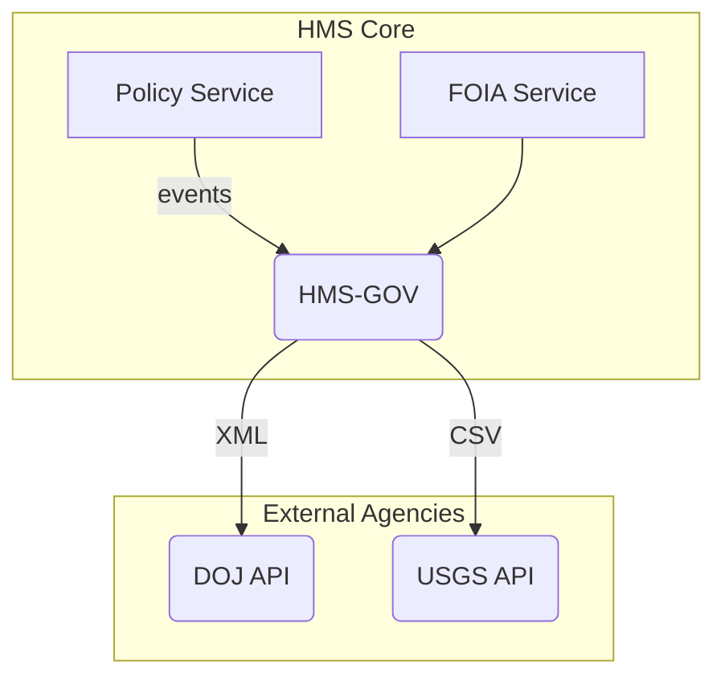
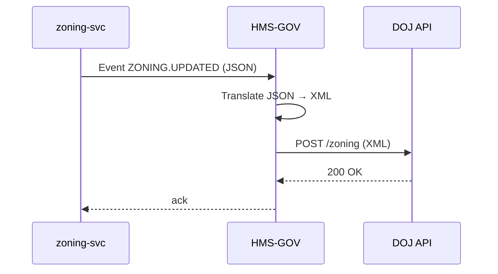

# Chapter 6: HMS-GOV – Government Integration Gateway

*(Follow-up to [Chapter 5: Policy Editor](05_policy_editor_.md))*  

---

## 1. Why Do We Need an “Embassy” for Software?

Picture this real-world story:

1. The **Department of Justice (DOJ)** emails City X asking for every *zoning change* tied to environmental cases.  
2. City X already stores those changes inside HMS-GOV.  
3. A clerk opens HMS and clicks **“Send to DOJ.”**  
4. Within seconds the DOJ portal shows the fresh zoning data exactly in the DOJ’s own XML dialect—even though City X keeps everything as JSON.

Nothing to install, no midnight CSV shuffles, zero manual copy-pasting.  
The hero behind the curtain is **HMS-GOV – the Government Integration Gateway.**

*Think of it as a diplomatic embassy that fluently translates and enforces each agency’s local etiquette while staying friendly to our platform.*

---

## 2. Big Picture in One Diagram



*Inside* we talk modern, clean JSON.  
*Outside* we may speak DOJ-XML, USGS-CSV, or even ancient SOAP—HMS-GOV handles the accents.

---

## 3. Key Concepts (Plain English)

| Concept                | Friendly Explanation |
|------------------------|----------------------|
| Embassy (Gateway)      | The single front door for **all** external agencies. |
| Connector              | A plug-in that knows one agency’s quirks (format, auth, rate limits). |
| Translation Rule       | Tiny functions that map *platform fields* → *agency fields*. |
| Protocol-Agnostic      | HMS-GOV does not care if the other side wants REST, SOAP, SFTP. |
| Guardrails             | Per-agency throttles, schema validation, and audit logging. |

Remember: *Gateway* houses many *Connectors*; each Connector owns its *Rules & Guardrails*.

---

## 4. A 2-Minute Walk-Through: Sending a Zoning Update to DOJ

### 4.1 Trigger From Inside HMS

```javascript
// zoning-svc/events.js   (simplified, 7 lines)
import { publish } from 'hms-event-bus'

export function onZoningUpdated(zone) {
  publish('ZONING.UPDATED', zone)   // HMS-GOV listens to this topic
}
```

*Explanation:*  
Whenever our internal `zoning-svc` finishes an update, it emits a plain JSON event.

### 4.2 HMS-GOV Picks It Up

```javascript
// hms-gov/handlers/zoning.js  (15 lines)
import { register } from 'hms-gov-core'

register('ZONING.UPDATED', async zone => {
  const dto = toDojXml(zone)        // ① translate
  await sendTo('DOJ', '/zoning', dto) // ② deliver
})
```

Lines:  
1. **translate** using a helper `toDojXml`.  
2. **deliver** through the DOJ Connector.  
If DOJ is down, HMS-GOV queues and retries automatically.

---

## 5. Under the Hood — Step-by-Step



Only **three** hops; each step is logged for auditing (who, what, when).

---

## 6. How Do I Add a New Agency Connector?

1. Generate a tiny scaffold:

```bash
npx hms-gov new-connector usgs
```

2. Edit `connectors/usgs/config.yaml` *(<12 lines)*:

```yaml
name: USGS
baseUrl: https://api.usgs.gov/v1
auth: apiKey
rateLimit: 10 req/sec
format: csv         # ← wants CSV not XML
```

3. Write the translator (keep it tiny):

```python
# connectors/usgs/translate.py  (13 lines)
def to_csv(zone):
    return f"{zone.id},{zone.lat},{zone.lon},{zone.label}"
```

4. Register the event handler:

```javascript
// connectors/usgs/index.js  (8 lines)
import { register, sendTo } from 'hms-gov-core'
import { to_csv } from './translate.js'

register('ZONING.UPDATED', z =>
  sendTo('USGS', '/zones', to_csv(z))
)
```

Push, CI runs tests, and that’s it—City X now speaks USGS-CSV automatically.

---

## 7. Internal File Map (For the Curious)

```
hms-gov/
 ├─ core/               shared helpers (retry, auth, logging)
 │   └─ index.js
 ├─ connectors/
 │   ├─ doj/
 │   │   ├─ config.yaml
 │   │   ├─ translate.js
 │   │   └─ index.js
 │   └─ usgs/           (your new one!)
 └─ handlers/           generic event → connector wiring
```

Only *core* is fixed; everything else is plug-in land.

---

## 8. Safety Rails Every Connector Gets “for Free”

*   **Schema Check** – Incoming JSON must match the platform contract; outgoing payload must match the agency’s contract.  
*   **Back-Pressure** – If DOJ says “429 Too Many Requests,” HMS-GOV slows down just for DOJ, not for USGS.  
*   **Encrypted Audit Log** – Who sent what, when, hash of payload, HTTP status.  
*   **Automatic Failover** – Persistent errors route messages to [External System Synchronization Connector](07_external_system_synchronization_connector_.md) for later replay.

These rails live in `core/` so beginners never touch them.

---

## 9. Beginner FAQ

**Q: Can HMS-GOV receive requests too (FOIA, scheduling calls)?**  
Yes! External systems can POST to `https://hms.gov/gov/{agency}/...`. HMS-GOV authenticates, translates into our JSON dialect, then forwards to internal services like `foia-svc`.

**Q: Do I need to learn XML to build a connector?**  
Usually not; the translator helpers (`xml-js`, `csv-stringify`, etc.) do the heavy lifting. You only map field names.

**Q: What if two agencies want the same data in different formats?**  
Just create two connectors pointing at the same event. Duplication is handled by the Gateway.

**Q: How big should a translation file be?**  
Keep each function under ~30 lines. If it grows, split helpers but stay inside the connector folder.

---

## 10. What You Learned

• HMS-GOV is the *embassy* that fluently speaks every agency’s dialect while keeping HMS internal language clean.  
• Adding a new agency means writing a **config file**, a **translator**, and a **handler**—all small and testable.  
• Guardrails (schema check, retry, audit) are built-in, so beginners can’t accidentally break federal integrations.  
• Both **outgoing** (zoning updates) and **incoming** (FOIA requests) travel through the same secure gateway.

Next we’ll see how failed or delayed messages are automatically replayed and kept in sync by the [External System Synchronization Connector](07_external_system_synchronization_connector_.md).

---

Generated by [AI Codebase Knowledge Builder](https://github.com/The-Pocket/Tutorial-Codebase-Knowledge)