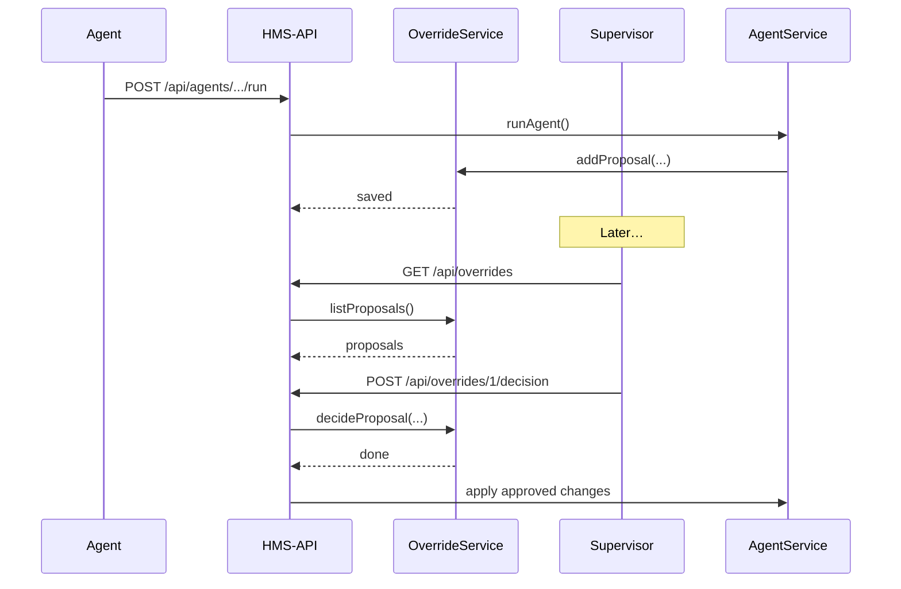

# Chapter 6: Human-In-The-Loop Override

Welcome back! In [Chapter 5: Specialized AI Agents (HMS-A2A)](05_specialized_ai_agents__hms_a2a__.md) we built autonomous agents that analyze data and apply changes. Now we’ll add a critical safety net: a **Human-In-The-Loop Override** mechanism so real decision-makers can review, adjust, or veto every AI proposal before it goes live.

---

## 1. Why Human-In-The-Loop Override?

Imagine the National Marine Fisheries Service uses an AI agent to reallocate patrol boats to high-risk zones. The agent might suggest moving two boats from Region A to Region B. But human experts know that a VIP visit is scheduled in Region A next week, so they need to step in.

With a **Human-In-The-Loop Override**, every AI proposal pauses in a “pending” queue. A supervisor can then:

- Approve the recommendation  
- Tweak parameters (e.g., only move one boat)  
- Reject it altogether  

This ensures accountability and prevents automated mistakes from impacting critical operations.

### Central Use Case

1. **Agent** runs daily and generates proposals like “add one crew in District 7.”  
2. Proposals are stored, waiting for human review.  
3. **Supervisor** logs in, sees pending proposals, and clicks “Approve,” “Edit,” or “Veto.”  
4. Only after approval do we apply changes to the database.

---

## 2. Key Concepts

1. **Proposal**  
   An AI-generated recommendation, e.g. `{ id: 42, district: '7', action: 'addCrew' }`.

2. **Override Queue**  
   A list of all pending proposals waiting for human sign-off.

3. **Decision Actions**  
   - Approve: apply as-is  
   - Adjust: modify parameters before applying  
   - Veto: discard  

4. **Audit Trail**  
   Recording who approved or vetoed and when, for accountability.

---

## 3. How to Use This Abstraction

### 3.1 Agent Submits Proposal

Modify your agent to push proposals into the override queue instead of applying them directly:

```js
// src/services/agentService.js (inside runAgent)
const { addProposal } = require('../services/overrideService');

async function runAgent(name) {
  const agent = require(`../agents/${name}.js`);
  const insights = await agent.analyze();
  const proposals = agent.propose(insights);
  // Instead of agent.apply(), we add to queue:
  for (const p of proposals) {
    await addProposal(name, p);
  }
}
```
Explanation: Each proposal is stored with the agent’s name for later review.

### 3.2 List Pending Proposals (Human UI)

Create an API endpoint to fetch all pending items:

```js
// src/routes/overrideRoutes.js
const express = require('express');
const { listProposals, decideProposal } = require('../services/overrideService');
const router = express.Router();

// GET all pending proposals
router.get('/', async (req, res) => {
  res.json(await listProposals());
});

// POST decision (approve, adjust, veto)
router.post('/:id/decision', async (req, res) => {
  const { action, params } = req.body; 
  await decideProposal(req.params.id, req.user.name, action, params);
  res.send('Decision recorded');
});

module.exports = router;
```
Explanation:  
- `GET /api/overrides` returns pending proposals.  
- `POST /api/overrides/42/decision` records the supervisor’s action.

### 3.3 Example Input & Output

**GET /api/overrides** →  
```json
[
  { "id":1, "agent":"PermitProcessingAgent", "district":"7", "action":"addCrew" },
  { "id":2, "agent":"RoadMaintenanceAgent", "section":"A3", "action":"increasePriority" }
]
```

**POST /api/overrides/1/decision** with body:
```json
{ "action":"adjust", "params": { "newCrewCount": 1 } }
```
→ Responds `Decision recorded`

---

## 4. Under the Hood: Sequence Diagram



1. Agent creates proposals.  
2. Proposals go into the **Override Queue**.  
3. Supervisor fetches and decides.  
4. OverrideService applies or rejects.

---

## 5. Internal Implementation

### 5.1 `overrideService.js`

```js
// src/services/overrideService.js
let queue = [];  // In-memory for simplicity

async function addProposal(agent, payload) {
  queue.push({ id: queue.length+1, agent, payload, status: 'pending' });
}

async function listProposals() {
  return queue.filter(p => p.status === 'pending');
}

async function decideProposal(id, reviewer, action, params) {
  const item = queue.find(p => p.id == id);
  item.status = action;           // 'approved', 'adjusted', or 'vetoed'
  item.reviewer = reviewer;
  item.params = params;           // e.g. adjusted values
  // If approved or adjusted, apply changes now:
  if (action !== 'vetoed') {
    // Import the agent module and call apply with adjusted payload
    const agent = require(`../agents/${item.agent}.js`);
    const finalPayload = action === 'adjust' ? { ...item.payload, ...params } : item.payload;
    await agent.apply([finalPayload]);
  }
}

module.exports = { addProposal, listProposals, decideProposal };
```
Explanation:  
- `addProposal`: queues AI proposals.  
- `listProposals`: fetches pending items.  
- `decideProposal`: records the decision and, if not vetoed, applies the change.

---

## 6. Why This Matters

- Accountability: Every AI suggestion is visible and signed off.  
- Flexibility: Humans can tweak or stop any automated action.  
- Safety: Critical operations always have a final human check.

---

## Conclusion

You’ve learned how to pause AI-driven changes in a review queue and let a supervisor **approve**, **adjust**, or **veto** them before they hit production. This **Human-In-The-Loop Override** adds an essential layer of accountability to HMS-AGX.

Up next, we’ll explore how to keep external systems in sync with these updates:

[Chapter 7: External System Synchronization](07_external_system_synchronization_.md)

---

Generated by [AI Codebase Knowledge Builder](https://github.com/The-Pocket/Tutorial-Codebase-Knowledge)