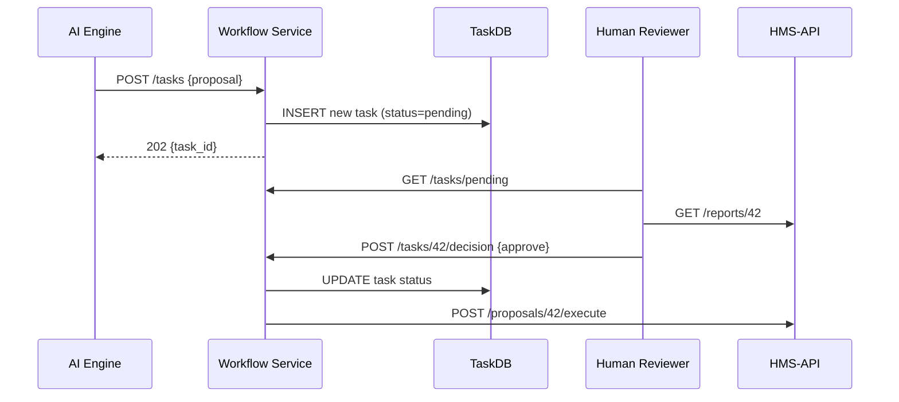

# Chapter 6: Human-in-the-Loop Workflow

In [Chapter 5: Intent-Driven Navigation](05_intent_driven_navigation_.md) we learned how to turn high-level goals into clickable steps. Now we’ll add a **Quality Assurance checkpoint**—a place where humans can review, tweak, and approve AI proposals before anything goes live.

---

## 1. Motivation & Central Use Case

Imagine the Consumer Product Safety Commission (CPSC) uses an AI to scan incident reports and recommends “Issue safety notice” or “No action needed.” But launching a notice without human review could have legal or ethical risks.  

**Use Case:**  
1. An AI module analyzes a product-injury report and proposes a “High Risk” safety notice.  
2. The proposal enters a **Human-in-the-Loop Workflow** queue.  
3. A safety officer reviews the details, adjusts the risk level if needed, and approves or rejects.  
4. Every decision is logged for auditing and accountability.

This pattern ensures we gain AI efficiency while keeping a clear human-approval trail.

---

## 2. Key Concepts

1. **AI Proposal**  
   The AI engine generates a suggestion (e.g., “Recall widget X”).  

2. **Task Queue & Workflow Service**  
   Proposals become “tasks” stored in a workflow microservice until a human acts.

3. **Human Checkpoint**  
   A reviewer UI where officers see pending tasks, inspect data, and choose “approve,” “reject,” or “adjust.”

4. **Decision Logging**  
   Every human decision (who, what, when) is saved for audit—powered by [HMS-SYS audit logging](01_core_system_platform__hms_sys__.md).

5. **Next Action Trigger**  
   After approval, the workflow service calls downstream APIs (e.g., send notice).

---

## 3. Submitting an AI Proposal

Here’s how an AI component can queue a safety-review task:

```python
# submit_proposal.py
import requests
from hms_sys.identity import verify_token

token = request.headers["Authorization"]
proposal = {
  "report_id": 42,
  "risk_level": "high",
  "message": "Recommend recall of model ZX100"
}
resp = requests.post(
  "https://workflow.gov/tasks",
  headers={"Authorization": token},
  json={"type": "safety_review", "data": proposal}
)
task = resp.json()
print("Task queued for human review:", task["id"])
```

- We include an **Authorization** header so HMS-SYS can verify who’s calling.  
- The workflow service returns a `task.id` that the reviewer will use.

---

## 4. What Happens Under the Hood



1. **AI Engine** creates a task in the Workflow Service.  
2. **Workflow Service** saves it in **TaskDB**.  
3. A **Reviewer** fetches pending tasks, reviews external data via **HMS-API**, then submits a decision.  
4. The Workflow Service records the decision and triggers the next action (“execute” the approved proposal).

---

## 5. Inside the Workflow Service

### a) Main Endpoints  
File: `workflow_service/app.py`

```python
from flask import Flask, request, jsonify
from hms_sys.identity import verify_token
from workflow_service.db import save_task, get_pending, record_decision

app = Flask(__name__)

@app.route("/tasks", methods=["POST"])
def create_task():
    user = verify_token(request.headers["Authorization"])
    task = save_task(request.json["type"], request.json["data"], user.id)
    return jsonify(task), 202

@app.route("/tasks/pending", methods=["GET"])
def pending_tasks():
    verify_token(request.headers["Authorization"])
    return jsonify(get_pending()), 200

@app.route("/tasks/<task_id>/decision", methods=["POST"])
def decide(task_id):
    user = verify_token(request.headers["Authorization"])
    record_decision(task_id, user.id, request.json["decision"])
    # Here you would call downstream APIs based on decision
    return "", 204

if __name__ == "__main__":
    app.run(port=5005)
```

Explanation:  
- **`/tasks`** creates a new review task.  
- **`/tasks/pending`** lists tasks waiting for a human decision.  
- **`/tasks/<id>/decision`** records “approve” or “reject” and can trigger the next step.

### b) Simplified In-Memory DB  
File: `workflow_service/db.py`

```python
_tasks = {}

def save_task(t_type, data, creator):
    tid = len(_tasks) + 1
    _tasks[tid] = {"id": tid, "type": t_type, "data": data,
                   "status": "pending", "creator": creator}
    return _tasks[tid]

def get_pending():
    return [t for t in _tasks.values() if t["status"] == "pending"]

def record_decision(tid, reviewer, decision):
    task = _tasks[int(tid)]
    task["status"]   = "approved" if decision=="approve" else "rejected"
    task["reviewer"] = reviewer
```

Explanation:  
- We store tasks in a simple dict for demo purposes.  
- `record_decision` flips the status and notes who reviewed it.

---

## 6. Summary

You’ve seen how to inject a controlled **human checkpoint** into AI workflows:

- Queue AI proposals as review **tasks**  
- Provide endpoints for listing and deciding tasks  
- Record every choice for an **audit trail**  
- Trigger downstream actions only after human approval  

This design balances AI speed with legal and ethical accountability.

Next up, we’ll automate how approved policies are rolled out in  
[Chapter 7: Policy Deployment Engine](07_policy_deployment_engine_.md).

---

Generated by [AI Codebase Knowledge Builder](https://github.com/The-Pocket/Tutorial-Codebase-Knowledge)