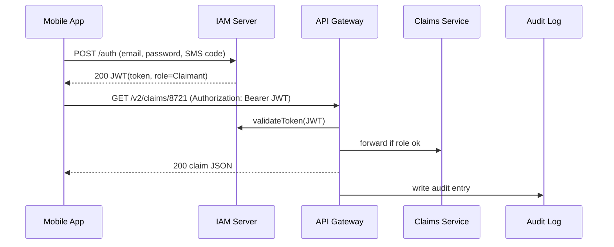

# Chapter 6: Identity & Access Management (IAM)

*(continuing from [Chapter 5: API Gateway & Policy Endpoints (HMS-API)](05_api_gateway___policy_endpoints__hms_api__.md))*  

---

## 1. Why Do We Need “Digital Passports”?

Picture fire-season on the U.S. West Coast.  
Thousands of citizens rush to the **Wildfire Relief Portal** to:

1. Upload damage photos.  
2. Check their application status.  
3. Grant temporary access to insurance adjusters.  

Without a strict gatekeeper, anyone could peek at somebody else’s private data—or worse, change it.  
**Identity & Access Management (IAM)** is that gatekeeper.  
Think of it as a **passport office + security desk** that:

1. Proves **who** you are (identity).  
2. Decides **what** you may do (access).  
3. Writes everything down for inspectors (audit).

No matter how many micro-services we spin up, IAM keeps the keys, the rules, and the visitor log.

---

## 2. Running Example: “Sara Checks Her Damage Claim”

Goal: Let Sara view claim `CLM-8721`—but nobody else.  
At a high level:

1. Sara signs in with a verified email + SMS code.  
2. IAM issues her a **JWT token** listing role = “Claimant”.  
3. Sara calls `/v2/claims/8721` at the API Gateway.  
4. The gateway verifies the token and role before forwarding to downstream services.  

Hold that picture; we’ll implement it step-by-step.

---

## 3. Key Concepts in Plain English

| Term | Analogy | Beginner Meaning |
|------|---------|------------------|
| Identity | Passport photo | A unique record about *you* (name, email, agency ID) |
| Authentication | TSA ID check | Proving the passport is really yours (password, SMS code, CAC card) |
| Authorization | Door badge light | Deciding which door opens (roles, scopes) |
| Token (JWT) | Temporary visitor badge | Signed note you show at each door—expires soon |
| Role-Based Access Control (RBAC) | “Staff vs. Visitor” sticker | Groups permissions so we don’t list them one-by-one |
| Audit Trail | Visitor logbook | Immutable record of who did what, when |

Keep these six bricks in mind; IAM simply automates them.

---

## 4. Sara’s 5-Step Journey



Five actors, all playing clear roles. The Claims Service never worries *how* Sara was vetted—that’s IAM’s job.

---

## 5. Using IAM as a Client (Beginner Hands-On)

### 5.1 Log In and Grab a JWT (cURL, 2 lines)

```bash
TOKEN=$(curl -s -X POST https://iam.hms.gov/auth \
  -d '{"email":"sara@mail.com","password":"flag$2024","sms":"123456"}' | jq -r .token)
```

What happens:  
1. IAM validates password + SMS.  
2. Returns a compact token like `eyJhbGciOi...`.

### 5.2 Call a Protected API

```bash
curl -H "Authorization: Bearer $TOKEN" \
     https://api.hms.gov/v2/claims/8721
```

Expected output (truncated):

```json
{ "claimId":"CLM-8721", "status":"UNDER_REVIEW", "amount": 4200 }
```

If the token is missing or expired, the gateway replies:

```json
{ "error":"UNAUTHORIZED" }
```

Simple rule: **No valid badge, no entry.**

---

## 6. Adding IAM Checks to Your Service (Developer View)

Most HMS services reuse a tiny middleware—here’s the **entire** code (< 20 lines):

```js
// svc/middleware/iamauth.js
import { verify } from "hms-iam-client";

export async function requireRole(role) {
  return async (req, res, next) => {
    try {
      const token = req.headers.authorization?.split(" ")[1];
      const claims = await verify(token);    // contacts IAM
      if (!claims.roles.includes(role)) throw "forbidden";
      req.user = claims;                    // stash user info
      next();
    } catch {
      res.status(403).json({ error: "FORBIDDEN" });
    }
  };
}
```

Usage in an Express-style route (3 lines):

```js
app.get("/claims/:id",
  requireRole("Claimant"),
  (req,res)=> res.json(fetchClaim(req.params.id, req.user.sub))
);
```

Explanation  
• `verify()` checks signature + expiry + revocation list.  
• `requireRole("Claimant")` blocks lawyers, auditors, or random visitors.  
• Your handler can safely assume the user is legit.

---

## 7. Under the Hood—How Tokens Are Forged

1. **Credential Check**  
   The IAM server looks up the user in **Directory DB** (`users.sara.id`).  
2. **Multi-Factor Validation**  
   Verifies password **and** current SMS code.  
3. **Token Minting**  
   Creates a JWT:

```json
{
  "sub": "USR-9123",
  "roles": ["Claimant"],
  "iat": 1718036161,
  "exp": 1718043361
}
```

   Signs it with the agency’s private key.  
4. **Audit Log Write**  
   Saves: `"Sara issued token", time, IP`.  
5. **Return to Caller**  
   Max TTL = 2 hours (agency default).

All steps are atomic; failure anywhere means *no* token.

---

## 8. IAM Micro-Components (Quick Peek)

```
iam/
├─ auth-server/      # handles /auth & /refresh
├─ directory-db/     # users, roles, orgs
├─ key-service/      # rotates signing keys
├─ audit-writer/     # append-only log
└─ revocation-list/  # stores force-logout tokens
```

### Example: Quick Revocation (Go, 12 lines)

```go
// revoker.go
func Revoke(tokenID string) error {
    now := time.Now().Unix()
    _, err := db.Exec("INSERT INTO revoked(id, ts) VALUES($1,$2)", tokenID, now)
    return err
}
```

Auditors can later query `revoked` to prove an access was cut off.

---

## 9. Connecting IAM with Other HMS Layers

• **API Gateway** — calls `validateToken()` on every request (see Chapter 5).  
• **Governance Portal** — uses IAM roles like `PolicyEditor`, `Auditor` (see [Chapter 2](02_governance_portal__hms_gov__.md)).  
• **Process & Policy Engine** — requires “Service” tokens for machine-to-machine calls (see [Chapter 3](03_process___policy_engine_.md)).  
• **Domain Packs** — may include extra role mappings (e.g., `HIPAA_Officer`) (see [Chapter 4](04_domain_packs__health__finance__education__etc__.md)).

One IAM, many consumers—single source of truth.

---

## 10. Frequently Asked Beginner Questions

**Q1. How long should tokens live?**  
Default is 2 hours; adjust via `ttlMinutes` claim. Shorter == safer.

**Q2. Can we do Single Sign-On with government CAC cards?**  
Yes. IAM supports SAML & OIDC federation. CAC users still get a normal JWT afterward.

**Q3. What if my phone is lost?**  
Admins can switch you to email MFA or a temporary hardware token—every change is audited.

**Q4. Do service-to-service calls need MFA?**  
No. They use *client credentials flow* and get a **Service Token** limited to backend scopes.

---

## 11. Recap & What’s Next

Today you learned:

• IAM is our **passport office**—authenticates users, issues short-lived badges, and logs every visit.  
• As a client, you only need two steps: **get token → attach header**.  
• As a developer, drop in a **15-line middleware** to enforce roles.  
• Under the hood, IAM is a set of small, auditable micro-services.

With secure identities in place, we can safely let dozens of micro-services talk to each other.  
Next up: how those services discover and trust each other inside the data center—meet the [Backend Service Mesh (HMS-SVC / HMS-SYS)](07_backend_service_mesh__hms_svc___hms_sys__.md).

---

Generated by [AI Codebase Knowledge Builder](https://github.com/The-Pocket/Tutorial-Codebase-Knowledge)