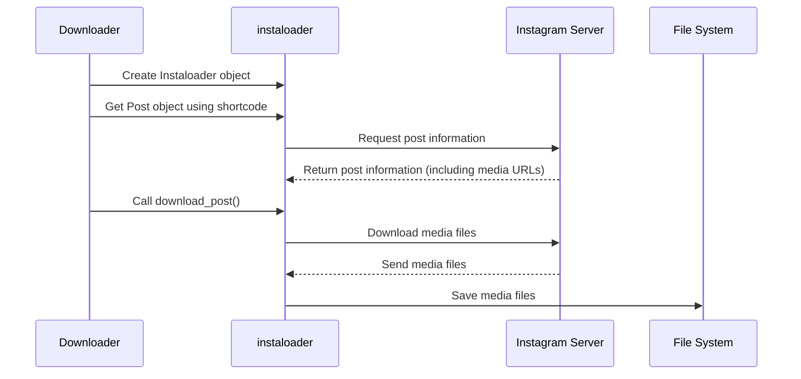

# Chapter 6: instaloader Library

In the previous chapter, [pytubefix Library](05_pytubefix_library.md), we learned how to download YouTube videos. Now, let's explore how to download content from Instagram using the `instaloader` library. Think of `instaloader` as a specialized toolkit designed for working with Instagram, just like `pytubefix` is for YouTube and `pyktok` is for TikTok.

## What Problem Does the `instaloader` Library Solve?

Imagine you want to download a photo or video from a public Instagram post.  You could try to figure out how Instagram stores its content and how to download it directly, but that's complicated! The `instaloader` library simplifies this process. It's like a specialized downloader tool designed specifically for Instagram.

## Key Concepts

1. **`Instaloader` Object:** This is the core of `instaloader`. You create an `Instaloader` object, which acts like your personal Instagram assistant. It handles logging in, accessing posts, and downloading content.

2. **`Post` Object:**  An Instagram post can contain photos, videos, or both. `instaloader` represents each post as a `Post` object.  This object contains information about the post, like its caption and the media it contains.

3. **Download:**  Once you have a `Post` object, you can download its content using the `download_post()` function. This function saves the photos and videos to your computer.

## Using `instaloader`

Here's a simplified example of how to download an Instagram post:

```python
import instaloader

L = instaloader.Instaloader()  # Create an Instaloader object
# ... (Code to handle login using cookies - we'll see this later)

shortcode = "Cqxxxxxxxx" # The shortcode of the Instagram post (the unique ID in the URL)
post = instaloader.Post.from_shortcode(L.context, shortcode) # Get the Post object
L.download_post(post, target="instagram_post") # Download the post to a directory named "instagram_post"
```

This code creates an `Instaloader` object, gets the `Post` object using its shortcode, and downloads the post's content to a directory.

## Internal Implementation

Here's a simplified sequence diagram showing how `instaloader` works:



The `Downloader` creates an `Instaloader` object and gets the `Post` object using its shortcode. `instaloader` then requests information about the post from Instagram's servers. After receiving the information, including the media URLs, the `Downloader` calls the `download_post()` function. `instaloader` then downloads the media files from Instagram's servers and saves them to the specified directory.

### Code Example: `lib/instagram.py`

```python
from .uploader import S3Uploader # Import the S3Uploader (explained in a later chapter)
import instaloader
# ... (other imports)

class Instagram:
    # ... (other code)

    def download(self):
        # ... (handle login using cookies, similar to how it's done in pyktok)
        instagram_dl = instaloader.Instaloader()
        # ... (load session from file)

        shortcode = self.url.split('/')[4] # Extract the shortcode from the URL
        post = instaloader.Post.from_shortcode(instagram_dl.context, shortcode)
        instagram_dl.download_post(post, target=dir) # Download the post

        # ... (preprocess downloaded files - convert videos to mp3, upload to S3 using [S3Uploader](07_s3uploader.md))
        return self.result
```

This simplified code snippet shows how the `Instagram` class in our project uses `instaloader` to download Instagram posts.  It handles login using cookies (similar to `pyktok`), extracts the shortcode from the URL, gets the `Post` object, and downloads the post content. It then preprocesses the downloaded files (e.g., converts videos to MP3) and uploads them to S3 using the [S3Uploader](07_s3uploader.md).

## Conclusion

In this chapter, we explored the `instaloader` library, a powerful tool for downloading Instagram content. We learned about the `Instaloader` object, `Post` object, and the `download_post()` function. Next, we'll look at the [S3Uploader](07_s3uploader.md), which is used for uploading files to Amazon S3.


---

Generated by [AI Codebase Knowledge Builder](https://github.com/The-Pocket/Tutorial-Codebase-Knowledge)