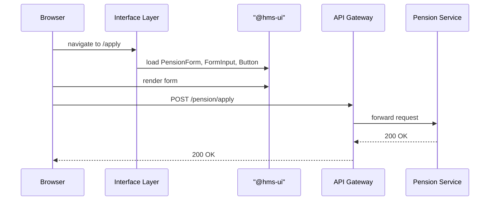

# Chapter 6: Interface Layer

In [Chapter 5: Real-Time Monitoring & Feedback](05_real_time_monitoring___feedback_.md) we built dashboards and feedback loops. Now let’s look at the **front door** of HMS-ACT: the **Interface Layer**—our “town hall” where citizens and officials meet the system.

---

## Why an Interface Layer?

Imagine the Pension Benefit Guaranty Corporation needs a simple way for retirees to apply for pension insurance and for caseworkers to review applications:

1. A **citizen** opens a web portal, fills out a pension application form, and clicks **Submit**.
2. A **caseworker** logs into an admin dashboard, sees new submissions in a table, and clicks **Approve** or **Request Info**.

The Interface Layer makes these interactions smooth and consistent. It bundles:

- Two portals: **HMS-MFE** (for citizens & field officers) and **HMS-GOV** (for administrators).
- A shared **UI component library** (`@hms-ui`) with buttons, forms, tables, charts.
- Routing, data-fetching hooks, and event handlers to call backend APIs.

---

## Key Concepts

1. Portals (Shells)  
   - **HMS-MFE**: citizen-facing micro-frontend.  
   - **HMS-GOV**: admin-facing dashboard.  

2. Shared UI Components  
   - Standardized **FormInput**, **Button**, **Table**, etc.  
   - Ensures consistent look & feel.

3. Routing & Shell  
   - A small “shell” app that sets up URL routes and loads pages.  

4. Interaction Handlers  
   - Functions on buttons or form submits that call backend APIs.

5. Data Binding  
   - Hooks or state to track form fields and table data.

---

## Using the Interface Layer

Let’s build a minimal **Pension Benefit Application** form in **HMS-MFE** and a **Pending Applications** table in **HMS-GOV**.

### 1. Pension Application Form (HMS-MFE)

```jsx
// File: interface/hms-mfe/PensionForm.js
import React, { useState } from 'react';
import { FormInput, Button } from '@hms-ui';

export function PensionForm() {
  const [name, setName] = useState('');
  const [ssn, setSsn] = useState('');
  const onSubmit = () => {
    fetch('/api/pension/apply', {
      method: 'POST',
      headers: {'Content-Type':'application/json'},
      body: JSON.stringify({ name, ssn })
    }).then(() => alert('Application submitted!'));
  };

  return (
    <div>
      <h1>Pension Application</h1>
      <FormInput label="Full Name" value={name}
        onChange={e => setName(e.target.value)} />
      <FormInput label="SSN" value={ssn}
        onChange={e => setSsn(e.target.value)} />
      <Button onClick={onSubmit}>Submit</Button>
    </div>
  );
}
```

This simple React component uses `@hms-ui` inputs and button. When **Submit** is clicked, it calls our backend API.

### 2. Admin Dashboard Table (HMS-GOV)

```jsx
// File: interface/hms-gov/AdminDashboard.js
import React, { useEffect, useState } from 'react';
import { Table, Button } from '@hms-ui';

export function AdminDashboard() {
  const [apps, setApps] = useState([]);
  useEffect(() => {
    fetch('/api/pension/applications')
      .then(r => r.json()).then(setApps);
  }, []);

  return (
    <div>
      <h1>Pending Pension Applications</h1>
      <Table data={apps} />
      <Button onClick={() => window.location.reload()}>Refresh</Button>
    </div>
  );
}
```

Here, a table lists all applications. The **Refresh** button reloads data from `/api/pension/applications`.

---

## What Happens Under the Hood?



1. **Browser** requests a portal route (`/apply`).  
2. **Shell** loads shared **UI components**.  
3. Citizen fills and **submits** form.  
4. **API Gateway** forwards the request to the pension service.  
5. Service responds, and the browser shows success.

---

## Inside the Implementation

Beyond pages, each portal has a tiny **Shell** that wires up routes.

```jsx
// File: interface/hms-mfe/Shell.js
import React from 'react';
import { BrowserRouter, Route } from 'react-router-dom';
import { PensionForm } from './PensionForm';

export default function Shell() {
  return (
    <BrowserRouter>
      <Route path="/apply" component={PensionForm} />
      {/* more citizen routes */}
    </BrowserRouter>
  );
}
```

```jsx
// File: interface/hms-gov/Shell.js
import React from 'react';
import { BrowserRouter, Route } from 'react-router-dom';
import { AdminDashboard } from './AdminDashboard';

export default function Shell() {
  return (
    <BrowserRouter>
      <Route path="/admin" component={AdminDashboard} />
      {/* more admin routes */}
    </BrowserRouter>
  );
}
```

Behind the scenes:

- A build step bundles each shell with `@hms-ui`.  
- Shared CSS and JS ensure uniform styling.  
- Environment variables point to the correct API gateway.

---

## Conclusion

In this chapter you learned how the **Interface Layer** brings together:

- **Portals** (HMS-MFE & HMS-GOV)  
- A **shared UI library**  
- **Routing** and **interaction handlers**  
- **Data binding** for forms and tables  

This “town hall” is how users submit requests and view reports. Next, we’ll climb to the **Management Layer**, where business workflows and policies live.  
[Next Chapter: Management Layer](07_management_layer_.md)

---

Generated by [AI Codebase Knowledge Builder](https://github.com/The-Pocket/Tutorial-Codebase-Knowledge)