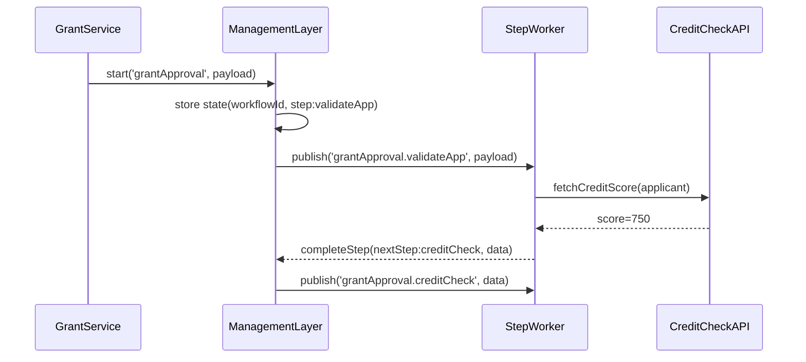

# Chapter 6: Management Layer

Welcome back! In [Chapter 5: External System Synchronization](05_external_system_synchronization_.md) we learned how to keep third-party systems in sync with HMS data. Now we move “upstairs” to the **Management Layer**—the orchestration tier that coordinates multi-step processes, schedules tasks, and tracks their state, just like a city manager’s office directs fire, police, and public works in the right order with retries and error handling.

## 1. Why a Management Layer?

Imagine a **Federal Grant Application** process:

1. A citizen submits an application.  
2. The system verifies the form (validation).  
3. It runs a credit check.  
4. It schedules a site inspection.  
5. It pays out funds if all checks pass.  

Without orchestration, each step would be spaghetti—manual triggers, fragile scripts, no retry logic. The **Management Layer** lets you define these steps as a workflow, kick them off with one call, and it ensures they run in order, can retry on failure, and record each state.

## 2. Key Concepts

1. **Workflows**  
   Named sequences of steps (e.g., `grantApproval`).  
2. **Task Scheduling**  
   Enqueue each step to run now or later.  
3. **State Management**  
   Store the status of each step (pending, running, succeeded, failed).  
4. **Retries & Error Handling**  
   Automatic retries or alternative error paths when something goes wrong.  

## 3. Defining and Running a Workflow

### 3.1 Initialize and Define Steps

Below we define a four-step grant approval workflow:

```javascript
// file: grant-workflow/index.js
const mgmt = require('hms-mgmt').init({ serviceName: 'GrantWorkflow' })

// 1) Define our workflow steps in order
mgmt.defineWorkflow('grantApproval', [
  'validateApp',
  'creditCheck',
  'scheduleInspection',
  'finalize'
])

// 2) Register a handler for the first step
mgmt.onStep('grantApproval.validateApp', async (ctx) => {
  // ctx.payload = { applicationId, applicantData }
  // pretend to validate form fields...
  console.log('Validating application', ctx.payload.applicationId)
  return { nextStep: 'creditCheck', data: ctx.payload }
})
```

Explanation:
- `init` wires up scheduling, state store, messaging.
- `defineWorkflow` names and orders the steps.
- `onStep` attaches your business logic for a specific step.

### 3.2 Start the Workflow

When an application arrives, you kick off the entire process:

```javascript
// file: grant-service/submit.js
const mgmt = require('hms-mgmt').init({ serviceName: 'GrantService' })

async function submitGrant(app) {
  const result = await mgmt.start('grantApproval', {
    applicationId: app.id,
    applicantData: app.data
  })
  console.log('Workflow started with ID:', result.workflowId)
}
```

This single `start` call enqueues the `validateApp` step automatically.

## 4. What Happens Under the Hood?

Here’s a simple sequence when you call `start('grantApproval', …)`:



1. **start**: state is saved, first task (`validateApp`) is published.  
2. **StepWorker** subscribes to step topics and executes handlers.  
3. On success, the handler returns `{ nextStep, data }`.  
4. **ManagementLayer** publishes the next step; on failure it can retry or route to an error handler.

## 5. Peek at Internal Implementation

Here’s a highly simplified core of `hms-mgmt`:

```javascript
// file: hms-mgmt/core.js
function init({ serviceName }) {
  const workflows = {}
  return {
    defineWorkflow: (name, steps) => { workflows[name] = steps },
    onStep: (topic, handler) => {
      // subscribe via HMS-SYS message bus
      const [wf, step] = topic.split('.')
      subscribe(topic, async (msg) => {
        try {
          const res = await handler({ payload: msg.data })
          if (res.nextStep) enqueue(wf, res.nextStep, res.data)
        } catch (e) {
          // retry or log error
        }
      })
    },
    start: async (workflowName, payload) => {
      const id = Date.now().toString()
      await saveState(id, { workflowName, step: workflows[workflowName][0] })
      publish(`${workflowName}.${workflows[workflowName][0]}`, payload)
      return { workflowId: id }
    }
  }
}
```

- **defineWorkflow** registers step order.  
- **onStep** subscribes handlers to topics like `grantApproval.validateApp`.  
- **start** saves initial state and enqueues the first task.  
- **enqueue**/`publish` and `subscribe` are built on the [Core Infrastructure (HMS-SYS)](01_core_infrastructure__hms_sys__.md) messaging bus.

## 6. Summary

In this chapter you learned how the **Management Layer**:

- Lets you define multi‐step workflows for processes like grant approval.  
- Schedules and tracks each task’s state with built-in retries and error handling.  
- Uses simple calls (`defineWorkflow`, `onStep`, `start`) to orchestrate complex flows.  

Next up, we’ll set up dashboards and alerts so administrators can watch these workflows in real time.  
[Real-time Monitoring & Metrics](07_real_time_monitoring___metrics_.md)

---

Generated by [AI Codebase Knowledge Builder](https://github.com/The-Pocket/Tutorial-Codebase-Knowledge)