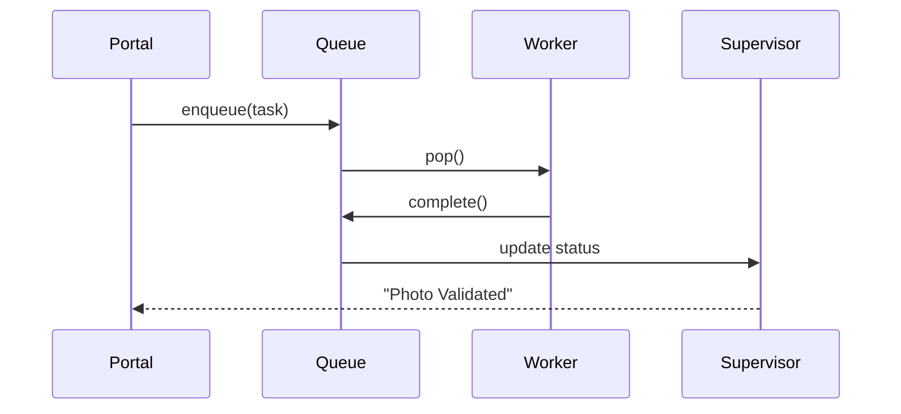

# Chapter 6: Management & Service Layer (HMS-SVC / OMS / ACT)

*(picks up from [Chapter 5: Data Core (HMS-DTA)](05_data_core__hms_dta__.md))*  

---

## 1  Why do we need a “Service Layer”?

Imagine a citizen called **Sam** submits an online **Passport Renewal** form at 10 p.m.  

Behind the scenes we must:

1. Validate Sam’s data (name, photo, fee).
2. Check old passport records.
3. Reserve a production slot at the printing facility.
4. Email Sam a tracking number.

Those four steps touch **four different micro-services**.  
If one fails or stalls at Step 2, Sam waits … and tweets … and trust drops.

**HMS-SVC** is the set of **clerks** that perform each business step.  
**OMS** (Operations Management System) and **ACT** (Activity Controller) act like their **floor supervisors**—queueing work, assigning it to available clerks, retrying on failure, and updating dashboards so managers can see bottlenecks.

In short:

```
Portal request  ➜  OMS queue  ➜  HMS-SVC clerk  ➜  ACT supervisor
```

Nothing gets lost, and everyone sees the status in real time.

---

## 2  Key Concepts (Beginner Friendly)

| Word (Acronym) | Think of it as … | Why it matters |
|----------------|------------------|----------------|
| **Task**       | A paper form on a clerk’s desk | One unit of work (e.g., “verify photo”) |
| **Queue (OMS)**| In-tray of forms | Guarantees first-in/first-out, no duplicates |
| **Worker (HMS-SVC)** | The human clerk | Executes the business logic |
| **Supervisor (ACT)** | Floor manager walking around | Assigns tasks, retries, escalates |
| **SLA Clock**  | A timer on the wall | Warns when a task takes too long |

Keep these five ideas in mind—the rest is just wiring.

---

## 3  Quick-Start: Build a “Photo Validator” Service

We’ll create one tiny service that:

* pulls “photo-validation” tasks from OMS,  
* checks if the uploaded image is JPEG & has a face,  
* marks the task **DONE** or **FAILED**.

### 3.1 Install the helper SDK

```bash
pip install hms-svc
```

### 3.2 Register the queue

```python
# file: register_queue.py  (12 lines)
from hms_svc import OMSClient

oms = OMSClient()

oms.create_queue(
    name="passport.photo",
    sla="2h"              # must finish within 2 hours
)
print("Queue ready!")
```

*Explanation*  
A single call creates a durable queue inside OMS. Every task dropped here will start the **2-hour SLA clock**.

### 3.3 Write the worker

```python
# file: worker.py  (20 lines)
from hms_svc import Worker, Task

def validate_photo(task: Task):
    img = task.payload["file"]          # URL in object storage
    if not img.endswith(".jpg"):
        task.fail("Not a JPEG")         # 📛 mark failed
        return

    # pretend we run a face detector …
    face_found = True
    if not face_found:
        task.fail("Face missing")
    else:
        task.complete({"note": "Photo OK"})  # ✅

Worker(
    queue="passport.photo",
    concurrency=5,           # 5 photos in parallel
    handler=validate_photo
).run_forever()
```

*Explanation*  
1. `Worker` automatically calls `oms.pop_task()` under the hood.  
2. `task.complete()` and `task.fail()` report back to OMS, which then triggers **ACT** to decide next steps (retry, escalate, etc.).

### 3.4 Drop a test task

```python
# file: enqueue.py  (9 lines)
from hms_svc import OMSClient

oms = OMSClient()
oms.enqueue(
    queue="passport.photo",
    payload={"file": "s3://uploads/sam.jpg"},
    correlation_id="REQ-123"
)
print("Task enqueued!")
```

Run the three small scripts in separate terminals.  
Within seconds you should see:

```
[OMS] Task REQ-123 pulled by worker#2
[Worker] Photo OK
[OMS] Task REQ-123 marked COMPLETE (1.2 s)
```

---

## 4  What happens step-by-step?



Plain English:

1. The portal drops a task.  
2. OMS stores it *durably* and hands it to the first idle worker.  
3. The worker finishes and reports back.  
4. ACT updates the overall workflow (Sam’s renewal now moves to the next step).

---

## 5  Peek Under the Hood

### 5.1 Queue table (simplified)

```json
// redis key: queue:passport.photo
[
  {"id":"t1","payload":{...},"eta":"2024-06-01T17:05Z"},
  {"id":"t2","payload":{...},"eta":"2024-06-01T17:06Z"}
]
```

A plain Redis list—fast, durable, and easy to inspect.

### 5.2 Task pop code (excerpt, 15 lines)

```python
# file: oms/pop.py
import redis, json, time

r = redis.Redis()

def pop(queue):
    raw = r.blpop(f"queue:{queue}", timeout=5)
    if raw:
        task = json.loads(raw[1])
        r.hset("inflight", task["id"], time.time())
        return task
```

*Beginners see*: `blpop` blocks until a task exists, then records it in an `inflight` hash so nothing gets lost if the worker crashes.

### 5.3 SLA monitor (excerpt, 12 lines)

```python
# file: act/sla.py
def check_sla():
    for task_id, started in r.hgetall("inflight").items():
        if time.time() - float(started) > 7200:   # 2 hours
            escalate(task_id)
```

If a task breaks the SLA, `escalate()` can re-queue it or page an on-call human.

---

## 6  How This Layer Fits in the Big Picture

```
Citizen Portal
      ↓
[Governance Layer](02_governance_layer__hms_gov__.md)
      ↓
Management & Service Layer (YOU ARE HERE)
      ↓
[Workflow Orchestrator](07_workflow_orchestrator__hms_act___oms__.md)
      ↓
[Operations Hub](01_operations___monitoring_hub__hms_ops__.md) keeps it healthy
```

Key links:

* Uses slices from [Data Core](05_data_core__hms_dta__.md) during task execution.  
* Exposes metrics to [HMS-OPS](01_operations___monitoring_hub__hms_ops__.md).  
* Hands complex, multi-step cases to the upcoming **Workflow Orchestrator**.

---

## 7  Beginner FAQ

**Q:** What if two workers try the same task?  
A: Impossible—`blpop` removes the task atomically.  

**Q:** Can I write workers in another language?  
Yes. Any language that can speak Redis (or the REST fallback) works; just POST `/oms/pop`.

**Q:** Where do I see all running tasks?  
Open the web dashboard at `http://hms-act.local/` – each queue has a live list of *Waiting*, *In-Progress*, *Done*, *Failed* tasks.

---

## 8  Recap & Next Steps

You learned to:

1. Create an OMS queue with a 2-hour SLA.  
2. Write a 20-line worker that validates passport photos.  
3. Watch ACT supervise, retry, and report status.

Your clerks and supervisors are ready—now let’s stitch individual tasks into **full citizen workflows** (passport renewal, grant approval, etc.).  

Continue to [Chapter 7: Workflow Orchestrator (HMS-ACT / OMS)](07_workflow_orchestrator__hms_act___oms__.md).

---

Generated by [AI Codebase Knowledge Builder](https://github.com/The-Pocket/Tutorial-Codebase-Knowledge)