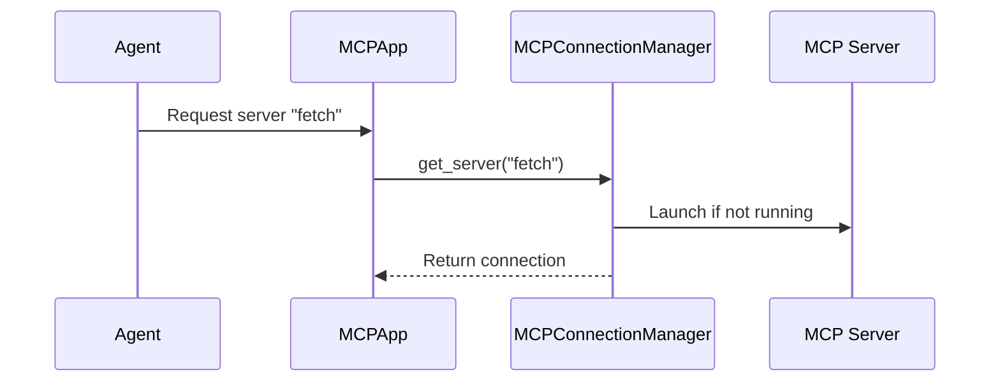

# Chapter 6: MCPConnectionManager

In the previous chapter, [AugmentedLLM](05_augmentedllm.md), we saw how our AI agents use tools provided by [MCP Servers](04_mcp_server.md). Now, let's explore how the `MCPApp` manages these server connections using the `MCPConnectionManager`.

## What problem does MCPConnectionManager solve?

Imagine our news summarization assistant needs to access both a "fetch" server to download web pages and a "database" server to store information.  We need a way to ensure both servers are running and available for our agents. The `MCPConnectionManager` handles this, ensuring all necessary servers are up and running.  Think of it as a project manager who ensures all the workers (MCP servers) are present and have the necessary tools.

## Key Concepts

The `MCPConnectionManager` has two main responsibilities:

1. **Launching Servers:** It starts the necessary MCP servers when an [Agent](02_agent.md) requests them.

2. **Managing Connections:** It maintains persistent connections to these servers, so agents can easily access them.

## Using MCPConnectionManager

You typically interact with the `MCPConnectionManager` indirectly through the [Agent](02_agent.md). When an agent is created with `server_names`, the [MCPApp](01_mcpapp.md) uses the `MCPConnectionManager` behind the scenes.

```python
from mcp_agent.agents.agent import Agent

fetch_agent = Agent(
    name="fetch_agent",
    instruction="Fetch a webpage.",
    server_names=["fetch"], # This agent will use the 'fetch' MCP server
)

async with fetch_agent:
    # ... use the fetch_agent ...
```

This code creates a `fetch_agent` that needs the "fetch" server. The `MCPConnectionManager` ensures the "fetch" server is running and the agent can connect to it.

## Internal Implementation

When an [Agent](02_agent.md) requests a server, the `MCPConnectionManager` checks if the server is already running. If not, it launches the server and establishes a connection.



Here's a simplified look at the `get_server` function from `src/mcp_agent/mcp/mcp_connection_manager.py`:

```python
async def get_server(self, server_name):
    # ... check if server is already running ...
    if server_name not in self.running_servers:
        # ... launch the server ...
        self.running_servers[server_name] = await self.launch_server(server_name)
    return self.running_servers[server_name]
```

The `launch_server` function handles the actual launching of the server process:

```python
async def launch_server(self, server_name):
    # ... get server configuration from [ServerRegistry](server_registry.md) ...
    # ... start the server process ...
    # ... establish connection ...
    return server_connection
```

The `MCPConnectionManager` also handles disconnections when the [MCPApp](01_mcpapp.md) shuts down.

```python
async def disconnect_all(self):
    # ... disconnect all running servers ...
```

## Conclusion

The `MCPConnectionManager` simplifies the management of [MCP Server](04_mcp_server.md) connections, ensuring that agents have access to the tools they need. It handles launching servers and maintaining persistent connections, allowing you to focus on building your agents and [Workflows](03_workflow.md). In the next chapter, [MCPAggregator](07_mcpaggregator.md), we'll explore how the `AugmentedLLM` interacts with these servers to execute tool calls.


---

Generated by [AI Codebase Knowledge Builder](https://github.com/The-Pocket/Tutorial-Codebase-Knowledge)